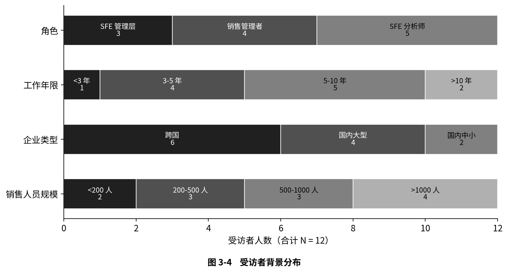
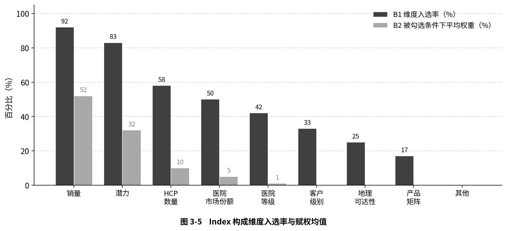
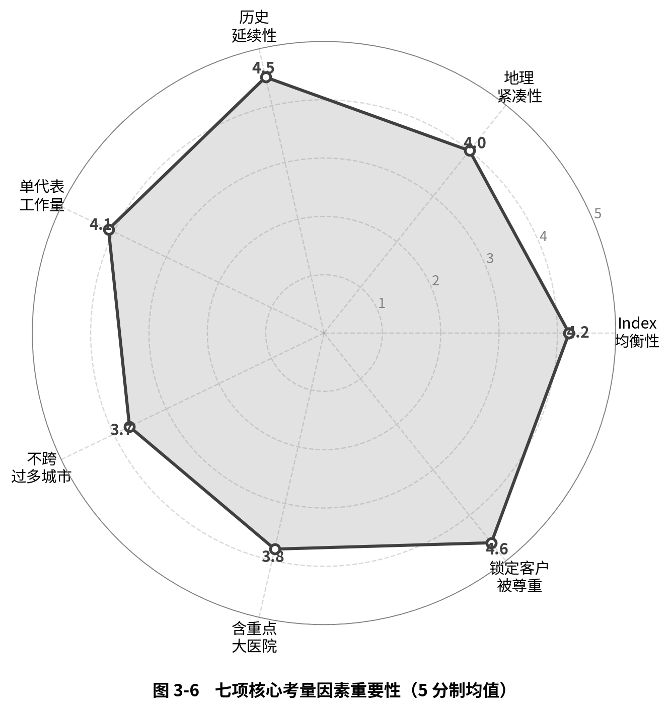
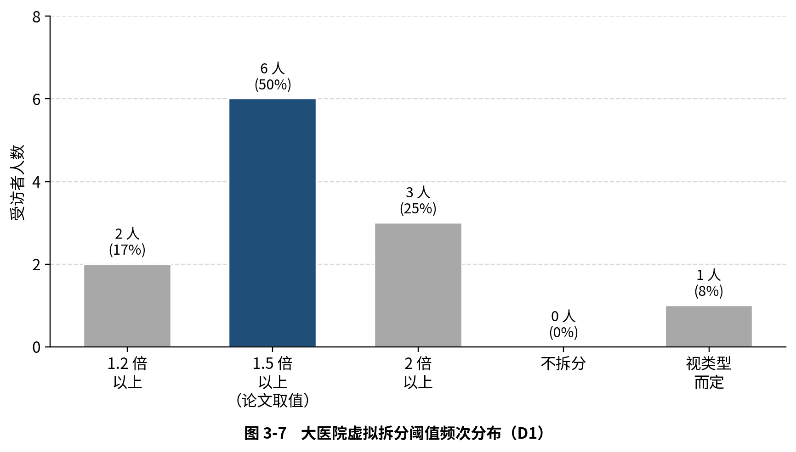
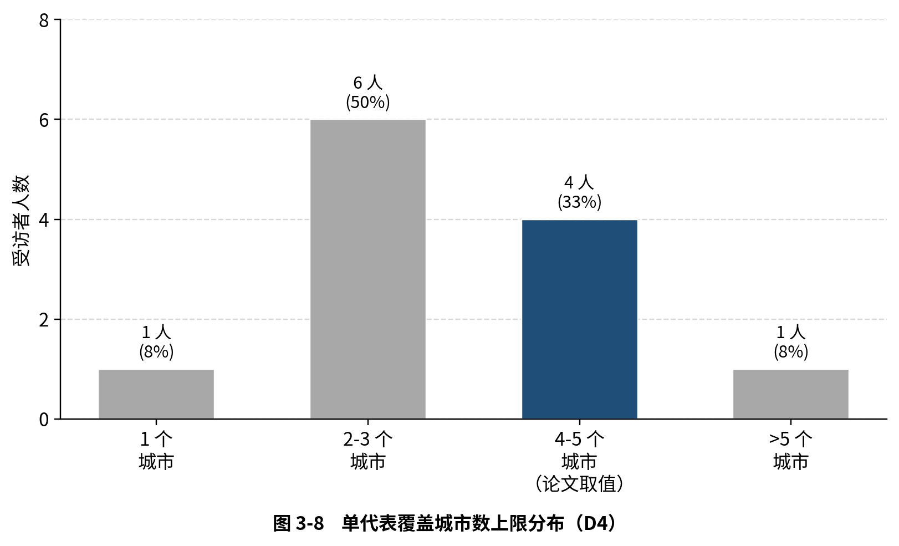
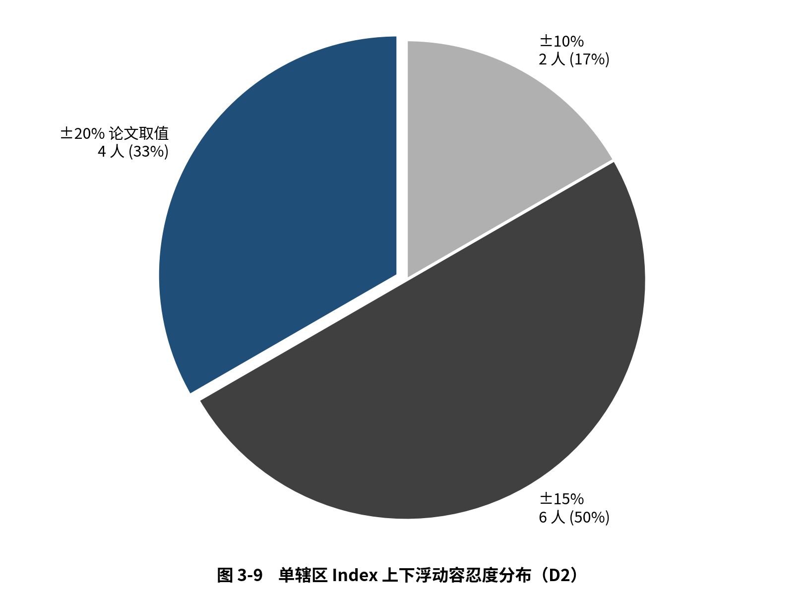
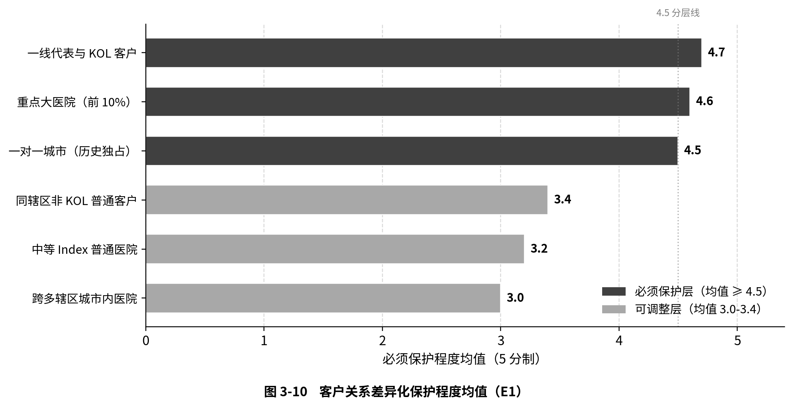

# 第一章 绪论

## 1.1 研究背景

### 1.1.1 医药行业"存量博弈"时代的宏观环境

过去十余年间，中国医药行业经历了从高速增长向结构性调整的深刻转型[@ma_xl2025]。据弗罗斯特沙利文统计，中国生物药市场空间从2019年的3120亿元预计增至2030年的13030亿元[@sun2022]，行业整体规模依然在扩大。然而总量增长的表象之下，行业的底层运行逻辑已经发生根本性变化——从过去的"增量扩张"逐步转向"存量博弈"。

图1-1呈现了2020-2025年中国医药市场全渠道（医院渠道、零售药店、DTP药店）销售额的演变轨迹[@cnpharma2025]。市场总规模从2020年的12.7万亿元逐步增至2025年的15.3万亿元，但增速曲线已经清晰显现疲态——2023年同比增长9%为近年高点，2024年同比微降1%，2025年同比持平。三年时间内增长率从两位数滑落至接近零增长，这正是行业从扩张周期切换到存量周期的直观信号。

数据来源：中康科技《2025 中国医药市场报告》[@cnpharma2025]

图1-2进一步给出未来五年的市场展望。IQVIA《中国医药市场预测（2024-2029）》显示，复合年增长率（CAGR）已下探至1.3%，同比增长率在0.3%至1.8%的低位徘徊，与过去十年7%-12%的高速期形成鲜明反差[@iqvia2025mpchina]。麦肯锡的同期研究亦指出，新药上市后的商业化窗口期被显著压缩，本土创新药企与跨国药企在新产品商业化上的博弈进入新阶段[@mckinsey2025launch]。这种由"高速增长"到"低速增长"的转变并非短期波动，而是行业进入新阶段的结构性特征。

数据来源：IQVIA Market Prognosis 2025-2029 China[@iqvia2025mpchina]

行业总量增速放缓的背后，是国家集中带量采购（Volume-Based Procurement, VBP）常态化、医保谈判机制化与医药反腐深水化三重政策压力的叠加。集采压缩了成熟仿制药的利润空间[@nhsa-vbp]，医保谈判压缩了创新药的商业化窗口期，反腐则从合规端重塑了商业模式——传统"带金销售"加速退出，学术推广成为核心[@zhang2025]。三重压力的具体影响机制将在第三章详细展开。

三重压力共同作用之下，中国医药行业呈现出一种结构性的"双向挤压"格局。外资药企因核心产品进入集采而面临战略收缩，需要以更少的人力覆盖同等甚至更大的市场；本土生物科技公司在政策红利下迅速扩张，但其内部管理职能——尤其是销售力有效性（Sales Force Effectiveness, SFE）管理——仍处于萌芽阶段，往往由一线业务人员主导资源分配，陷入"既是运动员又是裁判员"的困境。无论是收缩还是扩张，企业都迫切需要一套科学、高效的辖区分配方法论来替代传统的经验驱动模式。

### 1.1.2 制药企业精细化管理转型的迫切需求

销售辖区分配（Sales Territory Alignment）是企业SFE管理体系中的关键业务流程，其本质是一个高度复杂的资源配置与空间优化问题。张永铭（2023）在分析生物药企经营管理特点时指出，资源有效配置与精细化管理能力是企业在新形势下提升竞争力的关键抓手[@zhang_ym2023]。具体到销售辖区维度，分配的核心任务是将数千家目标医院终端合理地分配给数百名销售代表，使得每位代表的工作量与销售潜力达到相对均衡，同时兼顾地理紧凑性、客户关系连续性以及组织架构约束等多维目标。

然而，当前绝大多数制药企业的辖区分配仍采取"人力密集型"的作业模式。中央SFE团队与数百名一线销售经理深度依赖Excel进行庞杂的数据拆解，并在"自下而上"的指标分配中展开旷日持久的跨部门人工博弈与沟通拉扯。在过去医药行业高增长的"黄金时代"，企业尚能以高昂的利润掩盖这种低效带来的隐性摩擦成本。但在当前利润空间被急剧压缩的环境下，这种完全依赖人工操作、响应极度滞后且充斥着沟通内耗的传统管理模式，其所产生的人力成本与时间沉没成本已令企业不堪重负。

与此同时，制药企业的SFE部门天然拥有海量的沉淀数据——医院地理信息、医院分级、销售数据、医院潜力评估、医生专长画像等多源信息构成了一座"数据富矿"。但由于缺乏高级运筹智能算法的技术加持，中央管理团队在宏观排兵布阵时，往往只能提供颗粒度极粗的先验测算，最终沦为一线人员基于人情与经验的Excel手工博弈[@zoltners2008]。王晓玲（2024）指出，我国生物医药行业数字化转型受限于数据基础不足、复合背景人才短缺等瓶颈，转型进展相对落后[@wang2024]。这种"数据丰富、算法贫乏"的矛盾，正是制药企业精细化管理转型中亟待突破的核心瓶颈。

商业化解决方案层面，全球领先的数据与技术巨头（如IQVIA、Veeva等）曾斥巨资开发标准化SaaS系统，但在中国市场遭遇了严重的"水土不服"——业务规则的高度非标准化使标准化产品难以泛化，最终陷入定制化开发泥潭。第三章将对这一问题做深入剖析。综合来看，传统的"刚性SaaS系统"与"纯手工Excel执行"均已陷入死胡同，行业迫切需要一种轻量化、可配置、基于运筹优化算法的智能辖区分配解决方案，以填补从"数据富矿"到"智能决策"之间的技术鸿沟。这正是本研究的出发点。

## 1.2 研究意义

### 1.2.1 理论意义：填补 SFE 领域动态分配模型空白

纵观国内外关于销售辖区分配的研究，该领域的演进呈现出从"单纯数学规划"向"商业多目标启发式求解"跨越，从"通用销售"向"医药行业垂直定制"深化的显著特征。在国外，Hess和Samuels（1971）率先将线性规划应用于销售辖区划分[@hess1971]；Zoltners和Sinha（1983）提出了辖区分配必须满足的四个核心属性框架[@zoltners1983]；Skiera和Jordan（1996）通过EQUALIZER模型引入模拟退火与惩罚函数机制，解决了传统精确模型在27%测试算例中无法找到可行解的问题[@skiera1996]。然而，上述研究主要面向欧美市场的通用销售场景，其模型假设与中国医药行业的商业现实之间存在显著差距。

在国内，运筹优化算法在物流配送、供应链选址、城市网格化管理等通用领域的应用研究极为丰富，但针对医药行业特有商业逻辑的辖区分配模型的学术文献相对匮乏。现有的国内研究在处理"销售潜力均衡"、"客户关系连续性"以及"代表激励公平性"等SFE场景下的微妙商业维度时，尚未形成成熟的理论体系。

本文的理论贡献主要体现在三个方面。第一，搭建了一个融合中国医药行业特有业务规则（包括大医院共岗拆分、区县行政约束、锁定分配等）的多目标优化数学模型，弥补了通用辖区设计模型在中国医药场景中的适配缺口。第二，提出了"均衡优化—历史匹配"的两阶段求解框架，将辖区均衡性与历史延续性解耦为两个独立的优化阶段，避免了传统方法中两个目标在同一代价函数中相互妥协的问题。第三，设计了六层地理聚类算法作为模拟退火的初始解生成策略，并引入一对一城市识别和城市亲和图两项扩展机制，明显提升了启发式搜索的收敛效率与解的稳健性。

### 1.2.2 实践意义：解决企业辖区划分效率与公平难题

从实践角度看，本文的意义体现在以下三个层面。

第一，提升辖区分配的科学性与公平性。Zoltners和Lorimer（2000）的实证研究表明，仅通过算法优化辖区分配，无需增加任何额外资源，就能直接带来2%到7%的销售额提升，同时减少13.7%的差旅时间[@zoltners2000]，这一发现说明算法优化的价值远不止于行政效率。本文所搭建的算法模型依据阈值化的统一惩罚框架，将Index均衡度、地理紧凑性、容量约束等多维目标纳入到统一的代价函数中，能在数分钟内输出满足多重约束的近似最优分配方案，从根本上替代耗时数周的人工博弈过程。

第二，降低组织变革的震荡成本。在制药企业频繁的组织架构调整里——比如裁员合并、新产品上市扩编等——辖区的重新分配往往伴随着客户关系的断裂以及短期业绩的波动。本文给出的两阶段法借助Hungarian算法在第二阶段实现匿名簇与历史辖区的最优匹配，最大化客户保留率，从而有效降低了辖区调整所带来的业务震荡。

第三，为算法的商业化落地提供可行路径。本文不只停留在算法层面，还探讨了"人机协同"决策机制的建立、组织变革管理策略以及算法产品化的商业模式，为制药企业乃至更广泛的销售密集型行业提供了从算法研发到商业落地的完整参考框架。

## 1.3 研究内容与技术路线

### 1.3.1 主要研究内容

围绕"如何利用运筹优化算法实现制药企业SFE辖区的科学动态分配"这一核心问题，本文的研究内容包括以下四个方面：

（1）深入剖析医药行业销售辖区管理的现状与痛点。通过对国家集采常态化、医保谈判及反腐深化等政策背景的剖析，结合某跨国药企的真实案例，全面诊断当前辖区管理模式中存在的区域分配不公、响应滞后、数据支撑缺失等核心痛点，并据此论证引入智能算法的必要性。

（2）构建基于综合价值指数的多目标优化数学模型。针对中国医药行业的特有业务规则，设计医院综合价值指数（Index）的量化方法，建立包含Index均衡度、地理紧凑性、容量约束、区县集中度等多维目标的统一惩罚函数，并明确硬约束（锁定分配、拆分分散、城市上限）与软约束的边界。

（3）设计并实现"均衡优化—历史匹配"两阶段求解算法。其中第一阶段采用六层地理聚类生成初始分配方案，再借助模拟退火算法进行均衡性优化；第二阶段采用Hungarian算法将第一阶段产出的匿名簇映射到历史辖区编号，最大化客户保留率。两阶段的解耦设计使均衡性与历史延续性各自达到最优，构成本文的核心技术贡献。

（4）开展实证分析与商业化前景评估。依据某跨国药企的脱敏数据，在常规微调、裁员合并、组织扩张三种典型业务场景下验证算法效果，并从"人机协同"决策机制、变革管理策略、商业模式等角度探讨算法的落地路径与商业价值。

### 1.3.2 研究方法

本文采用定量分析与定性分析相结合的研究方法，主要包括以下三种：

文献研究法：系统梳理国内外销售辖区分配领域的理论演进，从经典精确算法到启发式算法再到现代 SFE 商业化落地，识别现有研究的局限性以及本文的切入点，为后续模型设计提供理论参照。

深度访谈与问卷调研法：以医药行业内 SFE 管理者与一线执行者为调研对象，采用以深度访谈为主、问卷量化验证为辅的研究方法，从业务侧收集关于辖区分配核心考量因素的判断、关键阈值的容忍带以及方案权衡的偏好。访谈用以挖掘业务判断背后的实际逻辑与少数派观点，问卷则把判断收敛为可量化的描述性统计，作为算法约束条件设计与参数取值的实证锚点。这一方法组合的研究产出（详见第三章 3.2-3.4 节）是连接文献综述与模型构建的桥梁，确保数学模型的优化目标与实际业务诉求保持一致，避免出现"模型在数学上最优但在业务上不可用"的脱节情况。

案例研究法：在算法完成开发之后，以行业内某跨国制药企业为研究对象，获取其脱敏后的医院清单、辖区配置、历史分配等业务数据，对算法输出进行 As-Is（现状人工分配）与 To-Be（算法优化分配）的对照分析，从 Index 均衡度、地理紧凑性、客户保留率等维度量化算法的改善效果，并通过关键参数（拆分阈值、退火迭代次数、惩罚权重等）的敏感性测试验证算法的稳健性。同时结合作者多年医药行业 SFE 实践经验，对算法输出方案进行业务合理性的人工核验。

### 1.3.3 论文结构与技术路线图

本论文共分为七章：

第一章，绪论。阐述研究背景、研究意义、主要研究内容与研究方法，概述论文整体结构与技术路线。

第二章，理论基础与文献综述。系统梳理SFE管理理论与销售辖区分配算法的研究演进，从经典精确算法、启发式算法到现代商业化体系融合三个阶段进行综述，分析国内相关研究现状，并指出现有研究的局限性与本文的改进思路。

第三章，制药企业 SFE 辖区管理痛点的行业调研验证。简要回顾政策环境与企业管理痛点，引入对 12 位行业从业者的深度访谈与问卷调研，从业务侧验证痛点的集体性，并把分散的诉求收敛为算法需求清单作为第四章的输入。

第四章，基于综合价值指数的智能辖区分配模型构建。本章是论文的技术核心，定义问题与模型假设，搭建综合价值指数与多目标优化模型，详细阐述两阶段求解算法的设计——含六层地理聚类、模拟退火优化以及Hungarian历史匹配。

第五章，实证分析与多场景模拟验证。依据脱敏数据开展算法效果验证，在常规微调、裁员合并、组织扩张三种典型业务场景下进行压力测试，并对关键参数进行敏感性分析。

第六章，企业内部管理的配套及算法的商业化前景评估。探讨"人机协同"决策机制、变革管理策略、数据治理保障，以及算法模型的商业价值与行业推广可行性。

第七章，结论与展望。总结主要研究结论与创新点，分析研究不足并提出未来展望。

本论文的整体结构与各章主要内容如图1-3所示。

数据来源：作者绘制

## 1.4 本章小结

本章从医药行业"存量博弈"的宏观环境切入，剖析了国家集采常态化、医保谈判深化以及反腐高压三重政策压力对制药企业销售管理模式的冲击，指出当前辖区分配中"数据丰富、算法贫乏"的核心矛盾，以及传统SaaS系统与手工Excel模式所共同陷入的双重困境。在此基础上，阐述了本文在理论层面（搭建融合中国医药业务规则的两阶段优化模型）和实践层面（提升分配科学性、降低震荡成本、探索商业化路径）的双重意义，并明确了核心研究内容、研究方法与七章论文结构。

下一章将系统梳理SFE管理理论与销售辖区分配算法的研究演进，为后续的模型构建与算法设计奠定理论基础。

# 第二章 理论基础与文献综述

## 2.1 销售力有效性（SFE）管理理论

### 2.1.1 SFE 的核心内涵与管理体系

销售力有效性（Sales Force Effectiveness, SFE）是指企业借助系统化的管理手段最大化销售团队市场产出效率与资源利用率的管理实践。Zoltners、Sinha和Lorimer（2008）将SFE定义为一个涵盖销售团队规模设计、辖区划分、人员招聘与培训、薪酬激励、目标设定以及绩效管理的完整体系[@zoltners2008]。在此体系内，各环节相互关联、彼此影响，共同决定了销售团队的整体效能。

从管理实践的演进来看，SFE经历了从"经验驱动"到"数据驱动"的范式转变。早期企业往往不清楚应该分析哪些数据，缺乏将数据转化为决策的模型与框架，直到近年来这种以数据分析为核心的管理理念才被广泛接受。ZS Associates 的研究表明，SFE管理体系的核心价值在于：通过科学的分析框架，把销售管理从"凭直觉决策"改良为"用数据驱动决策"。该公司2016年的Explorer Study发现，在医疗器械行业中，战略性地投资SFE改善项目可以带来2%至8%的销售业绩提升[@zs2016]——以一家年销售额1.5亿美元的企业为例，若在SFE项目上投入60万美元并实现4%的销售增长，其投资回报率可达500%，这一实证数据有力证明了SFE管理的商业价值。

在制药行业，SFE管理具有更为特殊的战略意义。Chressanthis和Mantrala（2016）指出，生物制药行业正在经历从传统小分子药物向大分子特药的战略转型，对销售团队的商业模式设计、数据分析能力和运营管理提出了全新要求[@chressanthis2016]。换言之，制药行业的SFE管理正在从以"提升医生处方量"为核心的战术执行层面，向以"证明药物价值与健康结局"为核心的战略资产层面演进。

### 2.1.2 销售辖区设计的基本原则

销售辖区设计（Sales Territory Design/Alignment）是 SFE 管理体系中的关键环节，其核心任务是把客户或地理区域分配给销售代表，使每位代表的工作量与销售潜力达到相对均衡。Zoltners 和 Sinha（1983）在其开创性论文中提出了辖区分配必须满足的四个核心属性[@zoltners1983]：均衡性（Balance）要求工作量公平，紧凑性（Compactness）要求地理紧凑以减少差旅，连续性（Contiguity）要求空间相互连接避免飞地，完整性（Integrity）要求行政单元不被拆分。Zoltners 和 Lorimer（2000）进一步以实证数据量化了辖区设计的商业价值——仅靠优化辖区分配就能直接带来 2% 至 7% 的销售额提升以及 13.7% 的差旅时间下降[@zoltners2000]，这意味着辖区设计并非简单的行政划分工作，而是一个具有突出经济价值的优化问题。

中国制药行业的实际场景下，辖区设计还需兼顾若干行业特有约束：大型三甲医院的销售潜力远超普通医院，需要多代表"共岗"覆盖，由此产生"大医院拆分"需求；客户关系的连续性使得"历史延续性"成为辖区调整中不可忽视的维度；企业组织架构（大区/省区层级）以及"锁定分配"等业务规则进一步增加了问题的复杂性。这些行业特有约束让中国医药行业的辖区设计问题远比通用销售场景更为复杂，也为本文的模型构建提供了明确的业务需求导向。

## 2.2 销售辖区分配算法的研究演进

### 2.2.1 国外算法演进：从精确算法到现代商业化融合

销售辖区划分问题在运筹学中属于带约束的多目标组合优化问题，国外研究的演进大致经历了精确算法、启发式算法与现代商业化融合三个阶段。

学术研究可追溯至 20 世纪 60 年代末。Hess 和 Samuels（1971）率先将线性规划应用于销售辖区划分，将问题建模为集合划分问题（Set Partitioning Problem），奠定了辖区划分问题的数学基础[@hess1971]。Zoltners 和 Sinha（1983）在此基础上提出了更为完整的整数规划模型，将均衡性、紧凑性、连续性和完整性四个核心属性形式化为约束或目标函数组成部分，首次系统定义了多维目标结构[@zoltners1983]。然而精确算法在实际应用中遭遇了计算瓶颈——辖区划分问题本质是 NP-hard 问题，当基本地理单元数量达到数百甚至数千时，精确求解的计算时间呈指数级增长，Kalcsics、Nickel 和 Schröder（2005）的综述对此做了系统证明，并将辖区设计的应用场景归纳为政治选区划分、销售辖区设计和服务区域划分三大类[@kalcsics2005]——这直接推动了启发式算法的引入。

启发式阶段以 Skiera 和 Jordan（1996）的 EQUALIZER 模型为标志[@skiera1996]，其核心创新有两点：一是引入惩罚函数机制将硬约束转化为代价函数中的惩罚项，把带约束多目标问题转化为无约束单目标最小化问题；二是采用模拟退火作为求解引擎，通过随机扰动与概率接受跳出局部最优。实验显示精确规划在 27% 的算例中无法找到可行解，而 EQUALIZER 在所有算例中均能找到满足约束的方案，且解的质量与精确解相当——这一结果有力证明了启发式方法在复杂约束场景中的优越性。EQUALIZER 对本文具有直接的启发意义，本文的代价函数设计——基于阈值的统一惩罚框架——正是对其惩罚函数思想的继承与发展。

进入 21 世纪，研究重心从"纯算法优化"转向"算法与商业体系的融合"。ZS Associates 在《The Power of Sales Analytics》中指出，成功的辖区设计还需兼顾数据治理、业务规则引擎以及人机协同——最终的可用方案是"算法建议+人工判断"的融合产物[@zoltners2014]。两阶段方法的思想渊源也在这一阶段逐渐清晰：罗军等（2022）在民航机场地面服务人力资源优化中提出"班次设计→优化排班"两阶段方案，使员工工时均衡性提升 48.5%[@luo2022]，其方法论与本文的"均衡优化—历史匹配"框架高度一致——通过两个独立阶段各自追求最优目标，避免了单一优化中多目标相互妥协的问题。

### 2.2.2 国内运筹算法应用与医药 SFE 研究空白

国内学术界在运筹优化算法的应用研究方面成果丰富，尤其在物流配送、生产调度、人力资源排班等通用领域积累了大量实践经验。尤佳等（2026）通过将协同优化问题归约至经典装箱问题严格证明了 NP-hard 性质，其"业务约束→必要性条件→启发式规则"的研究范式为本文"业务规则到算法约束"的转化过程提供了参考[@you2026]；杨磊（2012）对遗传算法在运筹问题中应用的综述则为本文选择求解算法提供了比较分析的基础——本文最终选择模拟退火而非遗传算法，主要考量在于模拟退火的邻域搜索机制更适合"局部微调"的辖区调整操作（Move 与 Swap），而遗传算法的交叉算子在保持辖区连续性方面存在编码困难[@yang2012]。在元启发式算法的混合策略层面，马傲冬等（2026）提出的遗传-模拟退火混合算法用于求解一类生产计划与调度集成优化问题，验证了"全局搜索+局部精修"两类机制结合的有效性[@ma2026]；这种"两类机制有机结合"的设计理念，与本文"六层聚类生成初始解 + 模拟退火迭代优化 + Hungarian 一一映射"的三阶段框架在方法论上同源。

聚类与启发式算法的组合在选址类运筹问题中也有丰富积累。李怡萱（2026）针对农产品直播电商产地仓选址问题，融合 K-means 聚类与遗传算法，实现了从聚类生成候选解到启发式优化的完整链路[@li2026]——这一思路与本文"六层地理聚类生成初始分配 + 模拟退火优化均衡性"的两阶段架构在结构上高度同构，是国内最直接的方法论对照；万莉莉等（2026）基于模糊最大覆盖模型的无人机应急配送中心选址研究，则展示了带有模糊约束的多目标选址问题的建模思路[@wan2026]，对本文软约束设计具有借鉴意义；田君豪等（2026）提出的基于地理自编码与跨域迁移的公交出行需求分层聚类方法，为复杂地理空间数据的多层次聚类提供了新的视角[@tian2026]。在行业语境层面，徐蓉（2023）从制药企业人力资源数字化创新视角[@xu2023]、陈兆兆（2024）从集采趋势下的成本控制策略[@chen2024]，均指出销售人力资源配置的精细化是企业精细化管理转型的重要抓手。

但在医药行业 SFE 领域——特别是销售辖区分配问题——的国内学术研究却极为匮乏。对中国知网（CNKI）以"销售辖区""辖区分配""Territory Alignment"等关键词系统检索所得的直接相关文献数量极少，且多为行业报告或管理咨询类文章，缺乏严格的数学建模和算法设计。研究空白的形成有其深层原因：需求端来看，中国医药行业的 SFE 管理实践起步较晚，多数企业的辖区分配仍处于"手工 Excel"阶段，未产生对算法优化的强烈拉动；供给端来看，辖区分配问题涉及运筹学、地理信息科学和医药商业管理的交叉知识，国内具备这种跨学科研究能力的团队相对稀缺；再加上辖区分配的数据具有高度的企业专属性和商业敏感性，学术研究者难以获取真实业务数据用于实证分析。值得一提的是，国外的辖区划分研究虽然在理论和方法上较为成熟，但其模型假设与中国医药行业的商业现实之间存在突出差距——例如 EQUALIZER 模型假设基本地理单元不可拆分、Kalcsics 等的统一框架未考虑中国特有的省-市-区县三级行政约束，都说明在中国医药 SFE 辖区分配这一特定领域，存在一个明确的研究空白。

## 2.3 现有研究的局限性与本研究切入点

综合上述文献综述，可从三个维度归纳现有研究的局限性。第一，模型假设与中国医药行业现实脱节——国外经典模型（Hess-Samuels、Zoltners-Sinha、EQUALIZER）均依据欧美通用销售场景设计，其核心假设（基本地理单元不可拆分、辖区数量固定、约束相对简单）与中国医药行业实际需求存在突出差距，"大医院共岗拆分""省-市-区县三级行政约束""锁定分配"等中国特有规则在现有模型中缺乏对应表达。第二，均衡性与历史延续性的目标冲突未得到有效解决——现有研究要么忽略历史延续性，要么将其作为软约束混入代价函数，后者会让两个目标在优化过程中相互妥协，均无法各自达到最优。第三，算法研究与商业落地之间存在鸿沟——学术研究侧重算法性能的理论分析与基准测试，而企业实践还涉及数据治理、业务规则配置、人机协同决策、组织变革管理等非算法维度，现有文献对这些维度的讨论相对薄弱。表 2-1 对本章综述的主要文献做了系统对比。

**表 2-1 辖区划分主要文献对比**

| 文献 | 方法 | 目标 | 历史延续性 | 单元拆分 | 行业场景 |
|------|------|------|------------|----------|----------|
| Hess & Samuels (1971) | 线性规划 | 均衡性 | 否 | 否 | 通用销售 |
| Zoltners & Sinha (1983) | 整数规划 | 均衡+紧凑+连续+完整 | 否 | 否 | 通用销售 |
| Skiera & Jordan (1996) | 模拟退火+惩罚函数 | 均衡性 | 否 | 否 | 通用销售 |
| Kalcsics et al. (2005) | 综述框架 | 多目标 | 部分讨论 | 否 | 通用框架 |
| 罗军等 (2022) | 两阶段优化 | 均衡+公平 | 否 | 否 | 民航排班 |
| 尤佳等 (2026) | 变邻域搜索 | 成本+均衡 | 否 | 否 | 电网配送 |
| 本研究 | 六层聚类+SA+Hungarian | 均衡+紧凑+历史延续 | 是（第二阶段） | 是（虚拟拆分） | 中国医药 |

针对上述局限性，本文提出以下改进思路：在 Skiera 和 Jordan（1996）惩罚函数框架的基础上引入大医院虚拟拆分机制、省-市-区县三级行政约束、锁定分配硬约束等中国医药行业特有业务规则，搭建更贴合实际的多目标优化模型；借鉴罗军等（2022）的两阶段思想，将均衡性优化与历史延续性保障解耦为两个独立阶段——第一阶段通过六层地理聚类与模拟退火纯优化均衡性（不含历史惩罚），第二阶段通过 Hungarian 算法将匿名簇映射到历史辖区编号，使两个目标各自达到最优。除算法研究本身之外，本文还进一步探讨"人机协同"决策机制、组织变革管理策略以及算法产品化的商业模式，弥合学术研究与商业实践之间的鸿沟。

## 2.4 本章小结

本章从SFE管理理论与辖区划分算法两个维度进行了系统的文献综述：梳理了SFE的核心内涵、管理体系演进以及辖区设计的四个基本原则；按照"经典精确算法→启发式算法与软约束引入→现代商业化体系融合"的三阶段演进脉络，剖析了 Skiera 和 Jordan 的 EQUALIZER 模型、Kalcsics 等的统一辖区设计框架以及罗军等的两阶段优化思想对本文的启发。在国内研究现状方面，指出了运筹算法在物流配送、人力调度等领域的丰富应用与医药行业SFE领域研究空白之间的明显反差。

通过系统的文献对比，本章识别了现有研究的三个核心局限——模型假设与中国医药行业脱节、均衡性与历史延续性的目标冲突未有效解决、算法研究与商业落地之间存在鸿沟——并据此提出了本文的改进思路，为下一章的现状诊断和第四章的模型构建奠定了理论基础。

# 第三章 制药企业 SFE 辖区管理痛点的行业调研验证

第一章和第二章分别从宏观背景与理论文献两个维度，论证了运筹优化算法在制药企业辖区分配中的研究价值与理论基础。但理论铺垫与文献综述毕竟来自既有研究——这套思路是否真正能服务于当前中国制药企业 SFE 的现实诉求，还有待业务侧的实证验证。本章先以简练笔触回顾政策环境与企业管理层面的痛点表征，然后引入一轮针对行业从业者的深度访谈与问卷调研，把分散的理论假设、政策压力与企业观察凝练为一份可量化的算法需求清单，作为第四章模型构建的业务输入。

## 3.1 行业政策与企业管理痛点的简要回顾

### 3.1.1 政策三重压力下的辖区分配诉求质变

近年来，国家集采常态化、医保谈判机制化与医药反腐深水化三项重大政策变量从不同维度重塑了制药企业的商业模式与组织架构。集采已推进至第十一批，覆盖品种超过 430 个[@nhsa-vbp]，每一轮新增品种都意味着相应产品线销售团队规模需重新评估——某成熟产品线进入集采后销售代表编制可由约 300 缩减至不足 200，缩减幅度超过 30%（图 3-1）。医保谈判降幅平均 60%[@nhsa-nrdl2024]，创新药商业化窗口被压缩到一年以内，要求辖区分配在数十至上百名新增代表的扩张场景下快速响应[@mckinsey2025launch]。医药反腐则从根本上重塑了销售模式：HCP 互动总量较 2019 年下降约 26%，面对面拜访占比从 91% 跌至 60%（图 3-2）[@iqvia2025mpchina]，让代表的"接触能力"被系统性削弱[@zhang2025]，工作负荷必须以更精确、可量化的方式衡量与分配。2026 年《医药代表管理办法》的施行进一步把辖区分配从单纯的业务问题上升为兼具合规属性的管理命题[@mr2026]。

数据来源：基于国家医疗保障局历年集采公告整理[@nhsa-vbp]

数据来源：IQVIA Market Prognosis 2025-2029 China[@iqvia2025mpchina]

三重政策压力叠加之下，制药企业的辖区管理面临前所未有的挑战：组织架构调整频率从年度变为季度甚至月度，分配维度从单一销量变为多维综合价值，精度要求从"大致均衡"变为"精确均衡"。这些变化从根本上超越了传统手工分配模式的能力边界，为算法化工具的引入创造了迫切需求。

### 3.1.2 现行管理模式与典型企业的写照

实际操作层面，制药企业的辖区管理目前主要依赖两种模式。第一种是 Excel 主导的手工分配：中央 SFE 团队搭建初始框架，再下发至大区、地区经理博弈调整，整个流程通常 4-8 周；最终方案受人为干预较深，常呈现"强势经理多拿资源、弱势经理被动接受"的格局。第二种是国际咨询公司或商业 SaaS（IQVIA OCE、Veeva Align 等）的外部方案：咨询公司一次性交付静态报告，企业组织一动即失效；SaaS 系统则因不同企业、不同产品线、不同省份的业务规则差异巨大，定制化开发成本居高，单客户年度订阅费用即可达数十万美元，仍需额外定制开发，最终多个项目陷入"用不好、扔不掉"的尴尬。

业内一家在华运营超过二十年、销售代表编制约 1,500 人的跨国药企的情况能侧面印证上述局面。该企业过去六年销售额从 115 亿元增至 173 亿元，累计增长接近 50%；然而一线销售人员数 2020 年为 2,578 人、2025 年仅 2,383 人，整体反而减少 7.5%（图 3-3）。每位代表所需承载的业务体量从 0.45 亿元/人提升到 0.73 亿元/人，工作负荷增加 60% 以上——这一变化的背后，是辖区方案不得不在更频繁的调整、更复杂的约束下持续适配业务变化。仅 2023-2024 年间，该企业就经历了集采产品线缩编、创新药新建团队、多治疗领域合并以及多省份的局部调整等多轮重大变更；据其内部统计，每次辖区调整后受影响区域 3-6 个月内业绩平均下降 8%-15%，"震荡成本"已成为管理层高度关注的问题。

数据来源：作者基于业内某跨国药企开题答辩内部数据整理，已经过开题委员会审议

### 3.1.3 痛点本质与算法化的研究假设

把政策环境与管理实践放在一起观察，当前辖区分配的痛点可以归纳为三组同源矛盾：业务复杂性与管理工具简陋性的错配；调整频率加快与传统流程响应滞后的错配；商业化标准方案的"普适性"与中国特色场景"差异性"的错配。这些痛点共同指向一个工具层面的研究假设——以两阶段运筹优化算法（六层地理聚类 + 模拟退火 + Hungarian 匹配）为代表的智能分配工具，理论上能够在数分钟内处理数千家医院、数百名代表、数十种约束的多目标优化任务，并支持快速场景模拟与人机协同决策。然而该假设是否成立，不能仅靠笔者作为业内观察者的判断，更需要业务侧的集体验证。下文 3.2 节将介绍为此设计的一轮深度访谈与问卷调研。

## 3.2 行业从业者的深度访谈与问卷调研

### 3.2.1 研究动机与方法选择

第二章的文献综述揭示，国外学界在销售辖区分配上已积累了从精确算法到现代商业化的系统研究，国内运筹算法在医药 SFE 领域则仍存在结构性研究空白；与此同时，3.1 节呈现的政策三重压力与典型企业写照表明，中国制药企业对算法化辖区管理的现实诉求正在加速积累。本研究的核心论点——两阶段运筹算法能够更好地服务于当下中国制药企业 SFE 的辖区分配场景——能否成立，需要从业务侧的集体判断中获得回应。基于此动机，作者在算法设计阶段同步开展了一轮针对行业从业者的实证调研。

考虑到具备 SFE 系统认知的从业者总量有限，且调研内容兼具量化判断与定性挖掘的双重性质，本研究采用以**深度访谈为主、问卷量化验证为辅**的研究方法。深度访谈用以挖掘判断背后的业务逻辑与少数派观点（例如"为什么大医院要被多人共同覆盖"在管理层面的实际挑战）；问卷量化则用以收敛业务侧对关键阈值、权重、优先级的具体判断，作为算法参数取值的实证锚点。这一方法组合在管理学小样本研究中较为常见——例如《S 公司技能型人才的激励优化研究》采用了 16 名访谈对象，《N 公司项目人才管理研究》采用了 8 名访谈对象，本研究的 12 人样本与之相当。

### 3.2.2 受访者背景与样本特征

调研对象覆盖 SFE 管理层、销售管理者（区域经理、省经理、大区经理）以及 SFE 分析师三类岗位，均为具备辖区分配实务经验的从业者。受访者由作者通过行业人脉招募，每位受访者先完成 14 道封闭式问卷（约 10 分钟），再接受 30-45 分钟的开放式访谈。问卷与访谈在同一轮约访中完成，共回收 12 份有效问卷与 12 位受访者的访谈记录。

样本规模 N = 12，背景分布如表 3-1 与图 3-4 所示。

**表 3-1 受访者背景分布**

| 维度 | 分布 |
|------|------|
| 角色 | SFE 管理层 3 名 / 销售管理者 4 名 / SFE 分析师 5 名 |
| 工作年限 | <3 年 1 名 / 3-5 年 4 名 / 5-10 年 5 名 / >10 年 2 名 |
| 企业类型 | 跨国制药企业 6 名 / 国内大型制药企业 4 名 / 国内中小型制药企业 2 名 |
| 组织销售人员规模 | 200 人以下 2 名 / 200-500 人 3 名 / 500-1000 人 3 名 / 1000 人以上 4 名 |

数据来源：作者整理调研问卷 A1-A4 题。

样本覆盖管理层与分析师两类视角、跨国与本土两类企业，从业年限以 5-10 年的中坚岗位为主，所在组织覆盖从中型药企到大型跨国企业的多种规模。受样本规模所限，本调研定位为辅助性的探索性研究，结果以描述性统计形式呈现（均值、入选率、频次分布），不进行推断性统计检验；原始问卷数据已脱敏处理，受访者身份不予披露。完整问卷题本与访谈大纲见附录 A。

## 3.3 调研结果分析

### 3.3.1 综合价值指数 Index 的构成共识

调研第一组题目（B1+B2）聚焦"Index 应由哪些维度构成、各占多少权重"。B1 多选题给出四个候选维度（销量、潜力、HCP 数量、医院市场份额）外加"其他"开放项，结果显示销量与市场潜力是受访者公认的核心维度，入选率分别为 92% 与 83%；HCP 数量与医院市场份额作为补充维度入选率分别为 58% 与 50%（图 3-5 上层）。"其他"开放项偶有受访者填写"医院等级"或"重点客户分层"，但未形成集中诉求。

数据来源：作者整理调研问卷 B1-B2 题。

B2 固定和权重题在被勾选条件下进一步收敛了各维度的相对重要性：销量平均赋权 52%、潜力 32%、HCP 数量 10%、医院市场份额 5%、其他 1%（图 3-5 下层）。两道题共同支撑了一个明确结论——业务侧公认 Index 应以销量与潜力为核心二维结构，二者合计占比 84%；HCP 数量与市场份额作为补充信号，可在数据可得性允许时纳入潜力子指标的计算。这一调研结论与第四章 4.2 节的 Index 设计高度一致：本研究构建的 Index 采用销量 60% + 潜力 40% 的简化结构，比例与调研均值 52:32 在四舍五入到 60:40 整数刻度上吻合；HCP 数量与医院市场份额则通过 IQVIA 流向数据与标杆指标系数折算到潜力子指标。

### 3.3.2 辖区评价的核心考量因素

调研第二组题目（C1）让受访者对辖区分配评价的七个维度逐项打分（5 分制 Likert）。结果按均值降序为：锁定客户被尊重 4.6、客户关系延续性 4.5、Index 均衡性 4.2、单代表工作量上限 4.1、地理紧凑性 4.0、含重点大医院 3.8、不跨过多城市 3.7（图 3-6）。

数据来源：作者整理调研问卷 C1 题。

七个维度中前五项均值≥4.0，构成辖区评价的核心维度。其中"锁定客户被尊重"以 4.6 居首，反映业务侧对特定关键客户必须留在指定辖区的"刚性"要求；"客户关系延续性"以 4.5 紧随其后，揭示历史关系不可破坏是业务侧普遍接受的底线。Index 均衡性、单代表工作量、地理紧凑性三项均值 4.0-4.2，是相互制衡的软性目标——过分追求其中之一会牺牲另外两项。这一打分结构对第四章模型构建提出了具体方向：锁定客户作为硬约束独立处理；客户关系延续性交由第二阶段 Hungarian 算法独立保障；Index、容量、地理、城市四项则进入第一阶段代价函数的软约束体系，分别采用二次或线性惩罚形式（详见 4.3 节）。

### 3.3.3 关键阈值的容忍带

调研第三组题目（D1+D2+D4）收敛了大医院拆分阈值、Index 偏差容忍带、单代表覆盖城市数三个关键参数的业务取值。

**大医院虚拟拆分阈值（D1）。** 50% 受访者认为大医院应在 Index 超出辖区平均值 1.5 倍时即触发拆分，25% 倾向于更保守的 2 倍，17% 倾向于更激进的 1.2 倍（图 3-7）。多数派 1.5 倍取值与本研究第四章 4.2.3 节的设定一致；少数派的分歧主要源于对"大医院共岗管理"的实操担忧——访谈 I5 反馈中，多位受访者提到绩效分摊与责任边界界定的复杂度，认为应以保守阈值降低拆分频次。

数据来源：作者整理调研问卷 D1 题。

**单代表覆盖城市数上限（D4）。** 50% 受访者选择 2-3 个城市，33% 选择 4-5 个，仅 8% 接受 5 个以上的跨大区覆盖（图 3-8）。累计 83% 的受访者将上限收敛在 5 个城市以内，体现了一线代表对差旅半径与拜访频次平衡的实际感受——超出 5 个城市意味着每个城市的有效覆盖时间被严重摊薄。本研究第四章 4.3.3 节的城市分散度软约束阈值 c_max = 5，与多数派意见一致；保留软约束弹性以容纳少数跨大区情境。

数据来源：作者整理调研问卷 D4 题。

**单辖区 Index 上下浮动容忍带（D2）。** 50% 受访者认为 ±15% 的辖区 Index 偏差可接受，33% 接受 ±20%，17% 仅接受 ±10%（图 3-9）。累计 83% 的受访者将容忍带集中在 ±10% 至 ±20% 区间，本研究第四章 4.3.3 节采用的 ±20% 阈值（即 200 个 Index 点）位于多数派的容忍上界——这一选择在保留充分均衡优化空间的同时，避免对算法施加过紧的硬性约束。

数据来源：作者整理调研问卷 D2 题。

### 3.3.4 算法接受度与人机协同的偏好

调研最后一组题目（G1，三组成对比较）测量受访者在算法决策上的方案偏好。结果如图 3-10 所示：

- 第一组（Index 完美均衡 vs 客户保留率 92%）：67% 选择保留率优先；
- 第二组（地理跨度大 vs 紧凑度优先）：58% 选择紧凑优先；
- 第三组（算法黑盒 vs 算法 + 人工调整）：83% 选择人机协同。

数据来源：作者整理调研问卷 G1 题。

前两组结果说明业务侧不接受将 Index 均衡作为压倒性目标而牺牲客户关系或地理紧凑度——单阶段方法把所有目标揉进一个代价函数后，均衡性容易在权重失衡时压倒其他目标，这正是受访者所抵触的情形。本研究第四章 4.4 节采用的两阶段解耦设计——第一阶段纯粹优化均衡与紧凑、第二阶段独立优化客户关系延续——恰好规避了这一陷阱。

第三组 83% 偏好人机协同的结果有更深远的含义：访谈中多位受访者反复强调"算法工具必须可解释、可干预，单纯黑盒输出全局最优在业务上是不可接受的"。这一诉求为第六章商业化设计中"人机协同决策机制"提供了直接的业务背书——算法负责大规模数据计算与多目标优化，业务管理者基于算法输出进行微调与最终决策，把无法量化的业务经验和人际因素纳入考量。

## 3.4 调研结论与算法需求清单

把 3.3 节的四组分析结果汇总，可以从业务侧凝练出一份明确的算法需求清单（表 3-2），每条需求都对应到第四章模型构建的一个具体设计：

**表 3-2 业务需求清单与算法设计映射**

| 业务需求 | 调研依据（题号 / 关键数据） | 第四章对应设计 |
|----------|---------------------------|----------------|
| Index 应以销量与潜力为核心二维结构 | B1（92% / 83% 入选）+ B2（52% / 32% 赋权） | 4.2.2 节 Index 公式：销量 60% + 潜力 40% |
| 客户关系延续性是核心评价维度，应与均衡性独立处理 | C1（客户关系延续性均值 4.5，仅次于锁定客户 4.6） | 4.4 节两阶段解耦：第二阶段 Hungarian 独立保障历史延续 |
| 大医院应在 Index 超出 1.5 倍时被多人共同覆盖 | D1（50% 选 1.5x） | 4.2.3 节虚拟拆分阈值 1.5 倍 |
| 单辖区 Index 偏差容忍带 ±10%~±20% | D2（83% 集中在该区间） | 4.3.3 节 Index 偏差软约束阈值 ±20%（200 点） |
| 单代表覆盖城市数 ≤5 | D4（83% 收敛 ≤5 城市） | 4.3.3 节城市分散度软约束 c_max = 5 |
| 均衡与延续不应在同一代价函数中相互妥协 | G1 第一、二组（67% / 58% 偏好保留率与紧凑） | 4.4 节两阶段解耦设计 |
| 算法应支持人工干预与可解释输出 | G1 第三组（83% 偏好人机协同）+ 访谈 I4 | 第六章 6.1 节人机协同决策机制 |
| 收缩与扩张场景的优先级应可差异化配置 | F1+F2（多数派分别偏好客户保留率与高潜力覆盖） | 第五章 5.3 节场景化压力测试参数 |

这份需求清单的价值在于：它把分散在政策环境、企业写照、文献综述中的零散观察，凝练为业务侧可验证、可量化的具体诉求，并明确指向算法层面的具体设计。第四章将基于这份清单系统化地构建两阶段优化模型，每一个数值阈值与权重设定都能从清单中追溯到对应的业务依据。

## 3.5 本章小结

本章先以简练笔触回顾了制药企业 SFE 辖区管理面对的政策三重压力（集采常态化、医保谈判机制化、医药反腐深水化）以及现行手工与商业化 SaaS 两条路径的局限性，确认这些痛点不是个别企业的孤立问题；继而通过一轮针对 12 位行业从业者的深度访谈与问卷调研，从业务侧验证了痛点的集体性，并把分散的诉求收敛为一份明确的算法需求清单。需求清单的每一条都对应着第四章模型的一个具体设计——从 Index 二维构成、关键阈值取值，到两阶段均衡—延续解耦、人机协同接口。下一章将基于这份需求清单，从数学建模和算法设计的角度系统化构建两阶段智能辖区分配模型。

# 第四章 基于综合价值指数的智能辖区分配模型构建

第三章的分析揭示了制药企业辖区管理在政策压力与业务复杂性双重作用下所面临的核心矛盾，本章将在此基础上，从数学建模的角度对辖区动态分配问题进行形式化定义，并给出一套完整的求解方案。全章遵循"问题定义→数据工程→预处理→模型构建→算法设计"的逻辑链条，逐步展开模型的各个组成部分。

## 4.1 问题定义与模型假设

### 4.1.1 辖区动态分配的业务场景定义

从业务视角来看，辖区动态分配问题可以被抽象为一个带约束的多目标组合优化问题。其输入包括四个要素：一是医院集合 $H = \{h_1, h_2, \ldots, h_N\}$，每家医院附带地理坐标、行政区划归属（省、市、区县）以及综合价值指数（Index）；二是目标辖区数量 $K$，通常等于销售代表的编制人数；三是历史分配方案，记录了上一周期中每家医院与辖区编号之间的对应关系；四是约束配置，涵盖锁定分配、城市上限、容量限制等业务规则。算法的输出则是一个从医院到辖区的映射关系 $\pi: H \rightarrow \{1, 2, \ldots, K\}$，需要特别说明的是，当某家医院的 Index 值过大时，该医院会被虚拟拆分为多个份额，各份额可以分配给不同的辖区，也就是说一家大型医院可以由多位销售代表共同覆盖。

在实际业务中，触发辖区重新分配的场景大致可以归纳为三类。第一类是常规年度微调，辖区数量基本不变，仅需根据最新的业务数据对个别医院的归属进行优化；第二类是战略收缩下的裁员合并，辖区数量减少，原有代表的客户需要被重新分配给留任的代表；第三类是新产品上市或市场扩张带来的组织扩编，辖区数量增加，需要从现有辖区中拆分出新的覆盖区域。这三种场景对算法的要求各有侧重——微调场景强调历史延续性，合并场景强调均衡性重构，扩张场景则需要在保持现有格局基本稳定的前提下合理切割新辖区。

本文所定义的"动态"并非指算法在运行过程中实时调整分配方案，而是指当外部约束条件发生变化（例如辖区数量调整、锁定医院变更、权重参数修改）时，算法能够在数分钟内快速响应并生成一套全新的、满足所有约束的分配方案，而非对旧方案进行局部修补。这种"约束驱动的快速重算"能力，正是传统手工模式和静态咨询方案所不具备的。

### 4.1.2 模型基本假设与边界条件

为使问题在数学上可处理，本模型做出以下基本假设：

假设一，每家医院至少属于一个辖区。当医院的 Index 值超过拆分阈值时，该医院被虚拟拆分为多个等额份额，各份额可分配给不同辖区，从而实现一家医院由多位代表共同覆盖的业务需求。假设二，每个辖区至少包含一家医院或虚拟份额，即不允许出现空辖区——这一约束的业务含义是每位在编代表都必须有明确的工作范围。假设三，医院的综合价值指数（Index）由外部数据系统计算并输入，算法本身不干预 Index 的生成过程，仅将其作为均衡性优化的核心度量。假设四，所有医院的地理坐标（经纬度）已知且足够准确，能够支撑距离计算和地理紧凑性评估。假设五，锁定约束的优先级最高，被锁定的医院在任何情况下都不得被移出其指定辖区，这一设计反映了业务中"关键客户关系不可中断"的刚性需求。

在边界条件方面，模型按省份独立求解，省与省之间的医院不会被分配到同一辖区。这一设定既符合中国医药行业以省为单位进行销售管理的惯例，也大幅降低了问题的规模——将一个全国性的大规模优化问题分解为若干个省级子问题，每个子问题的医院数量通常在几十到几百家之间，计算复杂度处于可控范围内。

### 4.1.3 符号定义与数学记号

为便于后续章节的公式推导和算法描述，表 4-1 汇总了本章使用的主要数学符号及其含义。

**表 4-1 主要符号定义**

| 类别 | 符号 | 含义 |
|------|------|------|
| 集合 | H = {h₁, …, hₙ} | 医院集合，N 为医院总数 |
| 参数 | K | 目标辖区数量（等于销售代表编制数） |
| 参数 | (xᵢ, yᵢ) | 医院 hᵢ 的地理坐标（经度、纬度） |
| 参数 | idxᵢ | 医院 hᵢ 的综合价值指数 |
| 参数 | idx\* = 1000 | 理想辖区 Index 值（由公式 4-4 保证） |
| 函数 | π(i) | 分配函数，表示医院 hᵢ 所属辖区编号 |
| 集合 | Tₖ = {hᵢ \| π(i) = k} | 辖区 k 包含的医院集合 |
| 指标 | Iₖ = Σ idxᵢ (hᵢ ∈ Tₖ) | 辖区 k 的 Index 总和 |
| 函数 | C(π) | 分配方案 π 的总代价（越小越优） |
| 函数 | d(i, j) | 医院 hᵢ 与 hⱼ 的 Haversine 距离（千米） |
| 参数 | wⱼ | 第 j 个软约束的惩罚权重 |
| 参数 | θⱼ | 第 j 个软约束的阈值 |

上述符号中，Haversine 距离 $d(i, j)$ 是球面两点间的大圆距离，其计算公式为：

$$d(i,j) = 2R \cdot \arcsin\sqrt{\sin^2\frac{\Delta\varphi}{2} + \cos\varphi_i \cos\varphi_j \sin^2\frac{\Delta\lambda}{2}} \qquad\text{(4-1)}$$

其中 $R = 6371$ 千米为地球平均半径，$\varphi$ 和 $\lambda$ 分别表示纬度和经度（弧度制），$\Delta\varphi = \varphi_j - \varphi_i$，$\Delta\lambda = \lambda_j - \lambda_i$。选择 Haversine 公式而非欧氏距离，是因为在中国这样跨越较大经纬度范围的地理区域内，平面近似会引入不可忽视的误差，尤其是在东西方向上。

## 4.2 数据特征工程与综合价值指数（Index）构建

### 4.2.1 多源数据清洗与整合

辖区分配算法的输入数据来源于三个相互独立的数据系统，需要经过清洗、校验和关联之后才能进入优化流程。

第一类是医院主数据（HCO Master Data），包含每家医院的唯一编码（inscode）、名称、等级、详细地址、所属省市区县以及经纬度坐标。这类数据通常由企业的数据治理部门维护，更新频率较低，但数据质量直接影响地理聚类和距离计算的准确性。在清洗环节，需要重点处理以下问题：坐标缺失或明显异常（如经纬度为零或落在国境之外）的记录需要通过地址解析服务补全；同一家医院因名称变更或编码调整而产生的重复记录需要合并；行政区划字段的不一致（如"浦东新区"与"浦东"）需要统一为标准名称。

第二类是业务数据（Business Data），包含每家医院在特定产品组下的销售额、销量数据、市场潜力评分等业务指标。这些数据来自销售管理系统或第三方数据供应商（如 IQVIA），更新频率通常为季度或月度。业务数据通过 inscode 与主数据进行关联（JOIN），无法匹配的记录会被跳过并记录日志，以便后续排查。

第三类是历史分配数据（Historical Assignment），记录了上一周期中每家医院所属的辖区编号（trtyCode）及覆盖比例（portion）。对于被多位代表共同覆盖的大医院，历史数据中会出现同一 inscode 对应多条记录、每条记录的 portion 值小于 1 的情况。这类数据在第二阶段的 Hungarian 匹配中发挥关键作用。

在数据脱敏方面，本研究使用的所有医院名称、代表姓名和辖区编号均已做匿名化处理，业务指标经过线性变换以保护商业机密，但变换后的数据保持了原始数据的分布特征和相对排序，不影响算法效果的验证。

### 4.2.2 基于省内份额归一化的医院价值量化模型

综合价值指数（Index）是整个辖区分配模型的核心度量。在制药企业的实际业务中，衡量一家医院价值的维度主要有两个：销售额反映当前的业务贡献，市场潜力反映未来的增长空间。如果只看销售额，高潜力但目前销量低的医院会被低估，代表可能错过增长机会；如果只看潜力，已经贡献大量销量的医院会被忽视，代表的实际工作量无法体现。Index 的设计目的，就是将这两个维度按照业务策略所确定的权重比例融合为一个单一的、可加的综合价值数值，使得后续的均衡性优化有一个统一的衡量标准。

Index 的构建分为两个步骤：省内份额归一化和缩放聚合。

**省内份额归一化。** 不同省份的市场规模差异悬殊——上海一家三甲医院的年销售额可能是青海全省的数倍。如果直接使用原始销量数字，跨省份的医院之间无法公平比较，也无法在全国范围内建立统一的均衡性标准。本模型采用的归一化方式是将每家医院的指标值除以其所在省份的总量，转化为"省内份额"：

$$s_i = \frac{\text{sales}_i}{\sum_{j \in P_i} \text{sales}_j}, \quad p_i = \frac{\text{potential}_i}{\sum_{j \in P_i} \text{potential}_j} \qquad\text{(4-2)}$$

其中 $P_i$ 表示医院 $i$ 所在省份的全部医院集合，$s_i$ 和 $p_i$ 分别为该医院的销量份额和潜力份额。归一化后，同一省份内所有医院的销量份额之和恒等于 1（即 100%），潜力份额同理。这种归一化方式的优点在于：它消除了省份间市场规模的绝对差异，使每家医院的数值反映的是其在本省内的相对重要性，而非绝对金额。

**加权聚合与缩放。** 归一化完成后，两个维度按用户设定的权重进行加权求和，再乘以一个与省份辖区数量挂钩的缩放系数：

$$\text{idx}_i = \left( s_i \times w_s + p_i \times w_p \right) \times K_{P_i} \times 1000 \qquad\text{(4-3)}$$

其中 $w_s$ 和 $w_p$ 分别为销量权重和潜力权重（两者之和为 1），$K_{P_i}$ 为医院 $i$ 所在省份的辖区数量（即该省的销售代表编制数），1000 为基准常数。

这个公式的设计蕴含着一个精巧的数学性质。由于同一省份所有医院的份额之和为 1，将公式对省内所有医院求和可得：

$$\sum_{i \in P} \text{idx}_i = \left( \sum_{i \in P} s_i \times w_s + \sum_{i \in P} p_i \times w_p \right) \times K_P \times 1000 = (w_s + w_p) \times K_P \times 1000 = K_P \times 1000 \qquad\text{(4-4)}$$

也就是说，每个省份所有医院的 Index 总和恒等于该省辖区数量乘以 1000。于是，理想状态下每个辖区的 Index 总和恰好为 1000——这个数字成为了一个天然的"锚点"。拿到任何一个辖区的 Index 总和，管理者无需额外换算就能直观判断其负荷水平：接近 1000 说明均衡，明显高于 1000 说明该辖区负担过重，明显低于 1000 则说明负担过轻。

以一个具体的例子来说明。假设湖南省有 20 个辖区（$K_P = 20$），销量权重 60%，潜力权重 40%。某医院的销量占全省的 3%（$s_i = 0.03$），潜力占全省的 2%（$p_i = 0.02$），则：

$$\text{idx}_i = (0.03 \times 0.6 + 0.02 \times 0.4) \times 20 \times 1000 = 0.026 \times 20000 = 520$$

该医院的 Index 为 520，意味着它大约相当于半个辖区的工作量。湖南省所有医院的 Index 总和为 $20 \times 1000 = 20000$，如果 20 个辖区完全均匀分配，每个辖区的 Index 恰好为 1000。

权重比例的设定由业务部门根据当期策略灵活决定。偏重维护现有业务时提高销量权重（如 70:30），偏重市场开拓时提高潜力权重（如 40:60）。权重的调整不会改变 Index 的总量（始终为 $K_P \times 1000$），只会改变各医院之间的相对排序，进而影响辖区分配的结果。

Index 具有三个对后续优化至关重要的性质。第一是非负性，由于份额和权重均为非负值，Index 恒为非负，确保辖区 Index 总和有意义。第二是可加性，辖区的 Index 等于其所含医院 Index 之和，这是均衡性度量的基础——代价函数中的 Index 偏差惩罚项正是基于辖区 Index 总和与理想值 1000 的偏离程度来计算的。第三是省内守恒性，同一省份的 Index 总量固定为 $K_P \times 1000$，不受权重调整的影响，这使得不同权重配置下的分配结果具有可比性。

调研结果为这一二维权重设计提供了业务侧的支撑。问卷 B1 题（多选）显示，销量与市场潜力两个维度被 92% 与 83% 的受访者纳入 Index 构成的核心维度，明显高于覆盖 HCP 数量（58%）、医院市场份额（50%）等补充维度；医院等级、客户级别、地理可达性、产品矩阵贡献等其余维度的入选率均低于 50%。在被勾选条件下完成的固定和权重题（B2）进一步显示，销量平均赋权 52%、潜力 32%，二者合计 84% 主导 Index 构成；HCP 数量与医院市场份额合计赋权约 15%，扮演辅助校正的角色。本研究采用销量 60% + 潜力 40% 的简化二维结构，其比例与调研中销量、潜力的均值之比 52:32（折算后约 62:38）在四舍五入到 60:40 的整数刻度上吻合。受访者对 HCP 数量、市场份额等补充维度的认可，则通过 IQVIA 流向数据和标杆指标系数折算到潜力子指标中加以体现，使 Index 在保持二维简洁性的同时仍能容纳多维度业务信号。详见 3.3.1 节图 3-5。

### 4.2.3 大医院虚拟拆分预处理

Index 计算完成后，算法对超大医院做一项关键的预处理——虚拟拆分。如果某家医院的 Index 远超理想辖区 Index 值 $\text{idx}^*$，那么无论如何调配其他医院，包含该医院的辖区 Index 总和都将明显高于其他辖区，均衡性从根本上无法达成。预处理把这类医院等额拆分为多个虚拟份额，让多位代表共同覆盖。

拆分的触发条件为：

$$\text{idx}_i > \text{idx}^* \times 1.5 \qquad\text{(4-6)}$$

即 Index 超出理想值 1.5 倍时触发拆分。拆分数量按 Index 与理想值的比值四舍五入取整：

$$n_i = \max\left(2,\; \text{round}\left(\frac{\text{idx}_i}{\text{idx}^*}\right)\right) \qquad\text{(4-7)}$$

下限 2 是因为一旦触发就至少拆为两份才有意义。每个虚拟份额继承原医院的全部地理属性（坐标、省市区县），但 Index、销量、潜力按比例等分：

$$\text{idx}_i^{(s)} = \frac{\text{idx}_i}{n_i}, \quad s = 1, 2, \ldots, n_i \qquad\text{(4-8)}$$

份额比例（portion）相应设为 $1/n_i$。等分策略的业务含义是大医院的业务量被均匀分摊给多位销售代表，每位代表负责该医院约 $1/n_i$ 的工作量。

以一个具体例子说明。假设理想 Index $\text{idx}^* = 1000$，某三甲医院的 Index 为 2800：因 $2800 > 1500$ 触发拆分，拆分数 $n = \text{round}(2800/1000) = 3$，该医院被拆为 3 个虚拟份额，每份 Index 约 933、份额比例 1/3。这三个虚拟份额在后续的聚类与优化过程中作为独立个体参与，但共享同一医院编码与坐标。同源份额必须分布在不同辖区，否则等于没拆——这一约束在 4.3.2 节作为硬约束统一处理。

1.5 倍阈值在调研中获得多数业务受访者认可。问卷 D1 题显示，50% 的受访者选 1.5 倍、25% 选 2 倍、17% 选 1.2 倍，多数派与本研究取值一致；少数派的分歧主要源于对绩效分摊与共岗管理复杂度的担忧（详见 3.3.3 节及附录 A 访谈 I5）。该阈值是折中点：过低会导致大量医院被拆分、增加日常管理负担；过高则让超大医院无法被妥善分散。详细分布见 3.3.3 节图 3-7。

## 4.3 多目标优化模型构建

辖区分配是一个多目标问题，企业同时关心 Index 均衡性、地理紧凑性、容量均衡、客户关系延续性等多维诉求，而这些目标之间往往存在冲突。在传统的单阶段方法中，所有目标——包括与历史辖区的延续性——都被作为惩罚项纳入同一代价函数，由同一个优化器统一求解。这种做法看似简洁，却埋下了"锚定效应"的隐患：历史惩罚项会把医院"绑"在原辖区附近，即使将其调整到另一辖区能明显改善均衡性，算法也会因为延续性惩罚而拒绝。两个目标在同一代价函数里相互妥协，最终任何一项都难以达到最优。

本研究在模型构建阶段就明确采用一个不同的设计原则：**把均衡优化与历史延续性解耦为两个独立阶段**。第一阶段——也就是本节所构建的代价函数——只关注均衡性、地理紧凑性、容量等纯结构性目标，完全不含历史惩罚项；第二阶段（4.4.3 节）使用 Hungarian 算法独立处理与历史辖区编号的最优匹配。两个目标各自达到最优而非相互妥协，且第三章 G1 调研中 67% 受访者偏好"客户保留率换 Index 偏差"、58% 偏好"紧凑度换偏差"的判断也支持这一设计——业务侧并不接受将均衡作为压倒一切的目标。本节随后构建的所有约束与惩罚项，都建立在这一解耦原则之上。

### 4.3.1 目标函数：基于阈值的统一惩罚框架

辖区分配问题的核心难点在于它是一个多目标优化问题——企业同时关心 Index 均衡性、地理紧凑性、容量均衡、区县集中度等多个维度，而这些目标之间往往存在冲突。例如，追求 Index 的绝对均衡可能导致辖区在地理上过于分散，而追求地理紧凑性又可能牺牲 Index 的均衡度。传统的加权求和法将各目标的偏差值乘以权重后直接相加，但这种做法存在一个根本性的缺陷：由于各目标的量纲和数量级不同，权重的设定缺乏直观的业务含义，调参过程往往沦为反复试错。

本模型采用一种基于阈值的统一惩罚框架来解决这一问题。其核心思想可以用一个"及格线"的比喻来理解：对每个优化目标设定一个可接受的阈值（及格线），在阈值范围内不产生任何惩罚，超出阈值的部分按惩罚函数计算代价。阈值的设定具有明确的业务含义（例如"Index 偏差不超过理想值的 15%"），管理者无需理解数学细节就能根据业务经验设定合理的阈值。

不同的优化目标对应着不同的惩罚函数形式。对于 Index 偏差和地理跨度这两个直接影响公平性与紧凑性的核心维度，框架采用二次惩罚以对极端偏离施加不成比例的重罚；对于容量、城市数、区县数等"计数型"维度，采用线性惩罚以鼓励渐进式改善。统一的二次惩罚公式为：

$$\text{penalty}_j = \left( \frac{\text{violation}_j}{\theta_j} \right)^2 \times B \qquad\text{(4-9)}$$

其中 $\text{violation}_j$ 为第 $j$ 个目标的实际违反量（超出阈值的部分），$\theta_j$ 为该目标的阈值（即"一个惩罚单位"对应多少违反量），$B = 10000$ 为基础惩罚常数。线性惩罚项则对应着指数为 1 的特例。总代价函数定义为所有辖区在所有目标上的惩罚之和，再叠加一个全局历史稳定性惩罚项：

$$C(\pi) = \sum_{k=1}^{K} \sum_{j} \text{penalty}_{j,k} + \text{penalty}_{\text{hist}}(\pi) \qquad\text{(4-10)}$$

二次惩罚的设计意图值得特别说明。以 Index 偏差为例，假设阈值 $\theta = 200$、$B = 10000$：偏差 200 时惩罚为 $1^2 \times 10000 = 10000$；偏差 400 时惩罚跃升到 $2^2 \times 10000 = 40000$；偏差 600 时则达到 90000。也就是说，偏差扩大一倍，惩罚却扩大四倍。这种非线性形态有效阻止了模拟退火接受"虽然小幅改善其他目标但严重恶化 Index 均衡性"的妥协方案。而对于容量、城市数等本质上是离散计数的维度，线性惩罚已经足以传递正确的优化信号——多 1 家医院或多 1 个城市的代价是恒定的，无需用平方放大。

与传统加权求和法相比，阈值惩罚框架有两点突出优势。其一，各目标的惩罚值经过阈值归一化后具有可比性——无论原始量纲是千米、百分比还是个数，"超出一个阈值单位"所产生的惩罚都是 $B = 10000$，这让不同目标之间的权衡变得透明。其二，阈值内的"安全区"避免了过度优化——当某个目标已经处于可接受范围内时，算法不会为了微小的改善而牺牲其他目标，这与实际业务中"差不多就行"的管理直觉是一致的。

代价函数中纳入哪些维度，调研也提供了清晰的业务依据。问卷 C1 题让受访者对辖区分配的七个评价维度逐项进行 5 分制重要性打分，结果显示：锁定客户被尊重均值 4.6、客户关系延续性 4.5、Index 均衡性 4.2、单代表工作量上限 4.1、地理紧凑性 4.0 五项均值≥4，被普遍视为辖区分配评价的核心维度；不跨过多城市与含重点大医院两项均值约 3.7-3.8，作为次级考量。其中锁定客户因其"刚性、不可妥协"的业务属性被独立处理为硬约束（详见 4.3.2 节），其余四项则进入代价函数的软约束体系——分别对应 Index 偏差（二次惩罚）、容量偏差（线性惩罚）、地理跨度（二次惩罚）、城市分散度（线性惩罚）四类惩罚项；客户关系延续性则交由第二阶段的 Hungarian 匹配独立保障。这一从调研结论到约束分类的映射，使代价函数的维度选择具有明确的业务背书，而非纯粹的设计选择。详细评分分布见 3.3.2 节图 3-6。

### 4.3.2 硬约束条件设定

在代价函数之外，模型还定义了三类硬约束。与软约束通过惩罚值影响代价函数不同，硬约束的违反会导致操作被直接拒绝——在模拟退火阶段，任何导致硬约束违反的 Move 或 Swap 操作都会在执行前被过滤掉，根本不会进入代价函数的计算环节。

**锁定医院约束。** 用户可以指定某些医院必须留在特定辖区（通过医院编码与代表编码的绑定关系实现）。被锁定的非拆分医院在整个优化过程中不参与任何移动操作；被锁定的拆分医院的各份额只能在其允许的辖区集合内移动。锁定约束的业务场景包括：关键客户关系不可中断、特殊协议要求特定代表覆盖等。

**拆分分散约束。** 4.2.3 节所引入的虚拟拆分的目的是让大医院的业务量分散到多个辖区，因此同一原始医院的各个虚拟份额必须被分配到不同的辖区——如果两个份额落入同一辖区，就等于没有拆分，失去了预处理的意义。算法通过检查目标辖区中是否存在相同 originalId 的虚拟份额来实施这一约束：六层地理聚类阶段，拆分份额在 Layer 1 中被优先分散到不同的簇；模拟退火阶段，每次 Move 或 Swap 操作执行前都会做同源份额检查，存在则跳过。从业务角度看，这反映的是"共岗管理"的基本原则：当一家大型医院的业务量足以支撑多位代表时，企业希望每位代表独立负责自己的份额，而非多人重叠覆盖同一份额，便于绩效考核时明确责任归属。

**非空辖区约束。** 每个辖区至少包含一家医院或虚拟份额。在代价函数中，空辖区会被赋予一个极大的惩罚值（$10^8$），确保优化过程不会产生空辖区的解。同时，在 Move 操作中，如果源辖区只剩一家医院，该操作也会被跳过。

需要特别说明的是，单代表覆盖城市数虽然存在业务上的合理上限（如 3-5 个），但本研究将其作为软约束而非硬约束处理：业务侧普遍接受"代表偶尔覆盖一个跨大区城市以承接长尾客户"的灵活性，因此通过代价函数的"城市分散度"惩罚项（4.3.3 节）施加压力，而不直接拒绝超额操作。这一选择与第三章 D4 题调研中"83% 受访者将上限收敛在 5 个城市以内"的判断相符——多数派意见构成软约束的阈值参考，少数派对跨大区情境的容忍则保留了软约束的弹性空间（详见 3.3.3 节图 3-8）。

### 4.3.3 软约束条件与惩罚权重

软约束通过代价函数中的惩罚项来实现，其违反不会导致操作被拒绝，而是增加方案的总代价，引导模拟退火向更优的方向搜索。表 4-2 汇总了模型中的全部约束体系。

**表 4-2 约束体系汇总**

| 约束类型 | 约束名称 | 含义 | 处理方式 |
|----------|----------|------|----------|
| 硬约束 | 锁定医院 | 指定医院必须留在指定辖区 | 违反则跳过操作 |
| 硬约束 | 拆分分散 | 同一医院虚拟份额不得同簇 | 违反则跳过操作 |
| 硬约束 | 非空辖区 | 每个辖区至少包含 1 家医院 | 违反则跳过操作 |
| 软约束 | Index 偏差 | 各辖区 Index 与理想值的偏差 | 代价函数二次惩罚 |
| 软约束 | 容量偏差 | 各辖区医院数量偏差 | 代价函数线性惩罚 |
| 软约束 | 城市分散度 | 辖区覆盖城市数量 | 代价函数线性惩罚 |
| 软约束 | 地理跨度 | 辖区内最远点到质心的距离 | 代价函数二次惩罚 |
| 软约束 | 区县集中度 | 辖区内区县数量 | 代价函数线性惩罚 |

表 4-3 进一步列出了各软约束惩罚项的具体参数设定及其业务依据。

**表 4-3 代价函数惩罚项与权重**

| 惩罚项 | 业务含义 | 阈值 θ | 惩罚计算方式 | 设计依据 |
|--------|----------|--------|--------------|----------|
| Index 偏差 | 辖区间公平性 | 200（Index 点数） | ((Iₖ − idx_max) / θ)² × B，当 Iₖ 超出允许范围时触发；同理处理 Iₖ < idx_min | 公平性是 SFE 核心诉求；二次形式对极端偏差施加重罚 |
| 容量偏差 | 工作量均衡 | 1（家） | (nₖ − n_max) / θ × B，当医院数超出上限时触发 | 影响代表日常工作负荷；线性惩罚足以引导渐进改善 |
| 城市分散度 | 地理紧凑性 | 1（个城市） | (cₖ − c_max) / θ × B，当城市数超出上限时触发；c_max 默认 5 | 减少跨城市差旅；保留软约束弹性以容纳少数跨大区情境 |
| 地理跨度 | 覆盖范围合理性 | 二次惩罚 | 3 × d_max²，d_max 为辖区内最远点到质心的距离（千米） | 二次项对离群点施加重罚；系数 3 抑制 SA 把医院推到远辖区换取 cost 改善 |
| 区县集中度 | 区域多样性 | 1（个区县） | (rₖ − 1) / θ × B，rₖ 为辖区内区县数 | 鼓励同区县医院聚集 |

表 4-3 中 Index 偏差阈值 200 个 Index 点（即理想值的 ±20%）的取值，在调研中位于业务容忍上界附近。问卷 D2 题询问受访者认为"单个辖区 Index 相对理想值的上下浮动范围多少属业务上可接受"，结果显示 50% 的受访者选择 ±15%、33% 选择 ±20%、17% 选择 ±10%；累计 83% 的受访者将容忍带集中在 ±10% 至 ±20% 区间。本研究采用的 ±20% 阈值位于多数派意见的上界——这一选择在保留充分均衡优化空间的同时，避免对算法施加过紧的硬性约束。当辖区偏差小于 200 点时不产生惩罚，超过后按二次形式快速增长，能够同时满足多数受访者的容忍预期。详细分布见 3.3.3 节图 3-9。

值得特别说明的是地理跨度惩罚项的设计。地理跨度采用二次惩罚形式 $3 \cdot d_{\max}^2$，其中 $d_{\max}$ 是辖区内距离质心最远的医院到质心的距离（千米），系数 3 起到加大软阈权重的作用。二次形式的设计意图是对"离群点"施加不成比例的重罚——一家距离质心 100 千米的医院产生的惩罚为 30000（约 3 倍 $B$），200 千米时跃升至 120000（12 倍 $B$），500 千米时则达到 750000（75 倍 $B$），1000 千米时更高达 300 万（300 倍 $B$）。这种远超线性增长的惩罚机制有效阻止了模拟退火把地理位置极端偏远的医院移入某个辖区，即使这样做能换取 Index 均衡性的小幅改善——换言之，超过一定距离阈值后，再去优化均衡性已经在数学上完全得不偿失。

## 4.4 两阶段求解算法设计

### 4.4.1 算法整体架构："均衡优化—历史匹配"两阶段流程

承接 4.3 节确立的解耦原则，本节给出两阶段算法的具体实现。图 4-1 展示了算法的整体架构：第一阶段（均衡优化）将所有医院分配到 $K$ 个辖区，使各辖区在 Index 均衡性、地理紧凑性、容量均衡等维度上尽可能接近最优，输出 $K$ 个"匿名簇"——每个簇包含一组医院，但簇的编号没有业务含义，与历史辖区编号无对应关系；第二阶段（历史匹配）将这 $K$ 个匿名簇映射到 $K$ 个历史辖区编号上，使得映射后的客户保留率最大化，使用 Hungarian 算法（Kuhn-Munkres 算法）求解一个最大权重二部匹配问题[@kuhn1955]。

数据来源：作者绘制

值得指出的是，这种解耦思路与 Skiera 和 Jordan（1996）在 EQUALIZER 模型中将均衡性与历史稳定性混合在同一目标函数中的做法形成了鲜明对比[@skiera1996]——后者无法避免锚定效应；而本模型的两阶段方案让两个目标各自达到最优，且与第三章 G1 调研中业务侧 67% / 58% 偏好"客户保留率 / 紧凑度优于绝对均衡"的判断高度一致，第三组 83% 偏好"算法 + 人工调整"则为第六章人机协同商业化设计做了铺垫。详细分布见 3.3.4 节图 3-10。

### 4.4.2 第一阶段：基于地理聚类与模拟退火的均衡优化

第一阶段由两个子模块串联组成：六层地理聚类负责生成一个质量较高的初始分配方案，模拟退火在此基础上进行局部搜索优化。初始解的质量直接影响模拟退火的收敛速度和最终解的质量——一个好的初始解意味着模拟退火只需在局部进行微调，而非从一个随机解开始进行全局搜索。

#### 4.4.2.1 六层地理聚类初始分配

模拟退火的收敛速度高度依赖初始解的质量——具有合理地理结构的初始解，能让退火专注于精修 Index 均衡性，而不是花费迭代预算去修补"飞地"等明显结构问题。本算法因此设计了一种**按中国行政区划层级逐步聚合**的初始解生成策略——六层地理聚类。图 4-2 展示了逐层聚合过程。

数据来源：作者绘制

聚合从医院级开始向上展开。第一层先把"巨型医院"和大医院虚拟拆分后的份额各自安置到不同簇——这一层从根本上消除了大医院造成的均衡性瓶颈，让后续层级能在更均匀的剩余医院基础上做合并。第二、三层依次按区县和城市做聚合，让同一行政单元内的医院倾向于归属同一辖区，与"代表服务半径以行政区划为天然边界"的业务直觉一致；其中第三层还引入"一对一城市"机制——对历史上由单一辖区独占的城市强制独立成簇并优先获得辖区编号，避免跨周期辖区调整破坏稳定的客户关系。剩余三层处理"长尾"小城市的合理组合：当一座小城市自身的 Index 不足以独立成簇时，借助"亲和图"（基于历史共属辖区或地理临近性建立的城市间关联）做小步合并，最终把所有医院归入恰好 $K$ 个簇。聚类完成后若仍存在空簇，算法把 Index 最高簇中价值最低的一家医院捐赠给空簇，反复执行直到所有 $K$ 个辖区都有实质工作内容。

这种自底向上、按区划层级渐进的聚合方式，与 K-Means 等随机初始化的聚类方法形成鲜明对比——后者受种子点选择影响大、可能产生"飞地"（一个簇跨非相邻区域），而六层聚类天然遵循行政地理结构，初始解几乎不出现非邻接的辖区跨区，给后续模拟退火留下的优化空间集中在 Index 均衡性而非地理破碎度上。

#### 4.4.2.2 邻接关系构建

为防止"把上海的医院移到新疆的辖区"这类破坏地理结构的极端情形，模拟退火的 Move 与 Swap 操作被限制在**地理相邻的辖区之间**——具体由各簇质心间的距离决定，每个簇与距离最近的若干个簇构成其邻接集合。随着退火过程中医院在簇间移动，质心会发生变化，邻接关系按一定步长周期性重建以保持有效性。这一约束让算法在追求 Index 均衡时，无法以"打散辖区地理结构"为代价。

#### 4.4.2.3 模拟退火优化

模拟退火（Simulated Annealing, SA）是一种经典的元启发式优化算法[@kirkpatrick1983]，其设计灵感来源于金属退火过程中原子从高温自由移动到低温稳定的物理现象。在辖区分配问题中，SA 从六层聚类产生的初始解出发，反复执行随机的局部扰动——Move（把一家医院从一个辖区移到邻接辖区）与 Swap（交换两个邻接辖区中各一家医院），如图 4-3 所示。两种操作以 60% / 40% 的概率混合执行，前者改变两辖区的医院数量、后者保持数量不变，配合让算法既能做大幅结构调整又能精细微调。

数据来源：作者绘制

退火的核心在于"对变差的容忍度"如何随时间变化。每次操作前算法先按 4.3.2 节硬约束做可行性过滤，通过的操作再代入代价函数（4.3 节）评估代价变化 $\Delta C$；变好的调整始终接受，变差的调整以与当前容忍度相关的概率被接受——容忍度越低、接受概率越小。算法启动时先做一轮快速摸底：随机试探 200 次调整、取所观察"代价变差"幅度的中位数作为初始容忍度的基准（数学上对应初始温度 $T_0$，由公式 4-12 给出）。这种自适应让算法不必针对不同省份或产品线手动调参——大省与小省的代价波动幅度天然不同，用各自摸底数据自动校准比预设固定值更稳健：

$$T_0 = -\frac{\Delta_{\text{med}}}{\ln 0.5} \qquad\text{(4-12)}$$

容忍度随迭代按指数衰减（公式 4-13），到后期几乎只接受改进：

$$T_{n+1} = \alpha \cdot T_n, \quad \alpha = \left(\frac{T_{\min}}{T_0}\right)^{1/L_{\text{SA}}} \qquad\text{(4-13)}$$

总迭代次数 $L = 500{,}000$。算法在整个过程中持续记录历史最优解，最终输出的是这一全局最优而非最后一步的状态——这种"留底"机制确保输出质量不会因末期随机扰动而退化。

### 4.4.3 第二阶段：基于 Hungarian 算法的历史辖区匹配

#### 4.4.3.1 两阶段解耦的设计动机

第一阶段模拟退火输出的是 $K$ 个匿名簇，簇的编号（0, 1, 2, ...）仅仅是数组下标，与历史辖区编号（如"SH-001"、"BJ-003"）之间没有任何对应关系。然而在实际业务中，辖区编号承载着丰富的管理含义——它关联着特定的销售代表、客户关系历史、绩效考核记录等。如果算法输出的辖区编号与历史编号完全无关，管理者将无法判断哪些客户被保留、哪些客户被转移，也无法评估辖区调整对业务连续性的影响。

将匹配问题从均衡优化中独立出来的好处是显而易见的。在传统的单阶段方法中，历史稳定性作为一个惩罚项被纳入代价函数，与 Index 均衡性、地理紧凑性等目标一起参与优化。这种做法的问题在于，历史惩罚会产生"锚定效应"——模拟退火倾向于将医院保留在其历史辖区附近，即使将其移到另一个辖区能显著改善均衡性。两阶段解耦彻底消除了这种干扰：第一阶段的代价函数中不包含任何历史相关的惩罚项，模拟退火可以自由地探索解空间；第二阶段在均衡性已经最优的前提下，通过最优匹配来最大化历史延续性。两个目标各自达到最优，而非在一个统一的目标函数中相互妥协。

#### 4.4.3.2 三层权重矩阵构建

Hungarian 匹配的核心是构建一个 $K \times K$ 的权重矩阵 $W$，其中 $W[c][t]$ 表示将匿名簇 $c$ 映射到历史辖区 $t$ 的"相似度"。权重越高，表示该映射越能保留历史分配关系。权重矩阵由三个层级的贡献累加而成：

**医院级权重。** 对于匿名簇 $c$ 中的每家虚拟医院 $h$，如果 $h$ 在历史分配中属于辖区 $t$，则贡献权重：

$$w_{\text{hospital}}(h, t) = \frac{\text{idx}_h^2}{500} \times p_h^{\text{hist}} \qquad\text{(4-14)}$$

其中 $\text{idx}_h$ 为该虚拟医院的 Index 值，$p_h^{\text{hist}}$ 为历史覆盖比例（对于非拆分医院为 1，对于拆分医院为其历史 portion 值）。Index 的平方项使得高价值医院在匹配中占据主导地位——一家 Index 为 800 的医院贡献的权重是 Index 为 200 的医院的 16 倍。这种设计反映了业务直觉：大客户的归属变更对业务的影响远大于小客户。

**区县级权重。** 如果虚拟医院 $h$ 所在的区县在历史辖区 $t$ 的区县集合中出现过，则贡献固定权重 +100。这一层级捕捉的是"同一区县的医院倾向于属于同一辖区"的地理惯性。

**城市级权重。** 如果虚拟医院 $h$ 所在的城市在历史辖区 $t$ 的城市集合中出现过，则贡献固定权重 +50。城市级权重的值低于区县级，反映了城市是比区县更粗的地理粒度，其匹配信号相对较弱。

最终的权重矩阵元素为：

$$W[c][t] = \sum_{h \in c} \left[ w_{\text{hospital}}(h, t) + w_{\text{district}}(h, t) + w_{\text{city}}(h, t) \right] \qquad\text{(4-15)}$$

医院级权重采用 Index 平方项的设计，使高价值医院在匹配中天然占据主导地位。一家 Index 为 800 的医院贡献的权重相当于 16 家 Index 为 200 的医院之和——这与 3.3.2 节调研中"客户关系延续性"均值 4.5 居于核心评价维度第二位的发现相呼应：业务侧普遍把保留高价值客户关系视为辖区调整的底线。当 Hungarian 求解最优匹配时，最优解会优先围绕大医院展开，从而自动实现重点大医院与历史辖区的对应关系保留。下文 4.4.3.3 节将进一步介绍的一对一城市保护权重 boost 至 $10^{12}$ 量级，则把"历史独占关系强制冻结"上升为硬性约束。中等价值医院与小区域关系在权重中的占比相对较低，使其能够在匹配中被适度让渡，服务于第一阶段已经达成的 Index 均衡与地理紧凑性目标。

图 4-4 给出一个 $4 \times 4$ 小型示例直观展示矩阵的结构与匹配过程：左侧 4 个匿名簇 $\{A, B, C, D\}$ 经第一阶段输出，右侧 4 个历史辖区 $\{T\text{-}001, T\text{-}002, T\text{-}003, T\text{-}004\}$ 是带有具体业务含义的代表归属编号；中间矩阵的每个 cell 即由公式 4-15 算出的权重 $W[c][t]$，数值越大表示簇与该历史辖区越相似。Hungarian 算法在矩阵中挑选一组一一映射（每行各取一个、每列各取一个），让被选 cell 的总和最大化——图中绿色加粗即为求解结果，对应映射为 $A \to T\text{-}001$（$w=850$）、$C \to T\text{-}002$（$w=720$）、$B \to T\text{-}003$（$w=780$）、$D \to T\text{-}004$（$w=690$），总权重 3040 大于其他任何一一映射。

数据来源：作者绘制

裁员合并场景下，历史辖区数量可能大于当前辖区数量——此时对每家拆分医院，算法仅保留历史 portion 值最高的前 $n_i$ 个历史辖区参与匹配（$n_i$ 为该医院当前的拆分份额数），其余历史关联被排除，确保拆分份额优先匹配到其历史主要覆盖辖区，而非被分散到边缘性的历史关联中。

#### 4.4.3.3 强约束的权重提升与求解

在求解 Hungarian 匹配前，第二阶段还需处理两类强约束：锁定医院归属与一对一城市保留。算法采用"软约束硬化"的技巧——把包含锁定医院的簇与其指定辖区之间的权重，以及包含一对一城市医院的簇与该城市历史所属辖区之间的权重，统一 boost 至 $10^{12}$ 量级。这一量级远超公式 4-15 输出的普通医院级权重的 $10^3 \sim 10^4$ 范围，让 Hungarian 在求解最优匹配时几乎不可能将这些簇映射到其他辖区，从而把"锁定客户不可中断、一对一城市不可拆分"的业务硬约束自然落实到匹配阶段。

权重矩阵准备完毕后，算法直接调用标准的 Kuhn-Munkres 求解器完成最优匹配。Kuhn-Munkres 算法的时间复杂度为 $O(K^3)$，对于制药企业典型的省级问题规模（$K$ 通常在 5 到 50 之间），求解时间可以忽略不计。算法输出的一一映射即为第一阶段匿名簇与历史辖区编号的最终对应关系，至此整个两阶段流程闭环。

## 4.5 本章小结

本章从数学建模的角度，完整地构建了制药企业 SFE 辖区动态分配的优化模型与求解算法。

在问题定义层面，本章将辖区分配形式化为一个带硬约束和软约束的多目标组合优化问题，明确了输入（医院集合、辖区数量、历史分配、约束配置）、输出（医院到辖区的映射）以及"动态"的含义（约束驱动的快速重算）。在数据工程层面，本章阐述了多源数据的清洗整合流程，并详细推导了综合价值指数（Index）的归一化与聚合方法，为后续均衡性优化提供了统一的度量标准。在预处理层面，本章设计了大医院虚拟拆分机制，通过将高 Index 医院等分为多个虚拟份额并施加分散硬约束，从根本上消除了单家医院 Index 过大导致的均衡性瓶颈。

在模型构建层面，本章在 4.3 节首段就明确了两阶段解耦的设计原则：均衡优化与历史延续性应分置于两个独立阶段，避免锚定效应。基于此原则展开的代价函数采用阈值惩罚框架——核心目标（Index 偏差、地理跨度）二次惩罚以重罚极端偏离，计数型目标（容量、城市数、区县数）线性惩罚以鼓励渐进改善，并明确区分了硬约束（锁定医院、拆分分散、非空辖区）与软约束。在算法设计层面，第一阶段通过六层地理聚类按行政区划层级生成具备地理紧凑性的初始解，再经模拟退火进行 500,000 次迭代优化；第二阶段通过 Hungarian 算法将匿名簇映射到历史辖区编号，并对锁定医院和一对一城市做权重 boost 至 $10^{12}$ 量级，确保两类强约束在匹配阶段被严格遵守。两阶段解耦让均衡性与历史延续性各自达到最优，避免了传统单阶段方法中两个目标相互妥协的问题。

下一章将基于真实业务数据（经脱敏处理），对本章构建的模型和算法进行实证验证，包括 As-Is 与 To-Be 的对比分析、多场景压力测试以及关键参数的敏感性分析。

# 附录 A 业务侧调研问卷与访谈大纲 {.unnumbered}

附录 A 收录第三章 3.2 节所述深度访谈与问卷调研的完整工具集——A.1 节简要回顾调研方法的关键设定，便于读者快速定位；A.2 节给出 14 道封闭式问卷的完整题本；A.3 节给出 8 道开放式访谈题目。受访者背景与调研结果分析已在第三章 3.2.2 与 3.3 节集中呈现，附录不再重复。

## A.1 调研方法摘要 {.unnumbered}

调研对象为具备 SFE 系统认知的行业从业者，覆盖 SFE 管理层、销售管理者（区域经理 / 省经理 / 大区经理）、SFE 分析师三类岗位。受访者由作者通过行业人脉招募，每位受访者先完成 14 道封闭式问卷（约 10 分钟），再接受 30-45 分钟的开放式访谈。问卷与访谈在同一轮约访中完成，共回收 12 份有效问卷与访谈记录（N=12）。

由于样本规模有限且涉及多家企业商业敏感信息，本调研定位为辅助性探索性研究，结果以描述性统计形式呈现，不进行推断性统计检验；原始问卷数据已脱敏处理，受访者身份不予披露。受访者背景分布详见正文表 3-1 与图 3-4。

## A.2 问卷量化题目 {.unnumbered}

### A.2.1 基本信息 {.unnumbered}

A1. 您当前的角色（单选）：

(1) SFE 管理层  
(2) 销售管理者（区域经理 / 省经理 / 大区经理）  
(3) SFE 分析师

A2. 您从事医药销售或 SFE 相关工作的年限（单选）：

(1) 不足 3 年   (2) 3-5 年   (3) 5-10 年   (4) 10 年以上

A3. 您所在企业的类型（单选）：

(1) 跨国制药企业（外资）  
(2) 国内大型制药企业  
(3) 国内中小型制药企业  
(4) 多家不同类型企业经历

A4. 您所在组织的销售人员规模（单选）：

(1) 200 人以下  
(2) 200-500 人  
(3) 500-1000 人  
(4) 1000 人以上

### A.2.2 综合价值指数（Index）构成 {.unnumbered}

B1. 在构建辖区"综合价值指数（Index）"时，您认为应纳入以下哪些数据维度？（多选）

(1) 现有销量（历史销售贡献）  
(2) 市场潜力（流向数据 / 标杆指标 / 患者数估算）  
(3) 覆盖 HCP 数量（目标医生数 / 处方医生数）  
(4) 医院市场份额（本品 vs 同类竞品占比）  
(5) 其他（请填写）：______

B2. 基于您在 B1 中选择的数据维度，请为它们分配相对权重（合计 100%），反映各维度在 Index 中的重要性比重。仅对您在 B1 中勾选的维度填写百分比，未勾选的维度留空，所有填写的百分比相加须等于 100%。

| 数据维度（仅填 B1 已选项） | 权重（%） |
|---------------------------|----------:|
| 现有销量 | _____ |
| 市场潜力 | _____ |
| 覆盖 HCP 数量 | _____ |
| 医院市场份额 | _____ |
| 其他 | _____ |
| **合计** | **100%** |

### A.2.3 辖区分配核心考量因素 {.unnumbered}

C1. 在评价一个销售辖区"分配是否合理"时，以下七个维度各自的重要性如何？请逐项打分，1 = 不重要，5 = 极其重要。

| 评价维度 | 1 | 2 | 3 | 4 | 5 |
|---------|:-:|:-:|:-:|:-:|:-:|
| 各辖区销售潜力是否均衡（Index 均衡性） | ○ | ○ | ○ | ○ | ○ |
| 辖区内医院的地理紧凑性（避免长途奔波） | ○ | ○ | ○ | ○ | ○ |
| 与历史辖区的客户关系延续性 | ○ | ○ | ○ | ○ | ○ |
| 单代表工作量是否在合理范围内 | ○ | ○ | ○ | ○ | ○ |
| 辖区不跨过多城市或区县 | ○ | ○ | ○ | ○ | ○ |
| 辖区内含有重点大医院（锚定客户） | ○ | ○ | ○ | ○ | ○ |
| 锁定客户能否被尊重（特定关键客户必须留在指定辖区） | ○ | ○ | ○ | ○ | ○ |

### A.2.4 关键阈值与上限 {.unnumbered}

D1. 您认为"重点大医院"应当在 Index 超出辖区平均值多少倍时被多位代表共同覆盖（即虚拟拆分门槛）？（单选）

(1) 1.2 倍以上即可拆分  
(2) 1.5 倍以上才拆分  
(3) 2 倍以上才拆分  
(4) 不拆分，重点医院应由单人负责到底  
(5) 视医院类型 / 产品线而定

D2. 您认为单个辖区的 Index 相对于理想值（各辖区平均潜力）的上下浮动范围，多少属业务上可接受？（单选）

(1) ±5%   (2) ±10%   (3) ±15%   (4) ±20%   (5) ±30%   (6) 视情况而定（请填）：______

D3. 您认为单个销售代表合理覆盖的医院数量上限大致是？（按一类医院、慢病或专科产品线，单选）

(1) 1-15 家   (2) 15-30 家   (3) 30-50 家   (4) 50-80 家   (5) 80 家以上

D4. 您认为单个销售代表合理覆盖的城市数量上限是？（单选）

(1) 1 个城市   (2) 2-3 个城市   (3) 4-5 个城市   (4) 5 个以上城市，可接受跨大区

### A.2.5 场景化优先级 {.unnumbered}

F1. 在"战略收缩（如代表数量从 100 缩减到 70）"的场景下，您认为算法应优先保证：（单选）

(1) Index 完美均衡  
(2) 客户保留率最高  
(3) 地理紧凑性最优  
(4) 单代表工作量不超阈值  
(5) 其他（请填）：______

F2. 在"新产品上市 / 市场扩张（如代表数量从 100 扩展到 130）"的场景下，您认为算法应优先保证：（单选）

(1) 与原辖区的对应关系（继承）  
(2) 新增辖区覆盖高潜力区域  
(3) 全网 Index 均衡  
(4) 不影响成熟产品的辖区结构  
(5) 其他（请填）：______

### A.2.6 方案权衡（成对比较） {.unnumbered}

G1. 如果必须二选一，您更倾向于哪种分配方案？（每行选一项）

(1) 方案 A：Index 完美均衡，但客户保留率仅 75%  
    方案 B：Index 偏差 ±15%，但客户保留率 92%

(2) 方案 A：辖区地理跨度大（含 5 个城市），但 Index 完美均衡  
    方案 B：辖区地理紧凑（≤3 城市），但 Index 偏差 ±10%

(3) 方案 A：算法黑盒输出，不可解释，但全局最优  
    方案 B：算法 + 人工调整，可解释、可干预

## A.3 半结构化访谈大纲 {.unnumbered}

每位受访者在完成问卷后，由作者进行 30-45 分钟的开放式访谈。访谈大纲为引导线索，实际对话依受访者的经验侧重展开。

I1. 请描述一个您印象深刻的"辖区分配不公"或"辖区调整失败"的真实案例（不必涉及具体公司或数据），并说明问题出在哪里？

I2. 在您实际工作中，"历史延续性"和"客观最优"出现冲突时，决策一般如何做出？谁来拍板？

I3. 您所在或熟悉的企业，目前是用什么方式做辖区划分的（手工、Excel 模型、咨询顾问、商业 SaaS）？实际效果如何？

I4. 假设有一个算法工具能在 30 秒内输出辖区分配方案，您和您的团队对它的接受度如何？需要满足哪些前提条件？

I5. "重点大医院由多位代表共同覆盖"这件事，在实际管理中有哪些挑战？比如绩效如何分摊？

I6. 您观察到，集采、医保谈判、反腐之后，对辖区分配的诉求有何变化？

I7. 在辖区调整时，您认为哪些客户关系是"绝对不能动"的？哪些是"可以为整体最优做出让步"的？请举例说明。

I8. 如果让您给"理想辖区分配算法"提一个最重要的建议，那会是什么？

调研结果分析详见正文 3.3 节，业务需求清单与算法设计映射详见正文 3.4 节表 3-2。

# 参考文献 {.unnumbered}

::: {#refs}
:::
