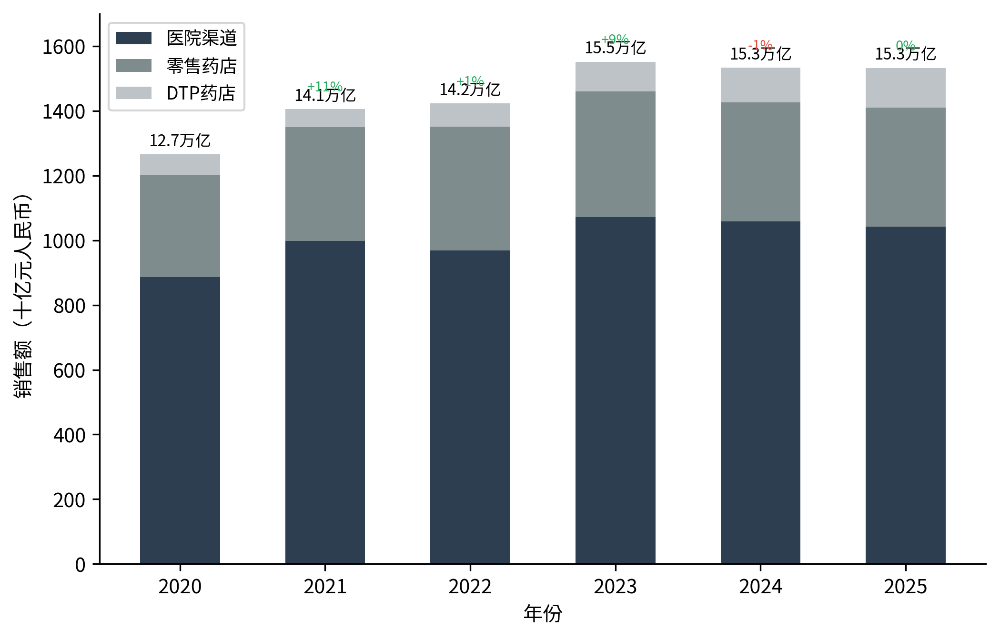
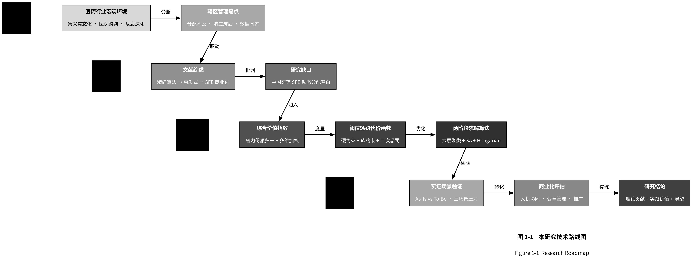
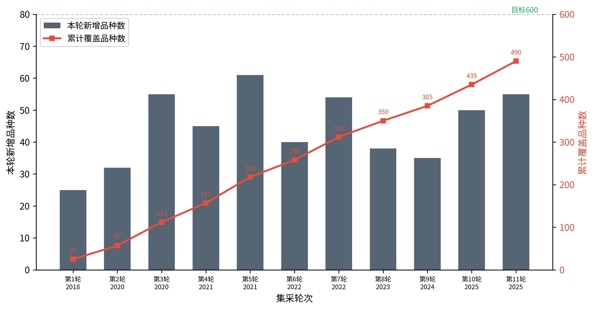
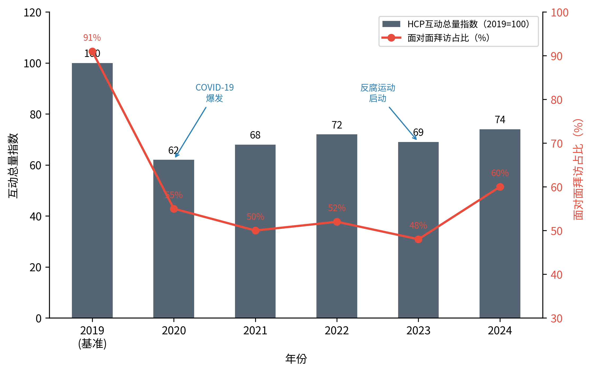
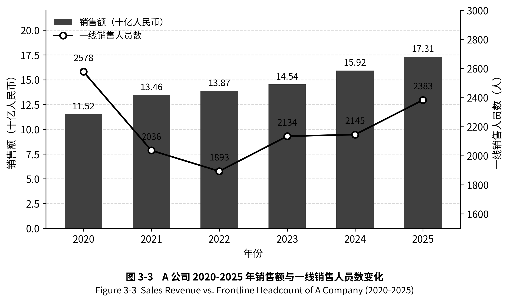
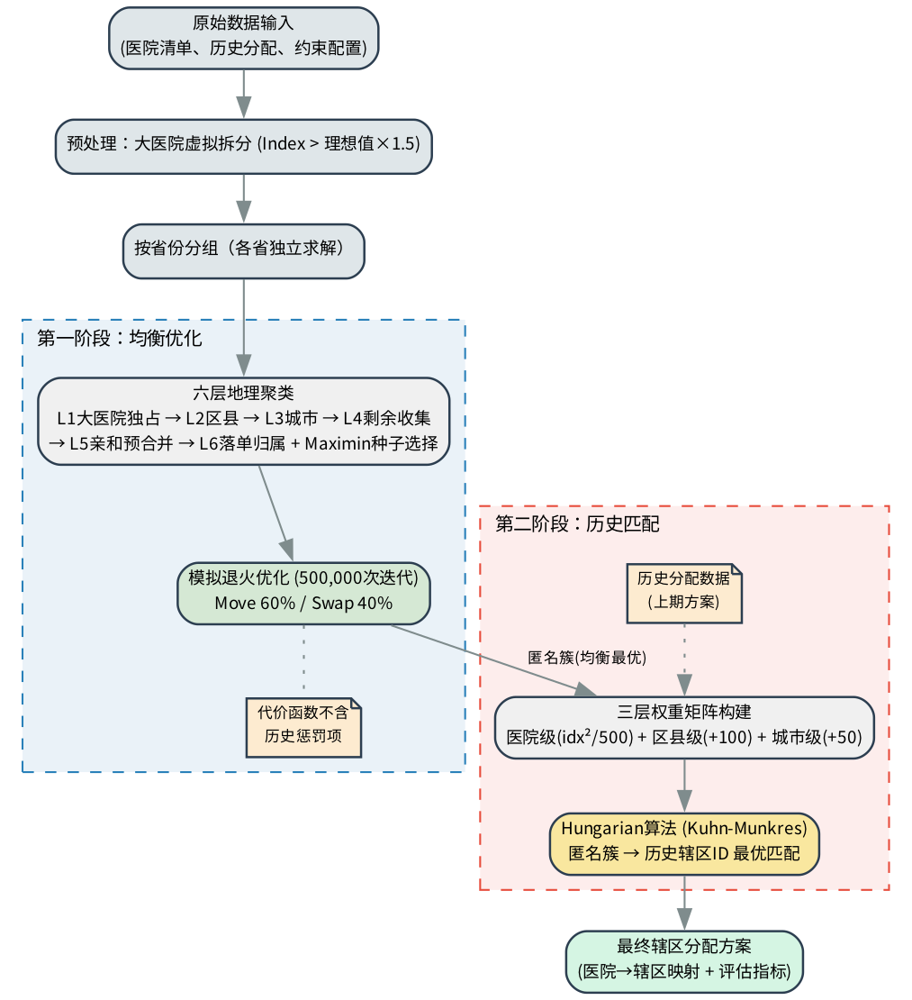
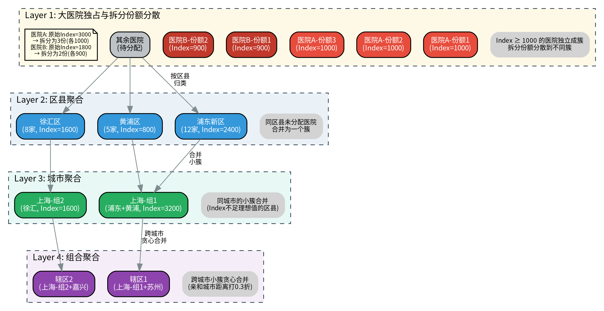
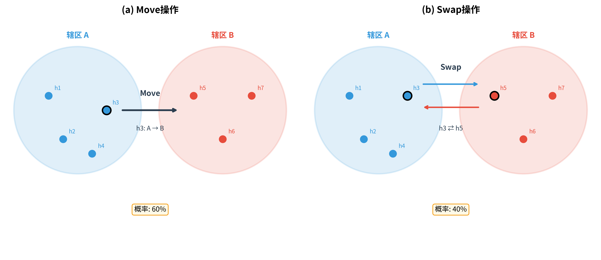
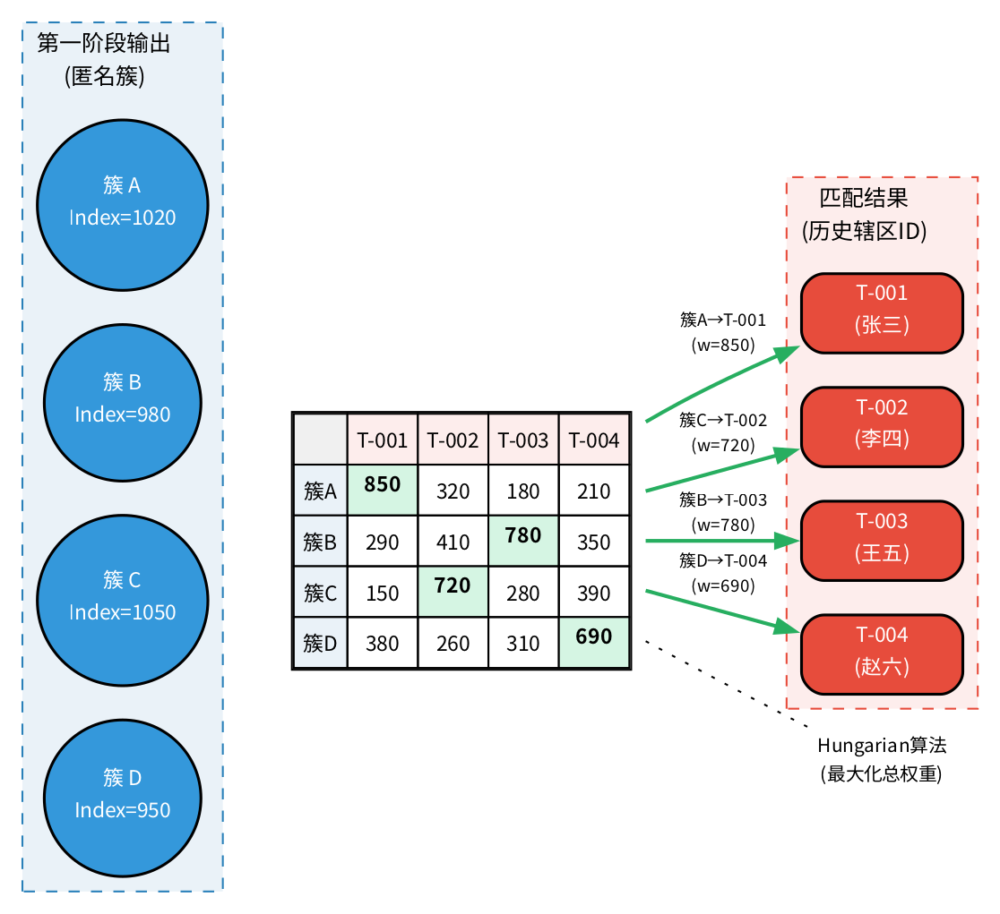

# 第一章 绪论

## 1.1 研究背景

### 1.1.1 医药行业"存量博弈"时代的宏观环境

过去十余年间，中国医药行业经历了从高速增长向结构性调整的深刻转型。据弗罗斯特沙利文统计，中国生物药市场空间从2019年的3120亿元预计增至2030年的13030亿元[@sun2022]，行业整体规模依然在扩大。然而总量增长的表象之下，行业的底层运行逻辑已经发生根本性变化——从过去的"增量扩张"逐步转向"存量博弈"。

图1-1呈现了2020-2025年中国医药市场全渠道（医院渠道、零售药店、DTP药店）销售额的演变轨迹。市场总规模从2020年的12.7万亿元逐步增至2025年的15.3万亿元，但增速曲线已经清晰显现疲态——2023年同比增长9%为近年高点，2024年同比微降1%，2025年同比持平。三年时间内增长率从两位数滑落至接近零增长，这正是行业从扩张周期切换到存量周期的直观信号。

图1-2进一步给出未来五年的市场展望。IQVIA《中国医药市场预测（2024-2029）》显示，复合年增长率（CAGR）已下探至1.3%，同比增长率在0.3%至1.8%的低位徘徊，与过去十年7%-12%的高速期形成鲜明反差。这种由"高速增长"到"低速增长"的转变并非短期波动，而是行业进入新阶段的结构性特征。

行业总量增速放缓的背后，是国家集中带量采购（Volume-Based Procurement, VBP）常态化、医保谈判机制化与医药反腐深水化三重政策压力的叠加。集采压缩了成熟仿制药的利润空间[@nhsa-vbp]，医保谈判压缩了创新药的商业化窗口期，反腐则从合规端重塑了商业模式——传统"带金销售"加速退出，学术推广成为核心[@zhang2025]。三重压力的具体影响机制将在第三章详细展开。

三重压力共同作用之下，中国医药行业呈现出一种结构性的"双向挤压"格局。外资药企因核心产品进入集采而面临战略收缩，需要以更少的人力覆盖同等甚至更大的市场；本土生物科技公司在政策红利下迅速扩张，但其内部管理职能——尤其是销售力有效性（Sales Force Effectiveness, SFE）管理——仍处于萌芽阶段，往往由一线业务人员主导资源分配，陷入"既是运动员又是裁判员"的困境。无论是收缩还是扩张，企业都迫切需要一套科学、高效的辖区分配方法论来替代传统的经验驱动模式。

### 1.1.2 制药企业精细化管理转型的迫切需求

销售辖区分配（Sales Territory Alignment）是企业SFE管理体系中的关键业务流程，其本质是一个高度复杂的资源配置与空间优化问题。在制药企业中，辖区分配的核心任务是将数千家目标医院终端合理地分配给数百名销售代表，使得每位代表的工作量与销售潜力达到相对均衡，同时兼顾地理紧凑性、客户关系连续性以及组织架构约束等多维目标。

然而，当前绝大多数制药企业的辖区分配仍采取"人力密集型"的作业模式。中央SFE团队与数百名一线销售经理深度依赖Excel进行庞杂的数据拆解，并在"自下而上"的指标分配中展开旷日持久的跨部门人工博弈与沟通拉扯。在过去医药行业高增长的"黄金时代"，企业尚能以高昂的利润掩盖这种低效带来的隐性摩擦成本。但在当前利润空间被急剧压缩的环境下，这种完全依赖人工操作、响应极度滞后且充斥着沟通内耗的传统管理模式，其所产生的人力成本与时间沉没成本已令企业不堪重负。

与此同时，制药企业的SFE部门天然拥有海量的沉淀数据，CRM系统中的医生分级、流向、处方等数据构成了一座"数据富矿"。但由于缺乏高级运筹智能算法的技术加持，中央管理团队在宏观排兵布阵时，往往只能提供颗粒度极粗的先验测算，最终沦为一线人员基于人情与经验的Excel手工博弈[@zoltners2008]。王晓玲（2024）指出，我国生物医药行业数字化转型受限于数据基础不足、复合背景人才短缺等瓶颈，转型进展相对落后[@wang2024]。这种"数据丰富、算法贫乏"的矛盾，正是制药企业精细化管理转型中亟待突破的核心瓶颈。

商业化解决方案层面，全球领先的数据与技术巨头（如IQVIA、Veeva等）曾斥巨资开发标准化SaaS系统，但在中国市场遭遇了严重的"水土不服"——业务规则的高度非标准化使标准化产品难以泛化，最终陷入定制化开发泥潭。第三章将对这一问题做深入剖析。综合来看，传统的"刚性SaaS系统"与"纯手工Excel执行"均已陷入死胡同，行业迫切需要一种轻量化、可配置、基于运筹优化算法的智能辖区分配解决方案，以填补从"数据富矿"到"智能决策"之间的技术鸿沟。这正是本研究的出发点。

## 1.2 研究意义

### 1.2.1 理论意义：填补 SFE 领域动态分配模型空白

纵观国内外关于销售辖区分配的研究，该领域的演进呈现出从"单纯数学规划"向"商业多目标启发式求解"跨越，从"通用销售"向"医药行业垂直定制"深化的显著特征。在国外，Hess和Samuels（1971）率先将线性规划应用于销售辖区划分[@hess1971]；Zoltners和Sinha（1983）提出了辖区分配必须满足的四个核心属性框架[@zoltners1983]；Skiera和Jordan（1996）通过EQUALIZER模型引入模拟退火与惩罚函数机制，解决了传统精确模型在27%测试算例中无法找到可行解的问题[@skiera1996]。然而，上述研究主要面向欧美市场的通用销售场景，其模型假设与中国医药行业的商业现实之间存在显著差距。

在国内，运筹优化算法在物流配送、供应链选址、城市网格化管理等通用领域的应用研究极为丰富，但针对医药行业特有商业逻辑的辖区分配模型的学术文献相对匮乏。现有的国内研究在处理"销售潜力均衡"、"客户关系连续性"以及"代表激励公平性"等SFE场景下的微妙商业维度时，尚未形成成熟的理论体系。

本文的理论贡献主要体现在三个方面。第一，搭建了一个融合中国医药行业特有业务规则（包括大医院共岗拆分、区县行政约束、锁定分配等）的多目标优化数学模型，弥补了通用辖区设计模型在中国医药场景中的适配缺口。第二，提出了"均衡优化—历史匹配"的两阶段求解框架，将辖区均衡性与历史延续性解耦为两个独立的优化阶段，避免了传统方法中两个目标在同一代价函数中相互妥协的问题。第三，设计了六层地理聚类算法作为模拟退火的初始解生成策略，并引入一对一城市识别和城市亲和图两项扩展机制，明显提升了启发式搜索的收敛效率与解的稳健性。

### 1.2.2 实践意义：解决企业辖区划分效率与公平难题

从实践角度看，本文的意义体现在以下三个层面。

第一，提升辖区分配的科学性与公平性。Zoltners和Lorimer（2000）的实证研究表明，仅通过算法优化辖区分配，无需增加任何额外资源，就能直接带来2%到7%的销售额提升，同时减少13.7%的差旅时间[@zoltners2000]，这一发现说明算法优化的价值远不止于行政效率。本文所搭建的算法模型依据阈值化的统一惩罚框架，将Index均衡度、地理紧凑性、容量约束等多维目标纳入到统一的代价函数中，能在数分钟内输出满足多重约束的近似最优分配方案，从根本上替代耗时数周的人工博弈过程。

第二，降低组织变革的震荡成本。在制药企业频繁的组织架构调整里——比如裁员合并、新产品上市扩编等——辖区的重新分配往往伴随着客户关系的断裂以及短期业绩的波动。本文给出的两阶段法借助Hungarian算法在第二阶段实现匿名簇与历史辖区的最优匹配，最大化客户保留率，从而有效降低了辖区调整所带来的业务震荡。

第三，为算法的商业化落地提供可行路径。本文不只停留在算法层面，还探讨了"人机协同"决策机制的建立、组织变革管理策略以及算法产品化的商业模式，为制药企业乃至更广泛的销售密集型行业提供了从算法研发到商业落地的完整参考框架。

## 1.3 研究内容与技术路线

### 1.3.1 主要研究内容

围绕"如何利用运筹优化算法实现制药企业SFE辖区的科学动态分配"这一核心问题，本文的研究内容包括以下四个方面：

（1）深入剖析医药行业销售辖区管理的现状与痛点。通过对国家集采常态化、医保谈判及反腐深化等政策背景的剖析，结合某跨国药企的真实案例，全面诊断当前辖区管理模式中存在的区域分配不公、响应滞后、数据支撑缺失等核心痛点，并据此论证引入智能算法的必要性。

（2）构建基于综合价值指数的多目标优化数学模型。针对中国医药行业的特有业务规则，设计医院综合价值指数（Index）的量化方法，建立包含Index均衡度、地理紧凑性、容量约束、区县集中度等多维目标的统一惩罚函数，并明确硬约束（锁定分配、拆分分散、城市上限）与软约束的边界。

（3）设计并实现"均衡优化—历史匹配"两阶段求解算法。其中第一阶段采用六层地理聚类生成初始分配方案，再借助模拟退火算法进行均衡性优化；第二阶段采用Hungarian算法将第一阶段产出的匿名簇映射到历史辖区编号，最大化客户保留率。两阶段的解耦设计使均衡性与历史延续性各自达到最优，构成本文的核心技术贡献。

（4）开展实证分析与商业化前景评估。依据某跨国药企的脱敏数据，在常规微调、裁员合并、组织扩张三种典型业务场景下验证算法效果，并从"人机协同"决策机制、变革管理策略、商业模式等角度探讨算法的落地路径与商业价值。

### 1.3.2 研究方法

本文采用定量分析与定性分析相结合的研究方法，主要包括以下四种：

文献研究法：系统梳理国内外销售辖区分配领域的理论演进，从经典精确算法到启发式算法再到现代SFE商业化落地，识别现有研究的局限性以及本文的切入点，为后续模型设计提供理论参照。

数学建模与算法设计：将辖区分配问题抽象为带约束的多目标组合优化问题，搭建基于阈值惩罚的代价函数，设计六层地理聚类、模拟退火、Hungarian匹配三阶段求解算法，并完成可交互的算法系统实现，将抽象的数学模型转化为面向业务管理者的实际工具。

案例研究法：以某跨国制药企业为研究对象，获取其脱敏后的医院清单、辖区配置、历史分配等数据，作为算法验证的实证基础。结合作者多年医药行业SFE实践经验，对算法输出方案进行业务合理性的人工核验。

对比实验与敏感性分析：通过As-Is（现状人工分配）与To-Be（算法优化分配）的对照设计，从Index均衡度、地理紧凑性、客户保留率等维度量化算法的改善效果，并借助关键参数（拆分阈值、退火迭代次数、惩罚权重等）的敏感性测试验证算法的稳健性。

### 1.3.3 论文结构与技术路线图

本论文共分为七章：

第一章，绪论。阐述研究背景、研究意义、主要研究内容与研究方法，概述论文整体结构与技术路线。

第二章，理论基础与文献综述。系统梳理SFE管理理论与销售辖区分配算法的研究演进，从经典精确算法、启发式算法到现代商业化体系融合三个阶段进行综述，分析国内相关研究现状，并指出现有研究的局限性与本文的改进思路。

第三章，制药企业SFE辖区管理现状与痛点诊断。分析医药行业宏观政策环境，以某跨国药企为案例剖析现行辖区管理模式，诊断核心痛点并论证引入智能算法的必要性。

第四章，基于综合价值指数的智能辖区分配模型构建。本章是论文的技术核心，定义问题与模型假设，搭建综合价值指数与多目标优化模型，详细阐述两阶段求解算法的设计——含六层地理聚类、模拟退火优化以及Hungarian历史匹配。

第五章，实证分析与多场景模拟验证。依据脱敏数据开展算法效果验证，在常规微调、裁员合并、组织扩张三种典型业务场景下进行压力测试，并对关键参数进行敏感性分析。

第六章，企业内部管理的配套及算法的商业化前景评估。探讨"人机协同"决策机制、变革管理策略、数据治理保障，以及算法模型的商业价值与行业推广可行性。

第七章，结论与展望。总结主要研究结论与创新点，分析研究不足并提出未来展望。

整体的研究技术路线如图1-3所示。

## 1.4 本章小结

本章从医药行业"存量博弈"的宏观环境切入，剖析了国家集采常态化、医保谈判深化以及反腐高压三重政策压力对制药企业销售管理模式的冲击，指出当前辖区分配中"数据丰富、算法贫乏"的核心矛盾，以及传统SaaS系统与手工Excel模式所共同陷入的双重困境。在此基础上，阐述了本文在理论层面（搭建融合中国医药业务规则的两阶段优化模型）和实践层面（提升分配科学性、降低震荡成本、探索商业化路径）的双重意义，并明确了核心研究内容、研究方法与七章论文结构。

下一章将系统梳理SFE管理理论与销售辖区分配算法的研究演进，为后续的模型构建与算法设计奠定理论基础。

# 第二章 理论基础与文献综述

## 2.1 销售力有效性（SFE）管理理论

### 2.1.1 SFE 的核心内涵与管理体系

销售力有效性（Sales Force Effectiveness, SFE）是指企业借助系统化的管理手段最大化销售团队市场产出效率与资源利用率的管理实践。Zoltners、Sinha和Lorimer（2008）将SFE定义为一个涵盖销售团队规模设计、辖区划分、人员招聘与培训、薪酬激励、目标设定以及绩效管理的完整体系[@zoltners2008]。在此体系内，各环节相互关联、彼此影响，共同决定了销售团队的整体效能。

从管理实践的演进来看，SFE经历了从"经验驱动"到"数据驱动"的范式转变。早期企业往往不清楚应该分析哪些数据，缺乏将数据转化为决策的模型与框架，直到近年来这种以数据分析为核心的管理理念才被广泛接受。ZS Associates 的研究表明，SFE管理体系的核心价值在于：通过科学的分析框架，把销售管理从"凭直觉决策"改良为"用数据驱动决策"。该公司2016年的Explorer Study发现，在医疗器械行业中，战略性地投资SFE改善项目可以带来2%至8%的销售业绩提升[@zs2016]——以一家年销售额1.5亿美元的企业为例，若在SFE项目上投入60万美元并实现4%的销售增长，其投资回报率可达500%，这一实证数据有力证明了SFE管理的商业价值。

在制药行业，SFE管理具有更为特殊的战略意义。Chressanthis和Mantrala（2016）指出，生物制药行业正在经历从传统小分子药物向大分子特药的战略转型，对销售团队的商业模式设计、数据分析能力和运营管理提出了全新要求[@chressanthis2016]。换言之，制药行业的SFE管理正在从以"提升医生处方量"为核心的战术执行层面，向以"证明药物价值与健康结局"为核心的战略资产层面演进。

### 2.1.2 销售辖区设计的基本原则

销售辖区设计（Sales Territory Design/Alignment）是 SFE 管理体系中的关键环节，其核心任务是把客户或地理区域分配给销售代表，使每位代表的工作量与销售潜力达到相对均衡。Zoltners 和 Sinha（1983）在其开创性论文中提出了辖区分配必须满足的四个核心属性[@zoltners1983]：均衡性（Balance）要求工作量公平，紧凑性（Compactness）要求地理紧凑以减少差旅，连续性（Contiguity）要求空间相互连接避免飞地，完整性（Integrity）要求行政单元不被拆分。Zoltners 和 Lorimer（2000）进一步以实证数据量化了辖区设计的商业价值——仅靠优化辖区分配就能直接带来 2% 至 7% 的销售额提升以及 13.7% 的差旅时间下降[@zoltners2000]，这意味着辖区设计并非简单的行政划分工作，而是一个具有突出经济价值的优化问题。

中国制药行业的实际场景下，辖区设计还需兼顾若干行业特有约束：大型三甲医院的销售潜力远超普通医院，需要多代表"共岗"覆盖，由此产生"大医院拆分"需求；客户关系的连续性使得"历史延续性"成为辖区调整中不可忽视的维度；企业组织架构（大区/省区层级）以及"锁定分配"等业务规则进一步增加了问题的复杂性。这些行业特有约束让中国医药行业的辖区设计问题远比通用销售场景更为复杂，也为本文的模型构建提供了明确的业务需求导向。

## 2.2 销售辖区分配算法的研究演进

### 2.2.1 国外算法演进：从精确算法到现代商业化融合

销售辖区划分问题在运筹学中属于带约束的多目标组合优化问题，国外研究的演进大致经历了精确算法、启发式算法与现代商业化融合三个阶段。

学术研究可追溯至 20 世纪 60 年代末。Hess 和 Samuels（1971）率先将线性规划应用于销售辖区划分，将问题建模为集合划分问题（Set Partitioning Problem），奠定了辖区划分问题的数学基础[@hess1971]。Zoltners 和 Sinha（1983）在此基础上提出了更为完整的整数规划模型，将均衡性、紧凑性、连续性和完整性四个核心属性形式化为约束或目标函数组成部分，首次系统定义了多维目标结构[@zoltners1983]。然而精确算法在实际应用中遭遇了计算瓶颈——辖区划分问题本质是 NP-hard 问题，当基本地理单元数量达到数百甚至数千时，精确求解的计算时间呈指数级增长，Kalcsics、Nickel 和 Schröder（2005）的综述对此做了系统证明，并将辖区设计的应用场景归纳为政治选区划分、销售辖区设计和服务区域划分三大类[@kalcsics2005]——这直接推动了启发式算法的引入。

启发式阶段以 Skiera 和 Jordan（1996）的 EQUALIZER 模型为标志[@skiera1996]，其核心创新有两点：一是引入惩罚函数机制将硬约束转化为代价函数中的惩罚项，把带约束多目标问题转化为无约束单目标最小化问题；二是采用模拟退火作为求解引擎，通过随机扰动与概率接受跳出局部最优。实验显示精确规划在 27% 的算例中无法找到可行解，而 EQUALIZER 在所有算例中均能找到满足约束的方案，且解的质量与精确解相当——这一结果有力证明了启发式方法在复杂约束场景中的优越性。EQUALIZER 对本文具有直接的启发意义，本文的代价函数设计——基于阈值的统一惩罚框架——正是对其惩罚函数思想的继承与发展。

进入 21 世纪，研究重心从"纯算法优化"转向"算法与商业体系的融合"。ZS Associates 在《The Power of Sales Analytics》中指出，成功的辖区设计还需兼顾数据治理、业务规则引擎以及人机协同——最终的可用方案是"算法建议+人工判断"的融合产物[@zoltners2014]。两阶段方法的思想渊源也在这一阶段逐渐清晰：罗军等（2022）在民航机场地面服务人力资源优化中提出"班次设计→优化排班"两阶段方案，使员工工时均衡性提升 48.5%[@luo2022]，其方法论与本文的"均衡优化—历史匹配"框架高度一致——通过两个独立阶段各自追求最优目标，避免了单一优化中多目标相互妥协的问题。

### 2.2.2 国内运筹算法应用与医药 SFE 研究空白

国内学术界在运筹优化算法的应用研究方面成果丰富，尤其在物流配送、生产调度、人力资源排班等通用领域积累了大量实践经验。尤佳等（2026）通过将协同优化问题归约至经典装箱问题严格证明了 NP-hard 性质，其"业务约束→必要性条件→启发式规则"的研究范式为本文"业务规则到算法约束"的转化过程提供了参考[@you2026]；杨磊（2012）对遗传算法在运筹问题中应用的综述则为本文选择求解算法提供了比较分析的基础——本文最终选择模拟退火而非遗传算法，主要考量在于模拟退火的邻域搜索机制更适合"局部微调"的辖区调整操作（Move 与 Swap），而遗传算法的交叉算子在保持辖区连续性方面存在编码困难[@yang2012]。在行业语境层面，徐蓉（2023）从制药企业人力资源数字化创新视角[@xu2023]、陈兆兆（2024）从集采趋势下的成本控制策略[@chen2024]，均指出销售人力资源配置的精细化是企业精细化管理转型的重要抓手。

但在医药行业 SFE 领域——特别是销售辖区分配问题——的国内学术研究却极为匮乏。对中国知网（CNKI）以"销售辖区""辖区分配""Territory Alignment"等关键词系统检索所得的直接相关文献数量极少，且多为行业报告或管理咨询类文章，缺乏严格的数学建模和算法设计。研究空白的形成有其深层原因：需求端来看，中国医药行业的 SFE 管理实践起步较晚，多数企业的辖区分配仍处于"手工 Excel"阶段，未产生对算法优化的强烈拉动；供给端来看，辖区分配问题涉及运筹学、地理信息科学和医药商业管理的交叉知识，国内具备这种跨学科研究能力的团队相对稀缺；再加上辖区分配的数据具有高度的企业专属性和商业敏感性，学术研究者难以获取真实业务数据用于实证分析。值得一提的是，国外的辖区划分研究虽然在理论和方法上较为成熟，但其模型假设与中国医药行业的商业现实之间存在突出差距——例如 EQUALIZER 模型假设基本地理单元不可拆分、Kalcsics 等的统一框架未考虑中国特有的省-市-区县三级行政约束，都说明在中国医药 SFE 辖区分配这一特定领域，存在一个明确的研究空白。

## 2.3 现有研究的局限性与本研究切入点

综合上述文献综述，可从三个维度归纳现有研究的局限性。第一，模型假设与中国医药行业现实脱节——国外经典模型（Hess-Samuels、Zoltners-Sinha、EQUALIZER）均依据欧美通用销售场景设计，其核心假设（基本地理单元不可拆分、辖区数量固定、约束相对简单）与中国医药行业实际需求存在突出差距，"大医院共岗拆分""省-市-区县三级行政约束""锁定分配"等中国特有规则在现有模型中缺乏对应表达。第二，均衡性与历史延续性的目标冲突未得到有效解决——现有研究要么忽略历史延续性，要么将其作为软约束混入代价函数，后者会让两个目标在优化过程中相互妥协，均无法各自达到最优。第三，算法研究与商业落地之间存在鸿沟——学术研究侧重算法性能的理论分析与基准测试，而企业实践还涉及数据治理、业务规则配置、人机协同决策、组织变革管理等非算法维度，现有文献对这些维度的讨论相对薄弱。表 2-1 对本章综述的主要文献做了系统对比。

**表 2-1 辖区划分主要文献对比**

| 文献 | 方法 | 目标 | 历史延续性 | 单元拆分 | 行业场景 |
|------|------|------|------------|----------|----------|
| Hess & Samuels (1971) | 线性规划 | 均衡性 | 否 | 否 | 通用销售 |
| Zoltners & Sinha (1983) | 整数规划 | 均衡+紧凑+连续+完整 | 否 | 否 | 通用销售 |
| Skiera & Jordan (1996) | 模拟退火+惩罚函数 | 均衡性 | 否 | 否 | 通用销售 |
| Kalcsics et al. (2005) | 综述框架 | 多目标 | 部分讨论 | 否 | 通用框架 |
| 罗军等 (2022) | 两阶段优化 | 均衡+公平 | 否 | 否 | 民航排班 |
| 尤佳等 (2026) | 变邻域搜索 | 成本+均衡 | 否 | 否 | 电网配送 |
| 本研究 | 六层聚类+SA+Hungarian | 均衡+紧凑+历史延续 | 是（第二阶段） | 是（虚拟拆分） | 中国医药 |

针对上述局限性，本文提出以下改进思路：在 Skiera 和 Jordan（1996）惩罚函数框架的基础上引入大医院虚拟拆分机制、省-市-区县三级行政约束、锁定分配硬约束等中国医药行业特有业务规则，搭建更贴合实际的多目标优化模型；借鉴罗军等（2022）的两阶段思想，将均衡性优化与历史延续性保障解耦为两个独立阶段——第一阶段通过六层地理聚类与模拟退火纯优化均衡性（不含历史惩罚），第二阶段通过 Hungarian 算法将匿名簇映射到历史辖区编号，使两个目标各自达到最优。除算法研究本身之外，本文还进一步探讨"人机协同"决策机制、组织变革管理策略以及算法产品化的商业模式，弥合学术研究与商业实践之间的鸿沟。

## 2.4 本章小结

本章从SFE管理理论与辖区划分算法两个维度进行了系统的文献综述：梳理了SFE的核心内涵、管理体系演进以及辖区设计的四个基本原则；按照"经典精确算法→启发式算法与软约束引入→现代商业化体系融合"的三阶段演进脉络，剖析了 Skiera 和 Jordan 的 EQUALIZER 模型、Kalcsics 等的统一辖区设计框架以及罗军等的两阶段优化思想对本文的启发。在国内研究现状方面，指出了运筹算法在物流配送、人力调度等领域的丰富应用与医药行业SFE领域研究空白之间的明显反差。

通过系统的文献对比，本章识别了现有研究的三个核心局限——模型假设与中国医药行业脱节、均衡性与历史延续性的目标冲突未有效解决、算法研究与商业落地之间存在鸿沟——并据此提出了本文的改进思路，为下一章的现状诊断和第四章的模型构建奠定了理论基础。

# 第三章 制药企业 SFE 辖区管理现状与痛点诊断

第一章和第二章分别从宏观背景与理论文献两个维度，论证了运筹优化算法在制药企业辖区分配中的研究价值与理论基础。本章将视角转向行业实践，以某跨国药企的真实业务场景为案例，系统诊断当前制药企业 SFE 辖区管理的现状与核心痛点，为第四章的模型构建提供问题导向的需求输入。

## 3.1 医药行业宏观政策环境分析

制药企业的辖区管理并非孤立的内部运营问题，而是深嵌于行业宏观政策环境之中。近年来，三项重大政策变量——国家集采常态化、医保谈判机制化和医药反腐深水化——从不同维度重塑了制药企业的商业模式与组织架构，进而对辖区分配的频率、复杂度和精度要求产生了深远影响。

### 3.1.1 国家集采（VBP）常态化的影响

国家组织药品集中带量采购（Volume-Based Procurement, VBP）已推进至第十一批，覆盖品种超过 430 个[@nhsa-vbp]。图 3-1 呈现了 2018 年首批"4+7"试点至 2025 年第十一批的演变全貌：本轮新增品种数从首批的 25 个稳步攀升至第三批的 55 个高点后保持在 35-60 之间的稳定节奏，累计覆盖品种数则呈现近乎线性的增长，从 25 个一路推进至 490 个，距离行业普遍预期的 600 个目标仅一步之遥。这意味着集采已不再是阶段性的政策实验，而是成为药品价格管理的常态化机制——每一轮新增品种都意味着相应产品线的销售团队规模需要重新评估。

集采政策的常态化对制药企业的辖区管理形成了两个层面的直接冲击。

第一层冲击是组织架构的频繁调整。一旦核心产品被纳入集采，该产品线的销售团队规模往往需要大幅缩减——以某跨国药企为例，其一条成熟产品线在进入集采后，全国销售代表编制从约 300 人缩减至不足 200 人，缩减幅度超过 30%。这意味着原有辖区方案需要在短时间内重新规划，将原本由 300 人覆盖的数千家医院终端重新分配给 200 人，同时确保核心高潜力医院不被遗漏。这类"战略收缩"场景对辖区分配的响应速度和算法能力提出了极高要求。

第二层冲击是资源配置逻辑的根本转变。集采前，企业的辖区分配主要围绕"销量最大化"展开，销售代表的覆盖范围以历史销量为核心权重；集采后，中标品种的销量被集采协议锁定，企业的竞争焦点转向非集采品种和创新药的市场开拓。也就是说，辖区分配的价值评估体系必须从单一的历史销量指标，改良为融合销售潜力、市场增长率、竞品渗透率等多维度的综合价值指数（Index）。传统的手工分配模式难以处理这种复合维度的价值评估与均衡优化。从行业整体来看[@sun2022]，集采政策加速了制药企业从"粗放式增长"向"精细化运营"的转型——辖区分配不再是一项可以"差不多就行"的行政事务，而是直接关系到企业资源配置效率和市场竞争力的战略性决策。

### 3.1.2 医保谈判对企业利润空间的挤压

与集采主要影响成熟仿制药不同，国家医保谈判机制的建立对创新药企业的辖区管理产生了独特的影响。医保目录动态调整机制使得创新药从获批上市到纳入医保的周期大幅缩短至约一年，但谈判降价幅度同样显著，平均降幅约为60%[@nhsa-nrdl2024]。

这一政策环境对辖区管理的影响体现在"时间窗口压缩"效应上。创新药的商业化窗口期被大幅缩短——企业必须在产品纳入医保后的极短时间内完成全国范围的销售团队部署和辖区划分，以抢占市场先机。这种"新产品上市扩张"场景要求辖区分配系统具备快速响应能力：在新增数十名甚至上百名销售代表的情况下，迅速生成覆盖全国的辖区方案，同时确保新辖区与现有辖区的衔接不产生冲突。

此外，医保谈判的降价压力进一步压缩了企业的利润空间，使得企业对辖区分配的"公平性"要求更加敏感。当每位销售代表的绩效直接与其辖区内的销售潜力挂钩时，辖区之间的潜力差异将直接转化为收入差异。如果辖区分配不够均衡，不仅会引发销售团队的不满和人才流失，还会导致高潜力区域的资源浪费和低潜力区域的过度投入。因此，医保谈判的降价效应间接提升了企业对辖区分配均衡性的精度要求。

### 3.1.3 反腐深化对商业模式的冲击

2023年以来，医药领域反腐进入"深水区"，对制药企业的商业模式和销售管理产生了深远影响[@zhang2025]。图 3-2 以 2019 年为基准展示了医药行业 HCP（Healthcare Professional，医疗专业人士）互动总量与面对面拜访占比的演变曲线[@iqvia2025mpchina]：互动总量指数在 2020 年因 COVID-19 爆发骤降至 62，此后缓慢回升至 2024 年的 74，仍未恢复到疫情前水平，与 2019 年相比综合下降幅度约为 26%；面对面拜访占比则从 2019 年的 91% 跌至 2020 年的 55% 后长期低位徘徊，在 2023 年反腐运动启动后又下挫至 48% 的最低点，2024 年虽小幅反弹至 60%，但相对疫情前已有 30 个百分点的结构性下降。这意味着销售代表的"接触能力"在过去五年间被系统性削弱，这一趋势直接重塑了辖区管理的实践。

反腐高压从三个维度影响了辖区管理的实践。

其一是销售模式的根本转型。传统的"带金销售"模式加速退出历史舞台，企业被迫转向以学术推广为核心的合规化运营——销售代表的工作内容从"客情维护"转向"学术推广"，其覆盖能力和工作效率发生了质的变化。辖区分配需要重新评估每位代表的合理工作负荷，从传统的以"客户数量"为核心的分配逻辑转向"学术覆盖质量"。

其二是医院准入门槛的明显提高。反腐之后，医院对药企的学术活动和人员来访建立了更严格的报备制度，医生参加学术会议也更加谨慎——这种变化让销售代表与医生的沟通效率明显降低，单位时间内的有效拜访次数减少。辖区分配需要考虑这一新的现实约束，适当降低每位代表的医院覆盖数量，以保证学术推广的质量和深度。

其三是组织架构的被动调整。反腐导致部分企业的医药代表数量锐减，尤其是以仿制药为主的企业。这种非计划性的人员变动进一步加剧了辖区分配的频率和复杂度，企业需要在人员流失后快速重新分配辖区，同时尽量保持客户关系的连续性，避免因代表更换导致的业务中断。

值得关注的是，2026 年由国家市场监督管理总局等七部门联合发布的《医药代表管理办法》将于 2026 年 8 月 1 日正式施行，对医药代表的备案制度、学术推广规范以及 22 项禁止行为做了系统性规定[@mr2026]。这一新政从制度层面进一步压缩了"灰色地带"的存续空间，让销售代表的工作负荷必须以更精确、更可量化的方式进行衡量与分配——换言之，《医药代表管理办法》让辖区分配从单纯的"业务问题"上升为兼具合规属性的管理命题。

综合来看，国家集采、医保谈判、医药反腐与医药代表合规规范叠加之下，制药企业的辖区管理面临前所未有的挑战：组织架构调整更加频繁（从年度调整变为季度甚至月度调整）、分配维度更加复杂（从单一销量指标变为多维综合价值指数）、精度要求更加严格（从"大致均衡"变为"精确均衡"）。这些变化从根本上超越了传统手工分配模式的能力边界，为智能算法的引入创造了迫切需求。

## 3.2 现行辖区管理模式分析——以某跨国药企为例

为深入理解制药企业辖区管理的实际运作方式及其局限性，本节以作者所服务的某跨国药企（以下简称"A公司"）为案例，剖析当前行业中最具代表性的两种辖区管理模式：传统手工划分模式和外部咨询/SaaS系统模式。

### 3.2.1 传统手工划分与静态咨询模式的流程

A公司是一家在华运营超过20年的跨国制药企业，拥有覆盖肿瘤、免疫、心血管等多个治疗领域的产品线，全国销售代表编制约1500人，覆盖目标医院终端超过8000家。其辖区管理的典型流程通常分为三个阶段。

第一个阶段是年度辖区规划。每年第四季度，A公司的中央SFE团队启动下一年度的辖区规划，该团队通常由3-5名SFE分析师组成，负责收集和整合来自CRM系统的医院基础数据、流向数据、处方数据以及第三方市场潜力数据。数据整合完成后，SFE团队借助Excel搭建辖区分配的基础框架，按照省份、城市、区县的行政层级逐级拆解。

紧接着进入"自下而上"的博弈阶段，这也是整个流程中最耗时的环节。初始方案形成后，SFE团队会将方案下发至各大区经理和地区经理审核，一线销售经理依据自身的业务经验和利益考量，对辖区方案提出大量修改意见——常见的争议包括某家高潜力医院应归属哪个辖区、某个区县是否应该拆分、某位代表的工作量是否过重或过轻等。SFE团队需要与数十位销售经理逐一沟通、反复协调，整个博弈过程通常持续4-6周。

最后是方案定稿与执行阶段。经过多轮博弈，最终方案由销售副总裁审批定稿；然而由于博弈过程中存在大量人为干预，最终方案往往偏离了SFE团队最初的均衡性设计，呈现出"强势经理多拿资源、弱势经理被动接受"的分配格局。

在外部咨询模式方面，A公司也曾尝试聘请国际咨询公司提供辖区分配的咨询服务。咨询公司的工作模式通常是：在项目启动阶段收集数据，经过4-8周的分析后交付一份静态的辖区分配报告（一般以PowerPoint和Excel形式呈现）。这种"一次性交付"的模式存在明显局限——一旦企业在项目交付后发生组织架构调整，咨询报告即刻失效，企业不得不重新启动咨询项目或回归手工分配。

### 3.2.2 组织架构频繁变动下的管理挑战

A 公司过去六年的销售额与一线销售人员数变化（图 3-3）能够直观体现"业绩持续增长、人员规模受限"的双向挤压格局。销售额从 2020 年的 115 亿元逐步攀升至 2025 年的 173 亿元，六年累计增长接近 50%；与之形成对照的是，一线销售人员数 2020 年为 2,578 人，受疫情与早期集采冲击在 2022 年降至 1,893 人的谷底，此后虽有所回升但 2025 年仍仅为 2,383 人，整体相比 2020 年反而减少了 7.5%。这意味着每位代表所需承载的业务体量从 2020 年的约 0.45 亿元/人提升到 2025 年的 0.73 亿元/人，工作负荷增加了 60% 以上——而这一切的背后，是辖区分配方案不得不在更频繁的调整、更复杂的约束下持续适配业务变化。

在当前的政策环境下，A公司的组织架构调整频率显著加快。仅在2023-2024年间，A公司就经历了以下重大调整：

- 某成熟产品线因进入集采，全国销售团队从280人缩减至180人；
- 某创新药获批上市，新组建了120人的销售团队；
- 两个治疗领域的销售团队合并，涉及约400人的辖区重新划分；
- 多个省份因区域经理离职或调动，需要进行局部辖区调整。

每一次组织架构调整都意味着辖区的重新分配。在传统手工模式下，一次全国范围的辖区重新规划需要6-8周的时间，而局部调整也需要2-3周。当多次调整在短时间内叠加时，SFE团队陷入了"刚完成上一轮调整，下一轮调整又已启动"的恶性循环。

更为严峻的是，频繁的辖区调整直接导致了客户关系的断裂。当一位销售代表被重新分配到新的辖区时，其原有辖区内的医生需要与新的代表重新建立信任关系。在医药反腐的背景下，这种信任关系的重建变得更加困难和耗时。据A公司内部统计，每次辖区调整后的3-6个月内，受影响区域的销售业绩平均下降8%-15%，这一"震荡成本"已成为企业管理层高度关注的问题。

## 3.3 核心痛点与成因分析

基于对A公司及行业内多家制药企业的深入调研，本节将当前辖区管理的核心痛点归纳为三个维度：分配公平性、响应时效性和技术支撑能力。

### 3.3.1 区域分配不公与资源错配

辖区分配的公平性是销售团队管理中最敏感的问题之一。在传统手工分配模式下，分配不公主要表现在三个方面。最直观的是 Index 均衡度偏差过大——A 公司的实际案例中，同一产品线内不同辖区的综合价值指数差异可达 2-3 倍，某省份 8 个辖区中 Index 最高者达到理想值的 180%、最低者仅 60%，意味着两位能力相当的代表仅因辖区分配差异业绩就可能相差 3 倍。其次是"超大医院"分配难题——以肿瘤领域为例，顶级医院的单院销售潜力可能相当于数十家普通医院的总和，拥有这类医院的辖区天然具有巨大优势；将超大医院拆分给多位代表共同覆盖需要精确的份额计算与协调机制，远超 Excel 的处理能力。最后是"强势经理"效应——资历深、话语权大的销售经理往往能在博弈中为自己的团队争取到更优质的辖区资源，让分配结果更多取决于博弈能力而非客观数据，从根本上背离了 SFE 管理的科学化初衷。

### 3.3.2 响应滞后与数据支撑缺失

响应滞后体现在两个层面。一是响应周期过长——一次全国范围的辖区重新规划在手工模式下需要 6-8 周，已严重滞后于当前频繁调整的业务需求，导致"人已到位但辖区未定"的管理真空期。二是方案迭代能力不足——当管理层提出"如果团队从 200 人调整为 180 人，方案会如何变化？"这类假设性问题时，SFE 团队需要从头重新计算，无法在短时间内给出多套备选方案。

更深层的问题是数据利用率低下。王晓玲（2024）指出我国生物医药行业数字化转型受限于数据基础不足、复合背景人才短缺等瓶颈[@wang2024]，在辖区管理领域表现尤为突出。A 公司 CRM 系统沉淀了海量医院基础数据、医生分级、处方流向等数据，但这些数据在辖区分配过程中的利用率极低——SFE 团队通常只采用历史销量和医院数量两个维度做粗略分配，市场潜力、竞品渗透率、地理距离等大量具有决策价值的数据被闲置。这种"数据丰富、算法贫乏"的矛盾，构成了制药企业辖区管理中最大的效率损失来源。

### 3.3.3 商业化 SaaS 系统的"水土不服"

面对手工分配的种种弊端，部分企业曾寄希望于商业化 SaaS 系统（IQVIA OCE、Veeva Align 等）来解决问题，但这些系统在中国市场的落地效果并不理想，原因可以从三个层面剖析。最根本的是业务规则的高度非标准化——不同企业、不同产品线、甚至同一企业在不同省份的业务规则都存在极大差异，例如有些企业要求同一区县的医院必须归属同一辖区，有些产品线存在"大医院共岗"的特殊安排，而有些则严格执行"一院一代表"原则——这种过于灵活且非线性的业务规则让标准化 SaaS 系统难以在底层架构上完成有效的数据抽象与业务流程泛化。

由此衍生出的是定制化开发的成本陷阱。为了满足不同药企客户的独特诉求，SaaS 提供商不得不投入大量资源进行定制化开发，既背离了 SaaS 产品边际成本递减的商业逻辑，也让产品开发与维护成本居高不下——某国际 SaaS 系统在中国市场的单客户年度订阅费用高达数十万美元，但仍需额外支付大量定制化开发费用，最终因投入产出比严重失衡，多个辖区分配系统面临重组、剥离甚至弃用。更深层次的问题在于中国特色业务场景的适配困难——复杂的行政区划体系（省-市-区县-街道四级）、差异巨大的城乡医疗水平，以及"超大型医院共岗""医联体"等独特安排，这些场景在西方市场中并不存在，依据西方市场设计的 SaaS 系统在底层数据模型上就存在先天不足。

## 3.4 本章小结

本章从宏观政策环境、现行管理模式和核心痛点三个层面，系统诊断了制药企业 SFE 辖区管理的现状。在宏观层面，国家集采常态化、医保谈判机制化和医药反腐深水化三重政策压力的叠加，叠加 2026 年《医药代表管理办法》的实施，使得辖区分配的频率、维度和精度要求全面升级。在管理模式层面，传统手工分配模式存在响应滞后、分配不公、迭代能力不足等固有缺陷，而商业化 SaaS 系统在中国市场则遭遇了业务规则非标准化、定制化成本过高、中国特色场景适配困难等"水土不服"问题。在痛点层面，区域分配不公与资源错配、响应滞后与数据支撑缺失、商业化系统的适配困难构成了当前辖区管理的三大核心痛点。

综合上述分析，当前制药企业辖区管理面临的核心矛盾在于业务需求的复杂性与管理工具的简陋性之间的深刻错配——企业需要一种能够在数分钟内处理数千家医院、数百名代表、数十种约束条件的分配工具，并能够快速生成多套备选方案供管理层决策，而 Excel 手工分配与商业化 SaaS 系统都无法满足这一需求。引入智能运筹算法可以同时实现多目标优化、复杂约束处理、响应速度提升与场景模拟支持，从"经验驱动"转向"数据驱动"。需要强调的是，智能算法的引入并非要完全取代人的判断，而是要建立"人机协同"的决策机制——算法负责大规模数据计算与多目标优化，业务管理者基于算法输出进行微调与最终决策，把无法量化的业务经验和人际因素纳入考量。下一章将基于本章诊断的业务需求，构建融合综合价值指数、六层地理聚类、模拟退火优化和 Hungarian 匹配的两阶段智能辖区分配模型，从数学建模和算法设计的角度提出系统性的解决方案。

# 第四章 基于综合价值指数的智能辖区分配模型构建

第三章的分析揭示了制药企业辖区管理在政策压力与业务复杂性双重作用下所面临的核心矛盾，本章将在此基础上，从数学建模的角度对辖区动态分配问题进行形式化定义，并给出一套完整的求解方案。全章遵循"问题定义→数据工程→预处理→模型构建→算法设计"的逻辑链条，逐步展开模型的各个组成部分。

## 4.1 问题定义与模型假设

### 4.1.1 辖区动态分配的业务场景定义

从业务视角来看，辖区动态分配问题可以被抽象为一个带约束的多目标组合优化问题。其输入包括四个要素：一是医院集合 $H = \{h_1, h_2, \ldots, h_N\}$，每家医院附带地理坐标、行政区划归属（省、市、区县）以及综合价值指数（Index）；二是目标辖区数量 $K$，通常等于销售代表的编制人数；三是历史分配方案，记录了上一周期中每家医院与辖区编号之间的对应关系；四是约束配置，涵盖锁定分配、城市上限、容量限制等业务规则。算法的输出则是一个从医院到辖区的映射关系 $\pi: H \rightarrow \{1, 2, \ldots, K\}$，需要特别说明的是，当某家医院的 Index 值过大时，该医院会被虚拟拆分为多个份额，各份额可以分配给不同的辖区，也就是说一家大型医院可以由多位销售代表共同覆盖。

在实际业务中，触发辖区重新分配的场景大致可以归纳为三类。第一类是常规年度微调，辖区数量基本不变，仅需根据最新的业务数据对个别医院的归属进行优化；第二类是战略收缩下的裁员合并，辖区数量减少，原有代表的客户需要被重新分配给留任的代表；第三类是新产品上市或市场扩张带来的组织扩编，辖区数量增加，需要从现有辖区中拆分出新的覆盖区域。这三种场景对算法的要求各有侧重——微调场景强调历史延续性，合并场景强调均衡性重构，扩张场景则需要在保持现有格局基本稳定的前提下合理切割新辖区。

本文所定义的"动态"并非指算法在运行过程中实时调整分配方案，而是指当外部约束条件发生变化（例如辖区数量调整、锁定医院变更、权重参数修改）时，算法能够在数分钟内快速响应并生成一套全新的、满足所有约束的分配方案，而非对旧方案进行局部修补。这种"约束驱动的快速重算"能力，正是传统手工模式和静态咨询方案所不具备的。

### 4.1.2 模型基本假设与边界条件

为使问题在数学上可处理，本模型做出以下基本假设：

假设一，每家医院至少属于一个辖区。当医院的 Index 值超过拆分阈值时，该医院被虚拟拆分为多个等额份额，各份额可分配给不同辖区，从而实现一家医院由多位代表共同覆盖的业务需求。假设二，每个辖区至少包含一家医院或虚拟份额，即不允许出现空辖区——这一约束的业务含义是每位在编代表都必须有明确的工作范围。假设三，医院的综合价值指数（Index）由外部数据系统计算并输入，算法本身不干预 Index 的生成过程，仅将其作为均衡性优化的核心度量。假设四，所有医院的地理坐标（经纬度）已知且足够准确，能够支撑距离计算和地理紧凑性评估。假设五，锁定约束的优先级最高，被锁定的医院在任何情况下都不得被移出其指定辖区，这一设计反映了业务中"关键客户关系不可中断"的刚性需求。

在边界条件方面，模型按省份独立求解，省与省之间的医院不会被分配到同一辖区。这一设定既符合中国医药行业以省为单位进行销售管理的惯例，也大幅降低了问题的规模——将一个全国性的大规模优化问题分解为若干个省级子问题，每个子问题的医院数量通常在几十到几百家之间，计算复杂度处于可控范围内。

### 4.1.3 符号定义与数学记号

为便于后续章节的公式推导和算法描述，表 4-1 汇总了本章使用的主要数学符号及其含义。

**表 4-1 主要符号定义**

| 类别 | 符号 | 含义 |
|------|------|------|
| 集合 | H = {h₁, …, hₙ} | 医院集合，N 为医院总数 |
| 参数 | K | 目标辖区数量（等于销售代表编制数） |
| 参数 | (xᵢ, yᵢ) | 医院 hᵢ 的地理坐标（经度、纬度） |
| 参数 | idxᵢ | 医院 hᵢ 的综合价值指数 |
| 参数 | idx\* = 1000 | 理想辖区 Index 值（由公式 4-4 保证） |
| 函数 | π(i) | 分配函数，表示医院 hᵢ 所属辖区编号 |
| 集合 | Tₖ = {hᵢ \| π(i) = k} | 辖区 k 包含的医院集合 |
| 指标 | Iₖ = Σ idxᵢ (hᵢ ∈ Tₖ) | 辖区 k 的 Index 总和 |
| 函数 | C(π) | 分配方案 π 的总代价（越小越优） |
| 函数 | d(i, j) | 医院 hᵢ 与 hⱼ 的 Haversine 距离（千米） |
| 参数 | wⱼ | 第 j 个软约束的惩罚权重 |
| 参数 | θⱼ | 第 j 个软约束的阈值 |

上述符号中，Haversine 距离 $d(i, j)$ 是球面两点间的大圆距离，其计算公式为：

$$d(i,j) = 2R \cdot \arcsin\sqrt{\sin^2\frac{\Delta\varphi}{2} + \cos\varphi_i \cos\varphi_j \sin^2\frac{\Delta\lambda}{2}} \qquad\text{(4-1)}$$

其中 $R = 6371$ 千米为地球平均半径，$\varphi$ 和 $\lambda$ 分别表示纬度和经度（弧度制），$\Delta\varphi = \varphi_j - \varphi_i$，$\Delta\lambda = \lambda_j - \lambda_i$。选择 Haversine 公式而非欧氏距离，是因为在中国这样跨越较大经纬度范围的地理区域内，平面近似会引入不可忽视的误差，尤其是在东西方向上。

## 4.2 数据特征工程与综合价值指数（Index）构建

### 4.2.1 多源数据清洗与整合

辖区分配算法的输入数据来源于三个相互独立的数据系统，需要经过清洗、校验和关联之后才能进入优化流程。

第一类是医院主数据（HCO Master Data），包含每家医院的唯一编码（inscode）、名称、等级、详细地址、所属省市区县以及经纬度坐标。这类数据通常由企业的数据治理部门维护，更新频率较低，但数据质量直接影响地理聚类和距离计算的准确性。在清洗环节，需要重点处理以下问题：坐标缺失或明显异常（如经纬度为零或落在国境之外）的记录需要通过地址解析服务补全；同一家医院因名称变更或编码调整而产生的重复记录需要合并；行政区划字段的不一致（如"浦东新区"与"浦东"）需要统一为标准名称。

第二类是业务数据（Business Data），包含每家医院在特定产品组下的销售额、处方量、市场潜力评分等业务指标。这些数据来自 CRM 系统或第三方数据供应商（如 IQVIA），更新频率通常为季度或月度。业务数据通过 inscode 与主数据进行关联（JOIN），无法匹配的记录会被跳过并记录日志，以便后续排查。

第三类是历史分配数据（Historical Assignment），记录了上一周期中每家医院所属的辖区编号（trtyCode）及覆盖比例（portion）。对于被多位代表共同覆盖的大医院，历史数据中会出现同一 inscode 对应多条记录、每条记录的 portion 值小于 1 的情况。这类数据在第二阶段的 Hungarian 匹配中发挥关键作用。

在数据脱敏方面，本研究使用的所有医院名称、代表姓名和辖区编号均已做匿名化处理，业务指标经过线性变换以保护商业机密，但变换后的数据保持了原始数据的分布特征和相对排序，不影响算法效果的验证。

### 4.2.2 基于省内份额归一化的医院价值量化模型

综合价值指数（Index）是整个辖区分配模型的核心度量。在制药企业的实际业务中，衡量一家医院价值的维度主要有两个：销售额反映当前的业务贡献，市场潜力反映未来的增长空间。如果只看销售额，高潜力但目前销量低的医院会被低估，代表可能错过增长机会；如果只看潜力，已经贡献大量销量的医院会被忽视，代表的实际工作量无法体现。Index 的设计目的，就是将这两个维度按照业务策略所确定的权重比例融合为一个单一的、可加的综合价值数值，使得后续的均衡性优化有一个统一的衡量标准。

Index 的构建分为两个步骤：省内份额归一化和缩放聚合。

**省内份额归一化。** 不同省份的市场规模差异悬殊——上海一家三甲医院的年销售额可能是青海全省的数倍。如果直接使用原始销量数字，跨省份的医院之间无法公平比较，也无法在全国范围内建立统一的均衡性标准。本模型采用的归一化方式是将每家医院的指标值除以其所在省份的总量，转化为"省内份额"：

$$s_i = \frac{\text{sales}_i}{\sum_{j \in P_i} \text{sales}_j}, \quad p_i = \frac{\text{potential}_i}{\sum_{j \in P_i} \text{potential}_j} \qquad\text{(4-2)}$$

其中 $P_i$ 表示医院 $i$ 所在省份的全部医院集合，$s_i$ 和 $p_i$ 分别为该医院的销量份额和潜力份额。归一化后，同一省份内所有医院的销量份额之和恒等于 1（即 100%），潜力份额同理。这种归一化方式的优点在于：它消除了省份间市场规模的绝对差异，使每家医院的数值反映的是其在本省内的相对重要性，而非绝对金额。

**加权聚合与缩放。** 归一化完成后，两个维度按用户设定的权重进行加权求和，再乘以一个与省份辖区数量挂钩的缩放系数：

$$\text{idx}_i = \left( s_i \times w_s + p_i \times w_p \right) \times K_{P_i} \times 1000 \qquad\text{(4-3)}$$

其中 $w_s$ 和 $w_p$ 分别为销量权重和潜力权重（两者之和为 1），$K_{P_i}$ 为医院 $i$ 所在省份的辖区数量（即该省的销售代表编制数），1000 为基准常数。

这个公式的设计蕴含着一个精巧的数学性质。由于同一省份所有医院的份额之和为 1，将公式对省内所有医院求和可得：

$$\sum_{i \in P} \text{idx}_i = \left( \sum_{i \in P} s_i \times w_s + \sum_{i \in P} p_i \times w_p \right) \times K_P \times 1000 = (w_s + w_p) \times K_P \times 1000 = K_P \times 1000 \qquad\text{(4-4)}$$

也就是说，每个省份所有医院的 Index 总和恒等于该省辖区数量乘以 1000。于是，理想状态下每个辖区的 Index 总和恰好为 1000——这个数字成为了一个天然的"锚点"。拿到任何一个辖区的 Index 总和，管理者无需额外换算就能直观判断其负荷水平：接近 1000 说明均衡，明显高于 1000 说明该辖区负担过重，明显低于 1000 则说明负担过轻。

以一个具体的例子来说明。假设湖南省有 20 个辖区（$K_P = 20$），销量权重 60%，潜力权重 40%。某医院的销量占全省的 3%（$s_i = 0.03$），潜力占全省的 2%（$p_i = 0.02$），则：

$$\text{idx}_i = (0.03 \times 0.6 + 0.02 \times 0.4) \times 20 \times 1000 = 0.026 \times 20000 = 520$$

该医院的 Index 为 520，意味着它大约相当于半个辖区的工作量。湖南省所有医院的 Index 总和为 $20 \times 1000 = 20000$，如果 20 个辖区完全均匀分配，每个辖区的 Index 恰好为 1000。

权重比例的设定由业务部门根据当期策略灵活决定。偏重维护现有业务时提高销量权重（如 70:30），偏重市场开拓时提高潜力权重（如 40:60）。权重的调整不会改变 Index 的总量（始终为 $K_P \times 1000$），只会改变各医院之间的相对排序，进而影响辖区分配的结果。

Index 具有三个对后续优化至关重要的性质。第一是非负性，由于份额和权重均为非负值，Index 恒为非负，确保辖区 Index 总和有意义。第二是可加性，辖区的 Index 等于其所含医院 Index 之和，这是均衡性度量的基础——代价函数中的 Index 偏差惩罚项正是基于辖区 Index 总和与理想值 1000 的偏离程度来计算的。第三是省内守恒性，同一省份的 Index 总量固定为 $K_P \times 1000$，不受权重调整的影响，这使得不同权重配置下的分配结果具有可比性。

## 4.3 预处理：大医院虚拟拆分机制

### 4.3.1 拆分规则与阈值设定

在完成 Index 构建之后、进入聚类和优化流程之前，算法需要对数据进行一项关键的预处理操作——大医院虚拟拆分。这一步骤的必要性源于一个简单的算术事实：如果某家医院的 Index 值远超理想辖区 Index 值 $\text{idx}^*$，那么无论如何调配其他医院，包含该医院的辖区的 Index 总和都将显著高于其他辖区，均衡性从根本上无法达成。

拆分的触发条件为：

$$\text{idx}_i > \text{idx}^* \times 1.5 \qquad\text{(4-6)}$$

即当一家医院的 Index 超过理想值的 1.5 倍时，该医院被判定为"大医院"，需要进行虚拟拆分。拆分数量的计算方式为：

$$n_i = \max\left(2,\; \text{round}\left(\frac{\text{idx}_i}{\text{idx}^*}\right)\right) \qquad\text{(4-7)}$$

其中 $\text{round}(\cdot)$ 为四舍五入取整。下限设为 2 是因为一旦触发拆分条件（Index 超过理想值的 1.5 倍），至少需要拆为两份才有意义。拆分后，每个虚拟医院继承原医院的全部地理属性（坐标、省市区县），但 Index 值被等分：

$$\text{idx}_i^{(s)} = \frac{\text{idx}_i}{n_i}, \quad s = 1, 2, \ldots, n_i \qquad\text{(4-8)}$$

同时，每个虚拟份额的销售额和潜力值也按相同比例等分，份额比例（portion）设为 $1/n_i$。这种等分策略的业务含义是：大医院的业务量被均匀地分摊给多位销售代表，每位代表负责该医院约 $1/n_i$ 的工作量。

举一个具体的例子来说明。假设理想辖区 Index 值 $\text{idx}^* = 1000$，某三甲医院的 Index 为 2800。由于 $2800 > 1000 \times 1.5 = 1500$，触发拆分条件。拆分数量 $n = \text{round}(2800/1000) = 3$，于是该医院被拆分为 3 个虚拟医院，每个虚拟医院的 Index 约为 933，份额比例为 1/3。这三个虚拟医院在后续的聚类和优化过程中被视为独立的个体参与分配，但它们共享同一个地理坐标和原始医院编码。

### 4.3.2 拆分分散硬约束

虚拟拆分的目的是让大医院的业务量分散到多个辖区，因此同一原始医院的各个虚拟份额必须被分配到不同的辖区——如果两个份额落入同一辖区，就等于没有拆分，失去了预处理的意义。这一要求在算法中被实现为硬约束，贯穿聚类和模拟退火两个阶段。

在六层地理聚类阶段，拆分份额在 Layer 1 中被优先处理：算法尝试将每个份额分配到不同的簇中，如果可用簇数量不足，则选择当前 Index 总和最低的、且不包含同源份额的簇进行分配。在模拟退火阶段，每次 Move 或 Swap 操作执行前，算法都会检查目标辖区中是否已经包含同一原始医院的其他份额（通过 originalId 字段判断），如果存在则直接跳过该操作，不进入代价函数的计算环节。

从业务角度来看，拆分分散约束反映的是"共岗管理"的基本原则：当一家大型医院的业务量足以支撑多位代表时，企业希望每位代表独立负责自己的份额，而非多人重叠覆盖同一份额。这种安排既能避免代表之间的内部竞争，也便于绩效考核时明确责任归属。

## 4.4 多目标优化模型构建

### 4.4.1 目标函数：基于阈值的统一惩罚框架

辖区分配问题的核心难点在于它是一个多目标优化问题——企业同时关心 Index 均衡性、地理紧凑性、容量均衡、区县集中度等多个维度，而这些目标之间往往存在冲突。例如，追求 Index 的绝对均衡可能导致辖区在地理上过于分散，而追求地理紧凑性又可能牺牲 Index 的均衡度。传统的加权求和法将各目标的偏差值乘以权重后直接相加，但这种做法存在一个根本性的缺陷：由于各目标的量纲和数量级不同，权重的设定缺乏直观的业务含义，调参过程往往沦为反复试错。

本模型采用一种基于阈值的统一惩罚框架来解决这一问题。其核心思想可以用一个"及格线"的比喻来理解：对每个优化目标设定一个可接受的阈值（及格线），在阈值范围内不产生任何惩罚，超出阈值的部分按惩罚函数计算代价。阈值的设定具有明确的业务含义（例如"Index 偏差不超过理想值的 15%"），管理者无需理解数学细节就能根据业务经验设定合理的阈值。

不同的优化目标对应着不同的惩罚函数形式。对于 Index 偏差和地理跨度这两个直接影响公平性与紧凑性的核心维度，框架采用二次惩罚以对极端偏离施加不成比例的重罚；对于容量、城市数、区县数等"计数型"维度，采用线性惩罚以鼓励渐进式改善。统一的二次惩罚公式为：

$$\text{penalty}_j = \left( \frac{\text{violation}_j}{\theta_j} \right)^2 \times B \qquad\text{(4-9)}$$

其中 $\text{violation}_j$ 为第 $j$ 个目标的实际违反量（超出阈值的部分），$\theta_j$ 为该目标的阈值（即"一个惩罚单位"对应多少违反量），$B = 10000$ 为基础惩罚常数。线性惩罚项则对应着指数为 1 的特例。总代价函数定义为所有辖区在所有目标上的惩罚之和，再叠加一个全局历史稳定性惩罚项：

$$C(\pi) = \sum_{k=1}^{K} \sum_{j} \text{penalty}_{j,k} + \text{penalty}_{\text{hist}}(\pi) \qquad\text{(4-10)}$$

二次惩罚的设计意图值得特别说明。以 Index 偏差为例，假设阈值 $\theta = 200$、$B = 10000$：偏差 200 时惩罚为 $1^2 \times 10000 = 10000$；偏差 400 时惩罚跃升到 $2^2 \times 10000 = 40000$；偏差 600 时则达到 90000。也就是说，偏差扩大一倍，惩罚却扩大四倍。这种非线性形态有效阻止了模拟退火接受"虽然小幅改善其他目标但严重恶化 Index 均衡性"的妥协方案。而对于容量、城市数等本质上是离散计数的维度，线性惩罚已经足以传递正确的优化信号——多 1 家医院或多 1 个城市的代价是恒定的，无需用平方放大。

与传统加权求和法相比，阈值惩罚框架有两点突出优势。其一，各目标的惩罚值经过阈值归一化后具有可比性——无论原始量纲是千米、百分比还是个数，"超出一个阈值单位"所产生的惩罚都是 $B = 10000$，这让不同目标之间的权衡变得透明。其二，阈值内的"安全区"避免了过度优化——当某个目标已经处于可接受范围内时，算法不会为了微小的改善而牺牲其他目标，这与实际业务中"差不多就行"的管理直觉是一致的。

### 4.4.2 硬约束条件设定

在代价函数之外，模型还定义了四类硬约束。与软约束通过惩罚值影响代价函数不同，硬约束的违反会导致操作被直接拒绝——在模拟退火阶段，任何导致硬约束违反的 Move 或 Swap 操作都会在执行前被过滤掉，根本不会进入代价函数的计算环节。

**锁定医院约束。** 用户可以指定某些医院必须留在特定辖区（通过医院编码与代表编码的绑定关系实现）。被锁定的非拆分医院在整个优化过程中不参与任何移动操作；被锁定的拆分医院的各份额只能在其允许的辖区集合内移动。锁定约束的业务场景包括：关键客户关系不可中断、特殊协议要求特定代表覆盖等。

**拆分分散约束。** 如 4.3.2 节所述，同一原始医院的虚拟份额不得出现在同一辖区中。算法通过检查目标辖区中是否存在相同 originalId 的虚拟医院来实施这一约束。

**城市上限约束。** 单个辖区覆盖的城市数量不得超过用户设定的阈值（默认值通常为 3-5 个城市）。这一约束的业务含义是控制代表的差旅范围——覆盖过多城市意味着代表需要频繁跨城出差，不仅增加差旅成本，也降低了对每家医院的拜访频次。在 Move 操作中，如果目标辖区已经达到城市上限且待移入的医院来自一个新城市，该操作会被跳过。

**非空辖区约束。** 每个辖区至少包含一家医院。在代价函数中，空辖区会被赋予一个极大的惩罚值（$10^8$），确保优化过程不会产生空辖区的解。同时，在 Move 操作中，如果源辖区只剩一家医院，该操作也会被跳过。

### 4.4.3 软约束条件与惩罚权重

软约束通过代价函数中的惩罚项来实现，其违反不会导致操作被拒绝，而是增加方案的总代价，引导模拟退火向更优的方向搜索。表 4-2 汇总了模型中的全部约束体系。

**表 4-2 约束体系汇总**

| 约束类型 | 约束名称 | 含义 | 处理方式 |
|----------|----------|------|----------|
| 硬约束 | 锁定医院 | 指定医院必须留在指定辖区 | 违反则跳过操作 |
| 硬约束 | 一对一城市冻结 | 一对一城市的非拆分医院 SA 全程不可移动 | 违反则跳过操作 |
| 硬约束 | 拆分分散 | 同一医院虚拟份额不得同簇 | 违反则跳过操作 |
| 硬约束 | 城市上限 | 单辖区覆盖城市数不超过阈值 | 违反则跳过操作 |
| 硬约束 | 非空辖区 | 每个辖区至少包含 1 家医院 | 违反则跳过操作 |
| 硬约束 | 城市亲和 | Move/Swap 时医院城市须与目标簇至少 1 城亲和 | 违反则跳过操作 |
| 软约束 | Index 偏差 | 各辖区 Index 与理想值的偏差 | 代价函数二次惩罚 |
| 软约束 | 容量偏差 | 各辖区医院数量偏差 | 代价函数线性惩罚 |
| 软约束 | 城市分散度 | 辖区覆盖城市数量 | 代价函数线性惩罚 |
| 软约束 | 地理跨度 | 辖区内最远点到质心的距离 | 代价函数二次惩罚 |
| 软约束 | 区县集中度 | 辖区内区县数量 | 代价函数线性惩罚 |

表 4-3 进一步列出了各软约束惩罚项的具体参数设定及其业务依据。

**表 4-3 代价函数惩罚项与权重**

| 惩罚项 | 业务含义 | 阈值 θ | 惩罚计算方式 | 设计依据 |
|--------|----------|--------|--------------|----------|
| Index 偏差 | 辖区间公平性 | 200（Index 点数） | ((Iₖ − idx_max) / θ)² × B，当 Iₖ 超出允许范围时触发；同理处理 Iₖ < idx_min | 公平性是 SFE 核心诉求；二次形式对极端偏差施加重罚 |
| 容量偏差 | 工作量均衡 | 1（家） | (nₖ − n_max) / θ × B，当医院数超出上限时触发 | 影响代表日常工作负荷；线性惩罚足以引导渐进改善 |
| 城市分散度 | 地理紧凑性 | 1（个城市） | (cₖ − c_max) / θ × B，当城市数超出上限时触发 | 减少跨城市差旅 |
| 地理跨度 | 覆盖范围合理性 | 二次惩罚 | 3 × d_max²，d_max 为辖区内最远点到质心的距离（千米） | 二次项对离群点施加重罚；系数 3 抑制 SA 把医院推到远辖区换取 cost 改善 |
| 区县集中度 | 区域多样性 | 1（个区县） | (rₖ − 1) / θ × B，rₖ 为辖区内区县数 | 鼓励同区县医院聚集 |
| 历史稳定性（仅 Option1） | 客户保留率 | 200（Index 点数） | 全局聚合：每家医院按 (origIdx × changeRatio) / θ × B | 仅在 Option1 启用；Option2 由第二阶段 Hungarian 保证 |

值得特别说明的是地理跨度惩罚项的设计。地理跨度采用二次惩罚形式 $3 \cdot d_{\max}^2$，其中 $d_{\max}$ 是辖区内距离质心最远的医院到质心的距离（千米），系数 3 起到加大软阈权重的作用。二次形式的设计意图是对"离群点"施加不成比例的重罚——一家距离质心 100 千米的医院产生的惩罚为 30000（约 3 倍 $B$），200 千米时跃升至 120000（12 倍 $B$），500 千米时则达到 750000（75 倍 $B$），1000 千米时更高达 300 万（300 倍 $B$）。这种远超线性增长的惩罚机制有效阻止了模拟退火把地理位置极端偏远的医院移入某个辖区，即使这样做能换取 Index 均衡性的小幅改善——换言之，超过一定距离阈值后，再去优化均衡性已经在数学上完全得不偿失。

## 4.5 两阶段求解算法设计

### 4.5.1 算法整体架构："均衡优化—历史匹配"两阶段流程

本模型采用"均衡优化—历史匹配"两阶段求解框架，将辖区分配问题分解为两个相互独立的子问题，分别求解后再合并结果。图 4-1 展示了算法的整体架构。

第一阶段（均衡优化）的任务是：在不考虑历史分配的前提下，将所有医院分配到 $K$ 个辖区中，使得各辖区在 Index 均衡性、地理紧凑性、容量均衡等多个维度上尽可能接近最优。这一阶段的输出是 $K$ 个"匿名簇"——每个簇包含一组医院，但簇的编号没有任何业务含义，与历史辖区编号之间不存在对应关系。

第二阶段（历史匹配）的任务是：将第一阶段产出的 $K$ 个匿名簇映射到 $K$ 个历史辖区编号上，使得映射后的客户保留率最大化。这一阶段使用 Hungarian 算法（Kuhn-Munkres 算法）求解一个最大权重二部匹配问题[@kuhn1955]，其中权重反映了每个匿名簇与每个历史辖区之间的"相似度"。

两阶段解耦设计的学术价值在于：第一阶段的模拟退火代价函数中完全不包含历史惩罚项，均衡性优化不受历史数据的"锚定效应"干扰，能够自由地探索解空间中均衡性最优的区域；第二阶段的 Hungarian 匹配在给定均衡性最优解的前提下，独立地寻找与历史分配最相似的辖区编号映射。两个目标各自达到最优，而非在一个统一的代价函数中相互妥协。这种解耦思路与 Skiera 和 Jordan（1996）在 EQUALIZER 模型中将均衡性与历史稳定性混合在同一目标函数中的做法形成了鲜明对比[@skiera1996]。

### 4.5.2 第一阶段：基于地理聚类与模拟退火的均衡优化

第一阶段由两个子模块串联组成：六层地理聚类负责生成一个质量较高的初始分配方案，模拟退火在此基础上进行局部搜索优化。初始解的质量直接影响模拟退火的收敛速度和最终解的质量——一个好的初始解意味着模拟退火只需在局部进行微调，而非从一个随机解开始进行全局搜索。

#### 4.5.2.1 六层地理聚类初始分配

六层地理聚类是本算法的一个设计特色，它利用中国行政区划的层级结构（省→市→区县→医院）以及历史分配中蕴含的城市间关联关系，来构建初始分配方案。与传统的 K-Means 聚类不同，六层聚类不依赖随机初始化，而是按照行政区划的自然层级逐步聚合，从而保证初始解在地理上具有天然的紧凑性。图 4-2 展示了六层聚类的逐层聚合过程。

**(1) Layer 1：大医院独占与拆分份额分散。** 聚类的第一层处理两类特殊医院，分两个 Phase 完成。Phase 1a 处理 Index 值达到或超过理想值 $\text{idx}^*$ 的医院（即 $\text{idx}_i \geq \text{idx}^*$）——它们的 Index 已经足以支撑一个完整辖区，被直接分配为独立的簇，无需与其他医院合并。Phase 1b 处理经过虚拟拆分的医院份额（portion < 1）：算法将所有拆分份额分散到不同的簇中，如果当前簇数尚未占满，则为每个份额开辟一个新簇；如果簇数已满，则将份额放入 Index 总和最低且不含同源份额的现有簇中。这一设计同时实现了"大医院独占"和"拆分分散硬约束"两个目标。

**(2) Layer 2：区县聚合。** 第二层按区县（district）对剩余未分配的医院进行分组。对于 Index 总和达到或超过 $\text{idx}^* \times 0.8$（即 $\text{idx}_{\min}$）的区县，算法将其中的医院聚合为一个或多个簇。如果某个区县的 Index 总和足以支撑多个辖区（即 $\text{round}(\text{totalIndex} / \text{idx}^*) > 1$），则使用 Maximin 种子选择算法在该区县内选取多个种子点，再将区县内的其他医院分配到距离最近的种子所在簇中。Index 总和不足 $\text{idx}^* \times 0.8$ 的区县在这一层不做处理，留待后续层级聚合。

**(3) Layer 3：城市聚合（含一对一城市强制独立）。** 第三层的逻辑与第二层类似，聚合单位从区县上升到城市（city）。经过 Layer 2 之后仍有一些医院未被分配——它们所在的区县 Index 总和不足以独立成簇——Layer 3 将同一城市内的这些"零散"医院汇集起来。这一层的关键创新是引入"一对一城市"机制：历史分配中只属于 1 个辖区的城市，无论其 Index 总和是否达到 $\text{idx}_{\min}$，都被强制独立成簇，且优先获得 slot 分配。具体而言，排序时一对一城市排在非一对一城市之前，即使 $\text{round}(\text{totalIndex} / \text{idx}^*) = 0$ 也强制 numClusters = 1。这一设计反映的业务逻辑是：历史上由单一代表覆盖的城市具有强烈的客户关系连续性，应当尽可能在新方案中保持完整。此外，Layer 3 还会将过小的子簇（Index 小于 $\text{idx}_{\min} \times 0.3$）归并到同城市内最近的子簇，避免出现极小的零碎簇。

**(4) Layer 4：剩余城市收集。** 经过前三层处理后，仍有部分医院未被分配——这些医院通常来自 Index 总量较小的城市，单一城市无法独立成簇。Layer 4 不直接形成簇，而是将这些剩余医院按城市分组，构建带质心坐标和 Index 总和的"城市组"对象，作为 Layer 5 合并的输入。

**(5) Layer 5：基于亲和图的预合并。** 第五层引入"城市亲和图"（City Affinity Map）的概念。城市亲和关系来源于两个层面：一是历史分配的关联——历史上同属一个辖区的城市之间互为亲和（例如某历史辖区同时覆盖孝感和随州，则孝感与随州亲和）；二是地理距离的补充——对于没有历史亲和关系的城市，取距离最近的 3 个城市作为补充亲和。Layer 5 的合并规则是：在 Layer 4 产出的城市组中，仅在直接亲和的城市对之间进行合并，按距离排序后贪心配对，且每个城市只参与一次合并（不传递）。"不传递"的设计意图是防止出现"A 与 B 亲和、B 与 C 亲和、于是 A-B-C 滚雪球合并"的失控情形——它保证了即便存在长链亲和关系，每次合并也只跨出一步。合并完成后，每个城市组直接生成一个簇。

**(6) Layer 6：落单城市归属。** 经过 Layer 5 之后，如果簇数仍然超过目标辖区数 $K$，算法启动落单归属流程：从 Index 最小的 Layer 5 簇开始（这些通常是亲和度最弱、Index 最稀的边缘组），按距离将其归属到所有现有簇中最近的一个，且受 maxCities 约束限制（合并后城市数不超过上限）。Layer 6 不再区分簇的来源层级，搜索范围覆盖全部已有簇，目的就是把"剩饭"清光。

**(7) Maximin 种子选择算法。** 在 Layer 2 和 Layer 3 中，当一个区县或城市需要被拆分为多个簇时，种子点的选择至关重要。本算法采用 Maximin 策略：第一个种子选择 Index 值最高的医院（确保高价值医院成为簇的核心），后续每个种子选择得分最高的候选医院作为新种子，得分定义为：

$$\text{score}(h_c) = \min_{s \in S} d(h_c, s) \times \frac{\text{idx}_c}{\text{idx}_{\max}} \qquad\text{(4-11)}$$

其中 $S$ 为已选种子集合，$d(\cdot, \cdot)$ 为 Haversine 距离，$\text{idx}_{\max}$ 为候选集合中最高的 Index 值。这种"距离 × Index 权重"的双因素打分兼顾了地理分散性和价值聚焦——既要让种子在地理上尽可能远，又要让 Index 高的医院更有可能成为种子。

**(8) 空簇修复（Rebalance）。** 六层聚类完成后，如果某个簇在过程中未被分配到任何医院（这在辖区数量接近医院数量、或锁定约束分布不均时可能发生），算法从 Index 总和最高且包含两家以上医院的簇中，挑选 Index 最低的一家医院捐赠给空簇，反复执行直到所有簇非空，确保每个辖区都有实质性的工作内容。值得注意的是，新版算法**取消了聚类阶段对锁定医院的显式归位逻辑**——cluster→territory 的映射完全交由第二阶段的 Hungarian 算法处理，聚类阶段不再指定簇对应哪个具体辖区编号，这是与过往多数辖区分配算法的关键差异之一。

#### 4.5.2.1.1 一对一城市与城市亲和图机制

由于一对一城市和城市亲和图在六层聚类中只是局部使用，但实际上它们贯穿了聚类、模拟退火和 Hungarian 匹配三个阶段，因此有必要在此专门说明。

**一对一城市的定义。** 一座城市如果在历史分配中只被一个辖区覆盖，则被识别为一对一城市。这是一个"单向"定义——只要求城市归属唯一，并不要求该辖区也只覆盖这一座城市（即辖区可以同时覆盖一对一城市和其他普通城市）。一对一城市在三个阶段都享有特殊待遇：聚类阶段在 Layer 3 强制独立成簇并优先占 slot；SA 阶段，一对一城市内的非拆分医院（份额接近 1）完全不能被 move 或 swap，相当于在搜索中被冻结；Hungarian 阶段，包含一对一城市医院的簇与该城市历史所属辖区之间的匹配权重会被人为提升至 $10^{12}$ 量级，确保 Hungarian 求解的最优匹配将簇正确映射到原历史辖区。

**城市亲和图的构建与使用。** 亲和图是一个无向图，节点为城市，边表示两个城市之间存在亲和关系。亲和关系按对称方式建立：A 与 B 亲和则 B 与 A 亲和，每个城市与自身天然亲和。建图分两步：第一步从历史分配中提取，同一历史 trtyCode 下所有医院的城市互为亲和——这是数据驱动的"业务亲和"；第二步对没有历史亲和的城市做距离补充，取地理距离最近的 3 个城市建立亲和——这是数据驱动的"地理亲和"。需要强调的是，亲和关系不传递（A↔B 且 B↔C 不蕴含 A↔C），这避免了亲和关系经多跳后丧失约束力。亲和图的使用场景有三：Layer 5 预合并时仅在直接亲和的城市之间贪心合并；SA 的 Move 操作要求待移入医院的城市与目标簇中至少一个城市亲和；SA 的 Swap 操作做双向检查，确保两侧医院的城市分别与对方簇亲和。亲和图机制的本质，是把分散的、看似无关的小城市合理地组合到同一个辖区里，避免六层聚类在面对"长尾小城市"时出现盲合并或者瞎拼凑。

#### 4.5.2.2 邻接关系构建

模拟退火的 Move 和 Swap 操作并非在任意两个辖区之间进行，而是被限制在地理上相邻的辖区之间。这一设计的目的是保持辖区的地理紧凑性——如果允许将一家医院从上海的辖区移到新疆的辖区，虽然可能改善 Index 均衡性，但会严重破坏地理结构。

邻接关系的构建方式如下：计算每个簇的质心坐标（簇内所有医院经纬度的算术平均值），然后对于每个簇，按质心距离排序，取距离最近的 3 个簇作为其邻居。这种基于质心距离的邻接定义简单高效，且随着模拟退火过程中医院在簇间的移动，簇的质心会发生变化，因此邻接关系需要定期更新。

算法每隔 50,000 步模拟退火迭代重建一次邻接图（即在 500,000 次总迭代中重建 10 次）。重建的频率是一个权衡：过于频繁会增加计算开销（每次重建需要 $O(K^2)$ 的距离计算），过于稀疏则可能导致邻接关系与实际簇分布脱节。50,000 步的间隔在实践中被验证为一个合理的折中点。

#### 4.5.2.3 模拟退火优化

模拟退火（Simulated Annealing, SA）是一种经典的元启发式优化算法[@kirkpatrick1983]，其灵感来源于金属退火过程中原子在高温下自由移动、随温度降低逐渐趋于稳定的物理现象。在辖区分配问题中，模拟退火从六层聚类产生的初始解出发，通过反复执行随机的局部扰动操作（Move 和 Swap），逐步降低分配方案的总代价。

**(1) Move 与 Swap 操作设计。** 算法在每次迭代中以 60% 的概率执行 Move 操作、40% 的概率执行 Swap 操作。图 4-3 展示了两种操作的示意图。

Move 操作随机选择一个辖区 $t_1$ 及其一个邻接辖区 $t_2$，然后从 $t_1$ 中随机选择一家医院 $h$，将其移动到 $t_2$。Swap 操作同样选择一对邻接辖区 $t_1$ 和 $t_2$，但不是单向移动，而是从 $t_1$ 和 $t_2$ 中各随机选择一家医院，交换它们的辖区归属。Move 操作的搜索范围更大（改变了两个辖区的医院数量），而 Swap 操作更为保守（两个辖区的医院数量不变），两者的配合使得算法既能进行大幅度的结构调整，也能进行精细的微调。

**(2) 硬约束过滤机制。** 在执行 Move 或 Swap 操作之前，算法会依次检查以下硬约束条件，任何一项不满足则直接跳过该操作：

- 锁定检查：被锁定的非拆分医院不参与任何操作；被锁定的拆分份额只能移动到其允许的辖区集合内。
- 一对一城市冻结：源辖区中如果存在一对一城市的非拆分医院（份额接近 1），它在整个 SA 过程中被完全冻结，不参与 Move 或 Swap。
- 拆分分散检查：目标辖区中不得已包含同一原始医院的其他份额。
- 城市亲和检查：Move 时待移入医院的城市必须与目标辖区中至少一个城市在亲和图中相连；Swap 时做双向检查，确保两侧医院的城市分别与对方簇亲和。
- 城市上限检查：如果待移入医院来自一个新城市，且目标辖区已达到城市上限，则跳过。
- 非空检查（仅 Move）：如果源辖区只剩一家医院，则不允许移出。

这种"先过滤后计算"的策略避免了对不可行解进行代价函数计算，明显提升了每次迭代的效率。

**(3) 代价函数设计。** 每次操作执行后，算法重新计算分配方案的总代价 $C(\pi)$，并根据代价变化量 $\Delta C = C_{\text{new}} - C_{\text{old}}$ 决定是否接受该操作。代价函数的具体构成已在 4.4 节详述，此处不再赘述。

**(4) 退火参数与收敛策略。** 模拟退火的性能高度依赖于温度调度策略的设计。本算法采用自适应初始温度和指数冷却方案，具体参数如下：

**自适应初始温度 $T_0$。** 算法在正式迭代开始前执行一个探测阶段：随机执行 200 次 Move 操作（不实际接受，仅记录代价变化量），收集所有正向 $\Delta C$（即代价增加的操作）的值，取其中位数 $\Delta_{\text{med}}$，然后按以下公式设定初始温度：

$$T_0 = -\frac{\Delta_{\text{med}}}{\ln 0.5} \qquad\text{(4-12)}$$

这一公式的含义是：在初始温度下，代价增加量等于中位数的操作有约 50% 的概率被接受。这种自适应策略避免了手动设定初始温度的困难——不同规模的问题实例（医院数量、辖区数量不同）会产生不同量级的代价变化，固定的初始温度无法适应所有情况。如果探测阶段未收集到任何正向 $\Delta C$（这意味着初始解已经非常好），则以基础惩罚常数 $B = 10000$ 作为 fallback。

**指数冷却与两阶段迭代结构。** 温度按指数衰减：

$$T_{n+1} = \alpha \cdot T_n, \quad \alpha = \left(\frac{T_{\min}}{T_0}\right)^{1/L_{\text{SA}}} \qquad\text{(4-13)}$$

总迭代次数 $L = 500{,}000$，但并非全程采用 Metropolis 准则。算法将整个迭代过程切分为两个阶段：前 80%（即 $L_{\text{SA}} = 400{,}000$ 步）执行标准模拟退火，温度从 $T_0$ 按指数冷却降至 $T_{\min} = T_0 \times 10^{-4}$；后 20%（即 100,000 步）切换到"贪心抛光"模式，温度直接置零，仅接受 $\Delta C < 0$ 的改善操作。

**Metropolis 接受准则与贪心抛光。** 在 SA 主阶段，对每次操作产生的代价变化 $\Delta C$，接受概率为：

$$P(\text{accept}) = \begin{cases} 1 & \text{if } \Delta C < 0 \\ \exp(-\Delta C / T) & \text{if } \Delta C \geq 0 \text{ and 处于 SA 主阶段} \\ 0 & \text{if } \Delta C \geq 0 \text{ and 处于贪心抛光阶段} \end{cases} \qquad\text{(4-14)}$$

也就是说，改善解（$\Delta C < 0$）始终被接受；恶化解只在 SA 主阶段以与温度和代价增量相关的概率被接受，进入贪心抛光后则一律拒绝。这种两段式结构兼顾了探索与利用：高温阶段的恶化解接受机制让算法能够跳出局部最优，随着温度降低接受概率渐趋于零；最后 10 万步的纯贪心阶段则专注于把已经找到的近优解打磨到局部最优——既不浪费计算预算去探索温度已经降到接近零时几乎不会被接受的方向，也避免了"刚好找到一个不错的解但下一步又被一个偶然接受的恶化操作毁掉"的运气损失。

算法在整个过程中记录遇到的最优解（bestCost 和 bestAssignments），最终输出的是历史最优解而非最后一步的解，确保输出质量不会因末期的随机扰动而退化。

### 4.5.3 第二阶段：基于 Hungarian 算法的历史辖区匹配

#### 4.5.3.1 两阶段解耦的设计动机

第一阶段模拟退火输出的是 $K$ 个匿名簇，簇的编号（0, 1, 2, ...）仅仅是数组下标，与历史辖区编号（如"SH-001"、"BJ-003"）之间没有任何对应关系。然而在实际业务中，辖区编号承载着丰富的管理含义——它关联着特定的销售代表、客户关系历史、绩效考核记录等。如果算法输出的辖区编号与历史编号完全无关，管理者将无法判断哪些客户被保留、哪些客户被转移，也无法评估辖区调整对业务连续性的影响。

将匹配问题从均衡优化中独立出来的好处是显而易见的。在传统的单阶段方法中，历史稳定性作为一个惩罚项被纳入代价函数，与 Index 均衡性、地理紧凑性等目标一起参与优化。这种做法的问题在于，历史惩罚会产生"锚定效应"——模拟退火倾向于将医院保留在其历史辖区附近，即使将其移到另一个辖区能显著改善均衡性。两阶段解耦彻底消除了这种干扰：第一阶段的代价函数中不包含任何历史相关的惩罚项，模拟退火可以自由地探索解空间；第二阶段在均衡性已经最优的前提下，通过最优匹配来最大化历史延续性。两个目标各自达到最优，而非在一个统一的目标函数中相互妥协。

#### 4.5.3.2 三层权重矩阵构建

Hungarian 匹配的核心是构建一个 $K \times K$ 的权重矩阵 $W$，其中 $W[c][t]$ 表示将匿名簇 $c$ 映射到历史辖区 $t$ 的"相似度"。权重越高，表示该映射越能保留历史分配关系。图 4-4 展示了匹配的示意图。

权重矩阵由三个层级的贡献累加而成：

**医院级权重。** 对于匿名簇 $c$ 中的每家虚拟医院 $h$，如果 $h$ 在历史分配中属于辖区 $t$，则贡献权重：

$$w_{\text{hospital}}(h, t) = \frac{\text{idx}_h^2}{500} \times p_h^{\text{hist}} \qquad\text{(4-15)}$$

其中 $\text{idx}_h$ 为该虚拟医院的 Index 值，$p_h^{\text{hist}}$ 为历史覆盖比例（对于非拆分医院为 1，对于拆分医院为其历史 portion 值）。Index 的平方项使得高价值医院在匹配中占据主导地位——一家 Index 为 800 的医院贡献的权重是 Index 为 200 的医院的 16 倍。这种设计反映了业务直觉：大客户的归属变更对业务的影响远大于小客户。

**区县级权重。** 如果虚拟医院 $h$ 所在的区县在历史辖区 $t$ 的区县集合中出现过，则贡献固定权重 +100。这一层级捕捉的是"同一区县的医院倾向于属于同一辖区"的地理惯性。

**城市级权重。** 如果虚拟医院 $h$ 所在的城市在历史辖区 $t$ 的城市集合中出现过，则贡献固定权重 +50。城市级权重的值低于区县级，反映了城市是比区县更粗的地理粒度，其匹配信号相对较弱。

最终的权重矩阵元素为：

$$W[c][t] = \sum_{h \in c} \left[ w_{\text{hospital}}(h, t) + w_{\text{district}}(h, t) + w_{\text{city}}(h, t) \right] \qquad\text{(4-16)}$$

#### 4.5.3.3 历史比例加权机制

在实际业务中，可能出现历史辖区数量大于当前辖区数量的情况（例如裁员合并场景）。此时，历史分配数据中包含的辖区编号多于当前需要匹配的簇数量。算法的处理方式是：对于每家拆分医院，按历史 portion 值从高到低排序，仅保留前 $n_i$ 个历史辖区参与匹配（$n_i$ 为该医院当前的拆分份额数），其余历史辖区的匹配权重被排除。这种"保留 top-N"的策略确保了拆分医院的各份额优先匹配到其历史上覆盖比例最高的辖区，而非被分散到边缘性的历史关联中。

#### 4.5.3.4 锁定约束与一对一城市的权重提升

第二阶段需要同时遵守两类强约束：锁定医院归属和一对一城市保留。算法采用统一的"软约束硬化"技巧来处理两者——直接将相关权重提升至 $10^{12}$ 的量级，使得 Hungarian 算法在求解最优匹配时几乎不可能将这些簇映射到其他辖区。

**锁定医院的处理。** 对于包含锁定医院的匿名簇，将其与锁定医院指定 LEL 范围内所有 allowed territory 之间的权重统一加上 $10^{12}$。对于拆分锁定医院，由于其各份额分布在不同簇中，每个相关簇都会获得对所有 allowed territory 的权重提升，Hungarian 算法在这些可行选项中自动选择总权重最大的一一映射。

**一对一城市的处理。** 包含一对一城市医院的簇，与该城市历史所属辖区之间的权重同样被 boost 至 $10^{12}$。这一机制确保了一对一城市从聚类阶段开始的"独立成簇"待遇能够延续到匹配阶段——一对一城市所在的簇在 Hungarian 求解中必然被映射到原历史辖区，从而完整保留这部分客户关系，不会因为 Hungarian 的全局最优考虑而被打散。

两类权重提升使用相同的量级（$10^{12}$）是有意为之——它们处于"硬约束"地位，无须区分优先级；当两类约束在同一簇上并存时（例如一个簇既含锁定医院又含一对一城市），双倍提升后权重达到 $2 \times 10^{12}$，仍然远超普通的 medical-level 权重（典型值在 $10^3 \sim 10^4$ 量级），不会扰乱 Hungarian 求解的收敛性。这种"软约束硬化"的技巧避免了在 Hungarian 算法中引入额外的约束处理逻辑，保持了算法实现的简洁性。

#### 4.5.3.5 Kuhn-Munkres 求解与辖区映射

权重矩阵构建完成后，算法将其转化为一个标准的最大权重二部匹配问题。由于 Kuhn-Munkres（Hungarian）算法求解的是最小权重匹配，需要先将权重矩阵取反：令 $\text{cost}[c][t] = \max(W) - W[c][t]$，然后对 cost 矩阵求解最小权重完美匹配。如果匿名簇数量与历史辖区数量不等，算法将矩阵填充为方阵（用 $\max(W)$ 填充虚拟行或列），确保 Kuhn-Munkres 算法的输入满足方阵要求。

Kuhn-Munkres 算法的时间复杂度为 $O(K^3)$，对于制药企业典型的省级问题规模（$K$ 通常在 5 到 50 之间），求解时间可以忽略不计。算法输出一个一一映射 $\sigma: \{0, 1, \ldots, K-1\} \rightarrow \{0, 1, \ldots, K-1\}$，其中 $\sigma(c) = t$ 表示匿名簇 $c$ 被映射到历史辖区 $t$。最终，算法按照映射关系重新排列簇的顺序，使得输出结果中第 $t$ 个辖区对应历史辖区编号 $t$ 的医院集合。

## 4.6 本章小结

本章从数学建模的角度，完整地构建了制药企业 SFE 辖区动态分配的优化模型与求解算法。

在问题定义层面，本章将辖区分配形式化为一个带硬约束和软约束的多目标组合优化问题，明确了输入（医院集合、辖区数量、历史分配、约束配置）、输出（医院到辖区的映射）以及"动态"的含义（约束驱动的快速重算）。在数据工程层面，本章阐述了多源数据的清洗整合流程，并详细推导了综合价值指数（Index）的归一化与聚合方法，为后续均衡性优化提供了统一的度量标准。在预处理层面，本章设计了大医院虚拟拆分机制，通过将高 Index 医院等分为多个虚拟份额并施加分散硬约束，从根本上消除了单家医院 Index 过大导致的均衡性瓶颈。

在模型构建层面，本章提出了基于阈值的统一惩罚框架——核心目标（Index 偏差、地理跨度）采用二次惩罚以重罚极端偏离，计数型目标（容量、城市数、区县数）采用线性惩罚以鼓励渐进改善，并明确区分了硬约束（锁定、一对一城市冻结、拆分分散、城市上限、非空）与软约束的处理方式。在算法设计层面，本章提出了"均衡优化—历史匹配"两阶段求解框架：第一阶段通过六层地理聚类生成高质量初始解，再经模拟退火进行 500,000 次迭代优化（前 80% 为标准退火、后 20% 为贪心抛光）；其间引入了一对一城市识别和城市亲和图两项扩展机制，让分散的小城市能够基于历史业务关联或地理临近性合理组合到同一辖区。第二阶段通过 Hungarian 算法将匿名簇映射到历史辖区编号，并对锁定医院和一对一城市做权重 boost，确保两类强约束在匹配阶段被严格遵守。两阶段解耦的设计使得均衡性与历史延续性各自达到最优，避免了传统单阶段方法中两个目标相互妥协的问题。

下一章将基于真实业务数据（经脱敏处理），对本章构建的模型和算法进行实证验证，包括 As-Is 与 To-Be 的对比分析、多场景压力测试以及关键参数的敏感性分析。

# 参考文献 {.unnumbered}

::: {#refs}
:::
